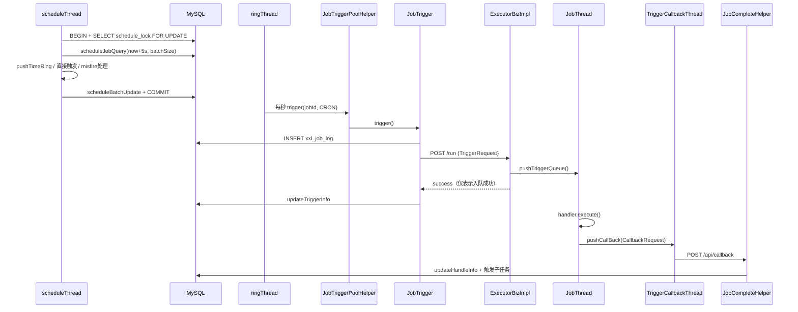
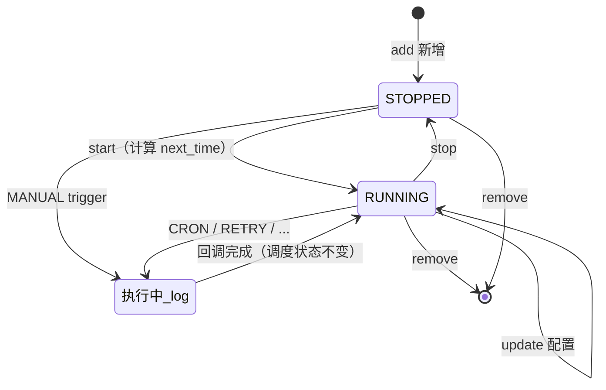
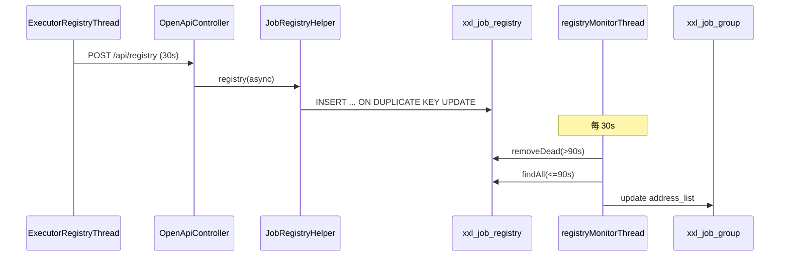
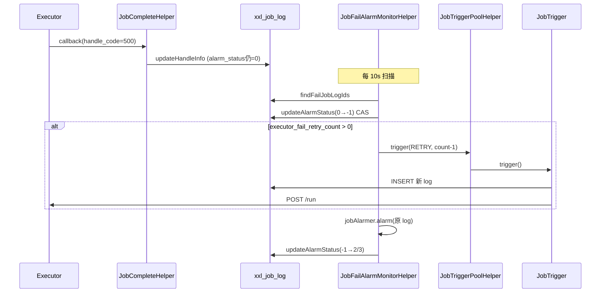
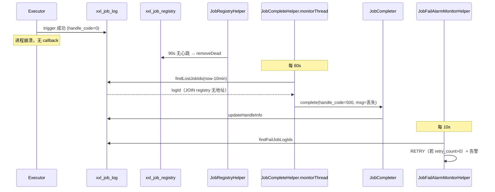
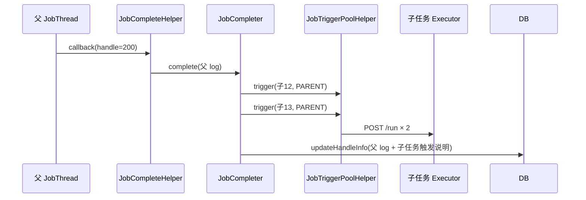

# XXL-JOB 源码架构深度分析

> 基于项目版本 **3.4.1-SNAPSHOT** 源码阅读整理  
> 分析范围：`xxl-job-core`、`xxl-job-admin` 及数据库脚本

---

## 目录

1. [项目概览](#1-项目概览)
2. [整体架构](#2-整体架构)
3. [模块划分与职责](#3-模块划分与职责)
4. [核心工作流程](#4-核心工作流程)
5. [定时任务调度底层原理](#5-定时任务调度底层原理)
6. [执行器底层原理](#6-执行器底层原理)
7. [通信协议与 RPC 模型](#7-通信协议与-rpc-模型)
8. [数据模型与持久化](#8-数据模型与持久化)
9. [后台辅助线程体系](#9-后台辅助线程体系)
10. [设计亮点](#10-设计亮点)
11. [技术亮点](#11-技术亮点)
12. [关键类索引](#12-关键类索引)
13. [深度专题导读](#13-深度专题导读)
14. [调度内核深析](#14-调度内核深析)
15. [路由与通信](#15-路由与通信)
16. [执行器与任务开发](#16-执行器与任务开发)
17. [可靠性与编排](#17-可靠性与编排)
18. [运维观测](#18-运维观测)
19. [部署、安全与演进](#19-部署安全与演进)

---

## 1. 项目概览

XXL-JOB 是一个**轻量级分布式任务调度框架**，采用经典的 **调度中心（Admin）+ 执行器（Executor）** 分离架构：

- **调度中心**：负责任务配置、Cron/固定频率调度、路由选机器、日志聚合、失败告警
- **执行器**：嵌入业务应用，接收远程触发、在本地线程中执行任务、异步回调结果

核心设计目标：**开发迅速、学习简单、轻量级、易扩展**。与 Quartz 等单机/嵌入式调度不同，XXL-JOB 将调度逻辑集中在 Admin，Executor 只做执行，天然支持分布式与水平扩展。

### 1.1 Maven 模块结构

```
xxl-job (parent pom)
├── xxl-job-core          # 核心库：执行器、通信、Handler、Glue 脚本
├── xxl-job-admin         # 调度中心：Web 管理 + 自研调度引擎
└── xxl-job-executor-samples
    ├── xxl-job-executor-sample-springboot
    ├── xxl-job-executor-sample-springboot-ai
    └── xxl-job-executor-sample-frameless
```

| 模块 | 打包产物 | 说明 |
|------|----------|------|
| `xxl-job-core` | Maven 中央仓库 JAR | 业务项目只需引入此依赖 |
| `xxl-job-admin` | 独立 Spring Boot 应用 | 不发布到 Maven Central |
| `executor-samples` | 示例工程 | 演示 Spring / 无框架集成 |

### 1.2 技术栈

| 层次 | 技术 |
|------|------|
| 语言 | Java 17 |
| Admin 框架 | Spring Boot 4.x + MyBatis |
| 执行器 HTTP 服务 | Netty 4.x |
| RPC 封装 | `xxl-tool` HttpTool 动态代理 |
| 序列化 | Gson JSON |
| 动态脚本 | Groovy + 多语言 Shell |
| 数据库 | MySQL（InnoDB） |
| 认证 | xxl-sso（Admin Web）+ AccessToken（OpenAPI） |

---

## 2. 整体架构

### 2.1 逻辑架构图

```
┌─────────────────────────────────────────────────────────────────────────┐
│                         XXL-JOB Admin（调度中心）                          │
│  ┌──────────────┐  ┌─────────────────────────────────────────────────┐  │
│  │ Web 管理界面  │  │           自研调度引擎 (scheduler 包)              │  │
│  │ Controller   │  │  JobScheduleHelper → JobTriggerPoolHelper         │  │
│  │ Service      │  │       → JobTrigger → ExecutorBiz (HTTP)           │  │
│  │ MyBatis/DB   │  │  JobRegistryHelper / JobCompleteHelper / ...    │  │
│  └──────────────┘  └─────────────────────────────────────────────────┘  │
│                              │ POST /api/*                               │
└──────────────────────────────┼──────────────────────────────────────────┘
                               │ HTTP + JSON
         ┌─────────────────────┼─────────────────────┐
         ▼                     ▼                     ▼
┌─────────────────┐  ┌─────────────────┐  ┌─────────────────┐
│  Executor 实例1  │  │  Executor 实例2  │  │  Executor 实例N  │
│  EmbedServer    │  │  EmbedServer    │  │  EmbedServer    │
│  (Netty /run)   │  │  (Netty /run)   │  │  (Netty /run)   │
│  JobThread      │  │  JobThread      │  │  JobThread      │
│  @XxlJob Handler│  │  @XxlJob Handler│  │  @XxlJob Handler│
└─────────────────┘  └─────────────────┘  └─────────────────┘
         │                     │                     │
         └─────────────────────┴─────────────────────┘
                               │ registry / callback
                               ▼
                         MySQL (xxl_job)
```

### 2.2 架构特点

1. **中心式调度**：所有 Cron 计算、时间轮推进、触发决策在 Admin 完成，Executor 无本地调度状态
2. **推拉结合**：
   - Admin **推**触发请求到 Executor（`/run`）
   - Executor **拉**式注册心跳、**推**回调结果到 Admin（`/api/callback`）
3. **无独立注册中心**：复用 MySQL `xxl_job_registry` 表 + 心跳机制，降低运维复杂度
4. **集群 HA**：
   - Admin 多实例：数据库悲观锁 `schedule_lock` 保证同一时刻只有一个实例扫描调度
   - Executor 多实例：路由策略（轮询、一致性 Hash、广播分片等）选机器

---

## 3. 模块划分与职责

### 3.1 xxl-job-admin

```
com.xxl.job.admin
├── controller/          # Web 层：任务 CRUD、日志查询、登录
│   ├── base/            # IndexController, LoginController
│   └── biz/             # JobInfoController, JobGroupController, ...
├── service/             # 业务服务：任务启停、下次触发时间计算
├── mapper/              # MyBatis 数据访问
├── model/               # 实体类
├── scheduler/           # ★ 调度引擎核心
│   ├── config/          XxlJobAdminBootstrap（启动入口）
│   ├── thread/          各类后台守护线程
│   ├── trigger/         JobTrigger 触发逻辑
│   ├── route/           执行器路由策略
│   ├── type/            调度类型（CRON/FIX_RATE/NONE）
│   ├── misfire/         过期策略
│   ├── cron/            CronExpression（Quartz 移植）
│   ├── complete/        JobCompleter 完成处理
│   ├── alarm/           失败邮件告警
│   └── openapi/         OpenApiController（Executor 回调入口）
└── web/                 # SSO、异常处理
```

### 3.2 xxl-job-core

```
com.xxl.job.core
├── executor/            # XxlJobExecutor / XxlJobSpringExecutor 生命周期
├── server/              EmbedServer（Netty HTTP 服务端）
├── thread/              JobThread, ExecutorRegistryThread, TriggerCallbackThread
├── handler/             IJobHandler, @XxlJob, MethodJobHandler
├── glue/                Groovy/脚本动态任务
├── openapi/             AdminBiz / ExecutorBiz 接口定义
├── context/             XxlJobContext / XxlJobHelper（线程上下文）
├── log/                 XxlJobFileAppender（本地文件日志）
└── constant/            常量（心跳间隔、Token 名等）
```

---

## 4. 核心工作流程

### 4.1 系统启动流程

#### Admin 启动（`XxlJobAdminBootstrap.afterPropertiesSet`）

启动顺序有依赖关系，源码注释明确标注：

```
1. JobTriggerPoolHelper.start()      # 快慢双线程池
2. JobRegistryHelper.start()         # 注册表监控
3. JobFailAlarmMonitorHelper.start() # 失败重试 + 告警
4. JobCompleteHelper.start()         # 回调处理 + 丢失监控
5. JobLogReportHelper.start()        # 日志报表统计
6. JobScheduleHelper.start()         # ★ 核心调度（依赖 trigger pool）
```

关闭时**逆序**停止，调度线程优雅等待时间轮中待触发任务（最多 10 秒）。

#### Executor 启动（`XxlJobExecutor.start`）

```
1. XxlJobFileAppender.initLogPath()       # 初始化日志目录
2. initAdminBizList()                     # 创建 Admin HTTP 客户端代理
3. JobLogFileCleanThread.start()          # 日志清理（retention ≥ 3 天）
4. TriggerCallbackThread.start()          # 结果回调 + 失败重试
5. initEmbedServer()                      # 启动 Netty + 注册线程
```

Spring 集成时，`XxlJobSpringExecutor.afterSingletonsInstantiated()` 在全部单例就绪后：

1. 扫描 `@XxlJob` 方法注册 Handler
2. `GlueFactory.refreshInstance(1)` 启用 Spring 依赖注入
3. 调用 `super.start()`

### 4.2 一次 Cron 调度的完整生命周期



**关键认知**：Admin 调用 `executorBiz.run()` 返回 success **只代表任务已进入 Executor 队列**，不代表业务执行完成。最终结果通过 **异步回调** 回传。

### 4.3 触发类型（TriggerTypeEnum）

| 类型 | 来源 | 说明 |
|------|------|------|
| `CRON` | 时间轮 / 调度扫描 | 定时自动触发 |
| `MANUAL` | Web 界面「执行一次」 | 人工触发 |
| `RETRY` | JobFailAlarmMonitorHelper | 失败自动重试 |
| `PARENT` | JobCompleter | 父任务成功后触发子任务 |
| `API` | OpenAPI / 外部系统 | 事件驱动 |
| `MISFIRE` | MisfireFireOnceNow | 过期补偿触发 |

---

## 5. 定时任务调度底层原理

> 核心类：`JobScheduleHelper`  
> 这是 XXL-JOB 最具技术含量的部分，采用了 **数据库锁 + 预读 + 60 槽秒级时间轮** 的组合方案。

### 5.1 设计目标与约束

| 目标 | 实现手段 |
|------|----------|
| 集群下调度互斥 | MySQL `FOR UPDATE` 悲观锁 |
| 高并发触发 | 预读 5 秒 + 内存时间轮削峰 |
| 秒级精度 | 双线程对齐到秒边界 |
| 调度不阻塞触发 | 触发异步提交到线程池 |

### 5.2 双线程模型

#### 线程一：`scheduleThread`（调度扫描线程）

职责：**每秒（理想情况）** 从数据库拉取即将触发的任务，写入时间轮或直接触发。

**启动对齐**：

```java
TimeUnit.MILLISECONDS.sleep(5000 - System.currentTimeMillis() % 1000);
```

等待到下一个整秒的「第 5 秒偏移」，避免启动瞬间与其他线程竞争。

**预读容量计算**：

```java
int preReadCount = (triggerPoolFastMax + triggerPoolSlowMax) * 10;
// 注释：假设每次 trigger 约 100ms，线程池大小 × 10 = 每秒可处理的预读量
// 默认 fastMax=200, slowMax=100 → preReadCount=3000
```

**单次扫描事务流程**：

```java
transactionManager.getTransaction(...)
xxlJobLockMapper.scheduleLock()                    // FOR UPDATE
scheduleList = scheduleJobQuery(now + PRE_READ_MS, preReadCount)
// 遍历 scheduleList，分类处理（见 5.3）
scheduleBatchUpdate(scheduleList)                  // 批量更新 trigger_next_time
transactionManager.commit(...)
```

**扫描后休眠策略**：

- 扫描耗时 `< 1s`：休眠至下一整秒（预读成功休眠 1s，无任务休眠 5s）
- 扫描耗时 `≥ 1s`：不休眠，立即进入下一轮（追赶模式）

#### 线程二：`ringThread`（时间环触发线程）

职责：**每秒整点** 从内存时间轮取出当前秒（及前 2 秒）的任务 ID，提交触发。

```java
TimeUnit.MILLISECONDS.sleep(1000 - System.currentTimeMillis() % 1000);

int nowSecond = Calendar.getInstance().get(Calendar.SECOND);
for (int i = 0; i <= 2; i++) {
    List<Integer> list = ringData.remove((nowSecond + 60 - i) % 60);
    // 去重后收集
}
for (int jobId : ringItemData) {
    jobTriggerPoolHelper.trigger(jobId, CRON, ...);
}
```

**向前校验 2 个刻度**：防止 `scheduleThread` 处理过慢跨过秒边界导致遗漏。

**去重**：同一秒重复 push 的 jobId 只触发一次。

### 5.3 60 槽秒级时间轮

```java
private final Map<Integer, List<Integer>> ringData = new ConcurrentHashMap<>();

// key = (triggerNextTime / 1000) % 60  →  秒字段 0~59
// value = 该秒需要触发的 jobId 列表
```

这是一个 **简化版时间轮**：

- 粒度：**秒**（非毫秒级 hierarchical time wheel）
- 槽数：**60**（对应一分钟内的秒）
- 数据结构：`ConcurrentHashMap<Integer, List<Integer>>`

> 注意：因为只有 60 槽，同一槽位可能混合不同分钟的任务，但 `scheduleThread` 每次扫描后会 `refreshNextTriggerTime` 更新 DB，且 ring 线程每秒消费，在预读 5 秒的窗口下工作正常。

### 5.4 三种任务分类处理

设 `now = System.currentTimeMillis()`，`next = jobInfo.triggerNextTime`：

| 条件 | 场景 | 处理 |
|------|------|------|
| `now > next + 5000ms` | 严重过期（>5s） | 执行 Misfire 策略 → `refreshNextTriggerTime` |
| `now >= next` | 轻微过期（≤5s） | **直接 trigger** → 刷新 next → 若 next 仍在 5s 内则 push 时间轮 |
| `now < next` | 预读区间 | **push 时间轮** → 刷新 next |

**5 秒预读窗口 `PRE_READ_MS = 5000`** 是贯穿整个调度逻辑的核心常量。

### 5.5 数据库悲观锁（集群调度互斥）

`XxlJobLockMapper.xml`：

```sql
SELECT * FROM xxl_job_lock WHERE lock_name = 'schedule_lock' FOR UPDATE
```

- 在 Spring 事务内执行
- 同一时刻只有一个 Admin 实例持有锁并完成扫描
- 其他实例阻塞等待锁释放（InnoDB 行锁）
- 无需 ZooKeeper / Redis 分布式锁，**极简 HA 方案**

### 5.6 调度任务查询 SQL

```sql
SELECT ... FROM xxl_job_info
WHERE trigger_status = 1
  AND trigger_next_time <= #{maxNextTime}
ORDER BY id ASC
LIMIT #{pagesize}
```

- `trigger_status = 1`：运行中的任务
- `maxNextTime = now + 5000`：预读未来 5 秒
- 按 ID 排序保证公平性

### 5.7 下次触发时间计算

`refreshNextTriggerTime` 委托给 **ScheduleType 策略**：

#### CRON（`CronScheduleType`）

```java
CronExpression cronExpression = new CronExpression(jobInfo.getScheduleConf());
return cronExpression.getNextValidTimeAfter(fromTime);
```

`CronExpression` 源自 **Quartz 2.5.2**（约 1690 行），支持 6 字段 + 可选年：

```
秒 分 时 日 月 周 [年]
```

核心算法 `getTimeAfter`：从 `afterTime + 1秒` 开始，逐字段在 `TreeSet<Integer>` 允许值中贪心推进。

#### FIX_RATE（`FixRateScheduleType`）

```java
Date next = new Date(fromTime.getTime() + scheduleConf_seconds * 1000L);
// 毫秒非零则进位到下一秒
```

#### NONE

返回 `null` → 任务自动停止（`trigger_status = 0`）

### 5.8 Misfire（过期）策略

当 `now > triggerNextTime + 5s` 时触发：

| 策略 | 实现类 | 行为 |
|------|--------|------|
| `DO_NOTHING`（默认） | `MisfireDoNothing` | 仅打日志，跳过本次 |
| `FIRE_ONCE_NOW` | `MisfireFireOnceNow` | 立即触发一次（MISFIRE 类型） |

无论哪种策略，都会 `refreshNextTriggerTime` 计算下一个合法触发点。

### 5.9 触发线程池：快慢隔离

`JobTriggerPoolHelper` 实现了**自适应线程池路由**：

| 线程池 | 核心/最大 | 队列 | 用途 |
|--------|-----------|------|------|
| fast | 10 / fastMax(≥200) | 2000 | 正常任务 |
| slow | 10 / slowMax(≥100) | 5000 | 慢任务隔离 |

**慢任务判定**：同一分钟内某 jobId 触发耗时 **> 500ms** 超过 **10 次** → 降级到 slow 池。

```java
if (jobTimeoutCount != null && jobTimeoutCount.get() > 10) {
    triggerPool_ = slowTriggerPool;
}
```

**设计意图**：防止少数慢任务（如网络超时到 Executor）占满 fast 池，导致大量定时任务触发延迟。

### 5.10 JobTrigger 触发详细流程

`JobTrigger.trigger(jobId, triggerType, ...)` 步骤：

1. **加载数据**：`XxlJobInfo` + `XxlJobGroup`
2. **分片广播判断**：路由策略 = `SHARDING_BROADCAST` 且无指定分片 → 对每个注册地址各触发一次
3. **`processTrigger`**（每个分片）：
   - `INSERT xxl_job_log` 获取 `logId`
   - 构建 `TriggerRequest`（handler、参数、glue、分片 index/total、logId 等）
   - **路由选地址**：见 5.11
   - `ExecutorBiz.run(triggerParam)` HTTP 调用
   - 组装 HTML 格式 `triggerMsg`，更新 log

### 5.11 执行器路由策略

| 策略 | 类 | 算法 |
|------|-----|------|
| FIRST | ExecutorRouteFirst | 第一个地址 |
| LAST | ExecutorRouteLast | 最后一个 |
| ROUND | ExecutorRouteRound | 每 jobId 独立 AtomicInteger 轮询 |
| RANDOM | ExecutorRouteRandom | 随机 |
| CONSISTENT_HASH | ExecutorRouteConsistentHash | MD5 一致性 Hash，100 虚拟节点 |
| LEAST_FREQUENTLY_USED | ExecutorRouteLFU | 每 job 维度计数，选最少 |
| LEAST_RECENTLY_USED | ExecutorRouteLRU | LinkedHashMap 访问序 |
| FAILOVER | ExecutorRouteFailover | 依次 `beat()` 直到成功 |
| BUSYOVER | ExecutorRouteBusyover | 依次 `idleBeat(jobId)` 直到空闲 |
| SHARDING_BROADCAST | （JobTrigger 内处理） | 广播到所有节点 |

**一致性 Hash 实现要点**（`ExecutorRouteConsistentHash`）：

```java
// 每个物理地址创建 100 个虚拟节点
for (String address : addressList) {
    for (int i = 0; i < 100; i++) {
        long hash = md5("SHARD-" + address + "-NODE-" + i);
        addressRing.put(hash, address);
    }
}
long jobHash = md5(String.valueOf(jobId));
return addressRing.ceilingEntry(jobHash).getValue();
```

- 使用 MD5 而非 `String.hashCode()`，避免 Hash 碰撞
- 虚拟节点解决物理机器数量少时的不均匀问题
- 同一 jobId 始终路由到同一机器（节点上下线时仅少量 job 迁移）

---

## 6. 执行器底层原理

### 6.1 EmbedServer：Netty 嵌入式 HTTP 服务

执行器不依赖外部 Servlet 容器，内置 Netty Server 接收 Admin 请求。

**Pipeline 配置**：

```
IdleStateHandler(90s)     → 空闲关闭（3 × 30s 心跳周期）
HttpServerCodec
HttpObjectAggregator(5MB)
EmbedHttpServerHandler
```

**业务线程池**：0~200 线程，队列 2000，拒绝抛异常。

**URI 路由**：

| URI | 功能 |
|-----|------|
| `/beat` | 心跳检测 |
| `/idleBeat` | 空闲检测（路由 BUSYOVER 用） |
| `/run` | ★ 触发任务 |
| `/kill` | 终止任务线程 |
| `/log` | 拉取执行日志（Admin 实时查看） |

### 6.2 ExecutorBizImpl.run()：触发编排核心

收到 `TriggerRequest` 后的决策树：

```
1. 加载已有 JobThread 和 Handler
2. 按 GlueType 解析 Handler：
   ├── BEAN      → 从 jobHandlerRepository 加载 @XxlJob 注册的 Handler
   ├── GLUE_GROOVY → GlueFactory 动态编译 Groovy
   └── GLUE_*    → ScriptJobHandler 写临时脚本文件执行
3. Handler/Glue 版本变更 → 标记 removeOldReason，重建 JobThread
4. 阻塞策略处理（jobThread 已存在时）：
   ├── DISCARD_LATER  → 运行中则直接返回失败
   ├── COVER_EARLY    → kill 旧线程，创建新线程
   └── SERIAL_EXECUTION → 入队等待（默认）
5. registJobThread() → pushTriggerQueue()
```

### 6.3 JobThread：一任务一线程模型

**核心设计**：每个 `jobId` 对应**唯一** `JobThread`，而非每次触发新建线程。

```java
// XxlJobExecutor
private static ConcurrentMap<Integer, JobThread> jobThreadRepository;
private static ConcurrentMap<String, IJobHandler> jobHandlerRepository;
```

**JobThread 主循环**：

```java
while (!toStop) {
    triggerParam = triggerQueue.poll(3, SECONDS);  // 不用 take()，以便检测 toStop
    if (triggerParam != null) {
        // 设置 XxlJobContext（ThreadLocal）
        // 执行 handler.execute()（可选超时子线程）
        // finally → TriggerCallbackThread.pushCallBack()
    } else {
        idleTimes++;
        if (idleTimes > 30 && triggerQueue.isEmpty()) {
            removeJobThread(jobId, "idle");  // 约 90s 无任务则回收线程
        }
    }
}
```

**关键机制**：

| 机制 | 实现 |
|------|------|
| 重复触发防护 | `triggerLogIdSet` 按 logId 去重 |
| 串行执行 | 同一 JobThread 的 `LinkedBlockingQueue` |
| 超时控制 | `FutureTask.get(timeout)` 另起子线程执行 |
| 空闲回收 | 30 次 × 3s poll = 90s 无触发则销毁 JobThread |
| 优雅停止 | `toStop` 共享变量（非仅靠 interrupt） |

### 6.4 Handler 注册与执行

#### BEAN 模式（最常用）

Spring 启动时扫描 `@XxlJob`：

```java
@XxlJob("demoJobHandler")
public void demoJobHandler() {
    XxlJobHelper.log("hello");
    XxlJobHelper.handleSuccess();
}
```

封装为 `MethodJobHandler`，按注解 `value()` 注册到 `jobHandlerRepository`。

#### GLUE 模式（动态任务）

| 类型 | 执行方式 |
|------|----------|
| GLUE_GROOVY | `GroovyClassLoader.parseClass` → 实现 `IJobHandler` |
| GLUE_SHELL/PYTHON/... | 写临时文件 → `Runtime.exec` → 输出重定向到日志 |

`SpringGlueFactory` 支持 Groovy 实例的 `@Autowired` / `@Resource` 注入。

### 6.5 阻塞策略（ExecutorBlockStrategyEnum）

| 策略 | 行为 |
|------|------|
| SERIAL_EXECUTION | 排队，依次执行（默认） |
| DISCARD_LATER | 丢弃新触发 |
| COVER_EARLY | 终止当前，执行新触发 |

### 6.6 结果回调与可靠性

`TriggerCallbackThread` 双线程：

1. **主回调线程**：`callBackQueue.take()` → 批量 `adminBiz.callback()`
2. **重试线程**：每 30s 扫描 `callbacklogs/` 目录下失败文件重试

失败持久化：

```
{logPath}/callbacklogs/xxl-job-callback-{md5}.log
```

保证 Admin 短暂不可达时结果不丢失。

### 6.7 执行器注册心跳

`ExecutorRegistryThread` 每 **30 秒**：

```java
RegistryRequest("EXECUTOR", appname, "http://ip:port/")
adminBiz.registry(request)  // 遍历 adminAddresses 直到一个成功
```

Admin 端 `JobRegistryHelper` 每 30 秒：

- 删除超过 **90 秒**（`DEAD_TIMEOUT = 3 × BEAT_TIMEOUT`）未更新的注册
- 刷新 `xxl_job_group.address_list`

---

## 7. 通信协议与 RPC 模型

### 7.1 协议概览

XXL-JOB 3.x 使用 **HTTP + JSON**，通过 `xxl-tool` 的 `HttpTool.createClient().proxy(Interface.class)` 生成动态代理，**非** gRPC/Hessian（旧版 `XxlJobRemotingUtil` 已标记 deprecated）。

### 7.2 Admin → Executor

```
POST {executorAddress}/run
Header: XXL-JOB-ACCESS-TOKEN: {token}
Body: TriggerRequest JSON
Response: Response<String> JSON
```

### 7.3 Executor → Admin

```
POST {adminAddress}/api/callback
POST {adminAddress}/api/registry
POST {adminAddress}/api/registryRemove
Header: XXL-JOB-ACCESS-TOKEN: {token}
Body: JSON
```

`OpenApiController` 统一入口，`@XxlSso(login = false)` 跳过 Web 登录。

### 7.4 安全模型

- `xxl.job.accessToken` 非空时，双方请求必须携带相同 Token
- Admin Web 界面使用 xxl-sso 独立认证
- OpenAPI 与 Web 认证分离

### 7.5 ExecutorBiz 客户端缓存

```java
ConcurrentMap<String, ExecutorBiz> executorBizRepository
// 按 executor 地址缓存 HTTP 代理，避免重复创建
```

---

## 8. 数据模型与持久化

### 8.1 核心表

| 表 | 用途 |
|----|------|
| `xxl_job_info` | 任务定义 + `trigger_next_time` 调度状态 |
| `xxl_job_group` | 执行器分组 + 地址列表 |
| `xxl_job_registry` | 心跳注册表 |
| `xxl_job_log` | 每次触发的调度/执行日志 |
| `xxl_job_log_report` | 按日汇总统计 |
| `xxl_job_lock` | 调度悲观锁 |
| `xxl_job_logglue` | GLUE 源码历史版本 |
| `xxl_job_user` | 管理员账号 |

### 8.2 任务调度状态字段

`xxl_job_info` 中与调度直接相关的字段：

```
trigger_status     0=停止, 1=运行
trigger_last_time  上次触发时间戳(ms)
trigger_next_time  下次触发时间戳(ms)  ← 调度扫描的核心索引
schedule_type      CRON / FIX_RATE / NONE
schedule_conf      cron 表达式 或 固定间隔秒数
misfire_strategy   DO_NOTHING / FIRE_ONCE_NOW
```

**启停任务**时，Service 层会计算并写入 `trigger_next_time`；调度线程只处理 `trigger_status=1` 的记录。

### 8.3 日志表设计

`xxl_job_log` 分两段记录：

| 阶段 | 字段 | 写入时机 |
|------|------|----------|
| 调度 | trigger_time, trigger_code, trigger_msg | JobTrigger 触发后 |
| 执行 | handle_time, handle_code, handle_msg | Executor 回调后 |

`handle_code`：`200=成功`, `500=失败`, `0=运行中`

---

## 9. 后台辅助线程体系

Admin 侧共 **6 组** 守护线程，构成完整调度闭环：

| Helper | 周期 | 职责 |
|--------|------|------|
| JobScheduleHelper | 1s | 调度扫描 + 时间轮 |
| JobTriggerPoolHelper | 按需 | 异步触发 |
| JobRegistryHelper | 30s | 注册表维护 |
| JobCompleteHelper | 60s + 异步 | 回调处理 + 丢失任务标记失败 |
| JobFailAlarmMonitorHelper | 10s | 失败重试 + 邮件告警 |
| JobLogReportHelper | 1min | 日志报表聚合 |

### 9.1 失败重试

`JobFailAlarmMonitorHelper` 扫描失败日志：

```java
if (log.getExecutorFailRetryCount() > 0) {
    trigger(jobId, RETRY, failRetryCount - 1, shardingParam, param, null);
}
```

重试时携带原分片参数，保证广播任务重试在同一节点。

### 9.2 任务结果丢失处理

`JobCompleteHelper` 监控线程：运行中超过 **10 分钟** 且 Executor 已下线的 log → 标记失败。

### 9.3 子任务编排

`JobCompleter.processChildJob`：父任务 `handle_code=200` 时，解析 `child_jobid` CSV，逐个 `trigger(PARENT)`。

---

## 10. 设计亮点

### 10.1 调度与执行彻底分离

- Admin 无业务代码，Executor 无 Cron 逻辑
- 任务配置变更即时生效（DB 驱动），无需重启 Executor
- 适合微服务场景：调度中心独立部署，业务服务轻量嵌入 core

### 10.2 预读 + 时间轮削峰

传统每秒扫 DB + 同步触发会在任务量大时成为瓶颈。XXL-JOB 将「决策」和「触发」解耦：

- `scheduleThread`：批量预读、写时间轮、更新 next_time（短事务）
- `ringThread`：纯内存操作，按秒触发
- `triggerPool`：HTTP 调用异步化

### 10.3 数据库锁实现调度中心 HA

相比 Quartz Cluster、ElasticJob ZooKeeper 等方案，XXL-JOB 用 **一行 SQL 悲观锁** 实现多 Admin 互斥，运维成本极低。代价是 Admin 集群扩展性受 DB 锁竞争限制，但对绝大多数企业场景足够。

### 10.4 快慢线程池隔离

基于运行时观测（500ms 阈值）自动降级慢任务，无需人工配置，体现**防御性设计**。

### 10.5 一任务一线程 + 队列串行

- 避免为每次触发创建线程的开销
- 天然支持同一任务的 SERIAL_EXECUTION
- 空闲自动回收，防止 JobThread 泄漏

### 10.6 触发与回调分离

`/run` 快速返回 + 异步回调，Admin 不被长任务阻塞；回调失败写磁盘重试，保证**至少一次**结果投递。

### 10.7 丰富的路由与分片

- 10 种路由策略覆盖常见分布式场景
- `SHARDING_BROADCAST` + `XxlJobHelper.getShardIndex()` 实现 MapReduce 式分片
- 一致性 Hash 保证同任务同节点，利于本地缓存

### 10.8 GLUE 动态任务

无需发版即可在 Admin 修改 Groovy/Shell/Python 脚本执行任务，配合 `xxl_job_logglue` 版本历史，适合运维脚本、紧急修复。

### 10.9 可扩展告警

`JobAlarmer` 聚合多个 `JobAlarm` 实现（默认 `EmailJobAlarm`），策略模式便于扩展钉钉/企微告警。

### 10.10 策略模式贯穿

| 扩展点 | 枚举 + 策略类 |
|--------|---------------|
| 调度类型 | ScheduleTypeEnum |
| 过期策略 | MisfireStrategyEnum |
| 路由策略 | ExecutorRouteStrategyEnum |
| 阻塞策略 | ExecutorBlockStrategyEnum |
| Glue 类型 | GlueTypeEnum |

新增策略只需实现接口 + 注册枚举，符合开闭原则。

---

## 11. 技术亮点

### 11.1 秒级对齐的精细时间控制

调度线程、时间环线程均通过 `sleep(1000 - now % 1000)` 对齐整秒，配合 60 槽时间轮，在 **无 Timer/ScheduledExecutorService** 的情况下实现准秒级调度。

### 11.2 Quartz Cron 表达式移植

完整移植 Quartz `CronExpression`，兼容复杂 Cron 语法（L、W、# 等），避免重复造轮子，同时与 Spring `@Scheduled` cron 字段语义一致（6 位秒级）。

### 11.3 Netty 轻量 RPC 服务

EmbedServer 仅 ~260 行核心代码，零依赖 Tomcat，执行器端口默认 9999，部署极简。

### 11.4 HttpTool 接口代理

```java
ExecutorBiz biz = HttpTool.createClient()
    .url(address)
    .timeout(timeout)
    .header(XXL_JOB_ACCESS_TOKEN, token)
    .proxy(ExecutorBiz.class);
```

声明式 RPC，Addres 变更时 Admin 侧透明。

### 11.5 ThreadLocal 上下文传递

`XxlJobContext` + `XxlJobHelper` 封装任务参数、日志、分片、返回码，业务代码零侵入：

```java
XxlJobHelper.getJobParam();
XxlJobHelper.log("...");
XxlJobHelper.handleSuccess();
```

超时子线程中重新 `setXxlJobContext`，保证上下文正确。

### 11.6 本地文件日志 + 远程拉取

日志写 `{logPath}/yyyy-MM-dd/{logId}.log`，Admin 通过 `/log` 接口分页拉取，避免大量日志走回调通道，**调度通道与日志通道分离**。

### 11.7 批量 DB 更新优化

`scheduleBatchUpdate` 支持配置 `xxl.job.schedule.batchsize`（50~500），减少高频调度时的 DB 往返。

### 11.8 优雅停机

- Admin：时间轮有数据时等待 10s
- Executor：EmbedServer 停止 → 等 5s → join 所有 JobThread → 注销 registry

### 11.9 Spring Boot 4 / Java 17 现代化

项目已升级至 Spring Boot 4.0.5、Java 17，Spring 集成使用 `SmartInitializingSingleton` 确保 Handler 扫描在所有 Bean 就绪后执行，避免循环依赖。

### 11.10 AI 执行器示例

`xxl-job-executor-sample-springboot-ai` 集成 Spring AI（Ollama/OpenAI）和 Dify，展示 XXL-JOB 作为 **AI 任务编排入口** 的扩展能力。详细接入步骤见 [§16.8](#168-spring-ai-与-dify-接入指南)。

---

## 12. 关键类索引

### Admin 调度引擎

| 类 | 路径 | 职责 |
|----|------|------|
| XxlJobAdminBootstrap | scheduler/config/ | 启动/停止所有 Helper |
| JobScheduleHelper | scheduler/thread/ | 双线程调度 + 时间轮 |
| JobTriggerPoolHelper | scheduler/thread/ | 快慢触发线程池 |
| JobTrigger | scheduler/trigger/ | 触发编排 |
| JobRegistryHelper | scheduler/thread/ | 注册表同步 |
| JobCompleteHelper | scheduler/thread/ | 回调 + 丢失监控 |
| JobFailAlarmMonitorHelper | scheduler/thread/ | 重试 + 告警 |
| JobCompleter | scheduler/complete/ | 完成处理 + 子任务 |
| CronExpression | scheduler/cron/ | Cron 解析 |
| OpenApiController | scheduler/openapi/ | Executor API 入口 |

### Core 执行器

| 类 | 路径 | 职责 |
|----|------|------|
| XxlJobExecutor | executor/ | 执行器生命周期 |
| XxlJobSpringExecutor | executor/impl/ | Spring 集成 |
| EmbedServer | server/ | Netty HTTP 服务 |
| ExecutorBizImpl | openapi/impl/ | 触发/kill/log 实现 |
| JobThread | thread/ | 任务执行线程 |
| ExecutorRegistryThread | thread/ | 心跳注册 |
| TriggerCallbackThread | thread/ | 结果回调 |
| XxlJobFileAppender | log/ | 文件日志 |
| XxlJobHelper | context/ | 业务 API |

---

## 13. 深度专题导读

第 1–12 章覆盖整体架构与主流程；**第 14–19 章**按主题展开源码级深析（原 40 个扁平小节已重组为 **6 大章、共 37 节**）。

### 13.1 章节地图

| 章 | 主题 | 包含专题 |
|----|------|----------|
| [14](#14-调度内核深析) | 调度内核 | 时间轮、Cron、生命周期、触发类型 |
| [15](#15-路由与通信) | 路由与通信 | 10 种路由、Hash/LFU/LRU、分片、注册、OpenAPI |
| [16](#16-执行器与任务开发) | 执行器开发 | Handler、JobThread、GLUE、Frameless、AI |
| [17](#17-可靠性与编排) | 可靠性 | 重试、丢失检测、回调、子任务、告警、停机 |
| [18](#18-运维观测) | 运维观测 | Dashboard、日志、排障、调优 |
| [19](#19-部署安全与演进) | 部署演进 | 集群、Docker、安全、升级、测试 |

### 13.2 推荐阅读路径

1. **调度内核**：§14.1 → §14.2 → §14.3  
2. **分布式执行**：§15.1 → §15.4 → §15.5 → §15.6  
3. **可靠性**：§17.1 → §17.2 → §17.3 → §17.5  
4. **运维排障**：§18.5 → §18.3 → §19.5 → §19.1  
5. **AI 任务**：§16.8  
6. **执行器开发**：§16.1 → §16.2 → §16.6 → §16.4  
7. **升级部署**：§19.7 → §19.6 → §19.2  

### 13.3 旧编号对照（13.x → 新编号）

| 原 §13.x | 新编号 | 主题 |
|----------|--------|------|
| 13.1 | §14.1 | 时间轮 |
| 13.12 | §14.2 | Cron / 调度类型 |
| 13.13 | §14.3 | 任务生命周期 |
| 13.36 | §14.4 | 触发类型 |
| 13.6 | §15.1 | 路由全景 |
| 13.2 | §15.2 | 一致性 Hash |
| 13.4 | §15.3 | LFU / LRU |
| 13.7 | §15.4 | 分片广播 |
| 13.15 | §15.5 | 执行器注册 |
| 13.16 | §15.6 | OpenAPI |
| 13.14 | §16.1 | @XxlJob 注册 |
| 13.28 | §16.2 | JobThread 全链路 |
| 13.9 | §16.3 | 阻塞策略 |
| 13.21 | §16.4 | 执行上下文 |
| 13.11 | §16.5 | GLUE |
| 13.31 | §16.6 | Frameless |
| 13.34 | §16.7 | 通用 Handler |
| 13.26 | §16.8 | Spring AI / Dify |
| 13.3 | §17.1 | 失败重试 |
| 13.5 | §17.2 | 结果丢失 |
| 13.8 | §17.3 | 回调可靠性 |
| 13.17 | §17.4 | 子任务 |
| 13.18 | §17.5 | kill / 告警 |
| 13.40 | §17.6 | 优雅停机 |
| 13.27 | §18.1 | Dashboard |
| 13.10 | §18.2 | 日志报表 |
| 13.20 | §18.3 | 实时日志 |
| 13.38 | §18.4 | 审计日志 |
| 13.30 | §18.5 | 排障手册 |
| 13.29 | §18.6 | 性能调优 |
| 13.22 | §19.1 | 集群 HA |
| 13.37 | §19.2 | Docker |
| 13.33 | §19.3 | 安全模型 |
| 13.19 | §19.4 | Web 权限 |
| 13.24 | §19.5 | 配置参考 |
| 13.32 | §19.6 | 数据库表 |
| 13.35 | §19.7 | 版本升级 |
| 13.23 | §19.8 | 框架对比 |
| 13.39 | §19.9 | 测试体系 |

---


## 14. 调度内核深析

> Admin 侧调度引擎核心：时间轮预读、Cron/固定频率、任务生命周期与 trigger 类型。

### 14.1 时间轮（Time Ring）

#### 14.1.1 源码位置与定位

| 项目 | 内容 |
|------|------|
| 核心类 | `com.xxl.job.admin.scheduler.thread.JobScheduleHelper` |
| 核心字段 | `private final Map<Integer, List<Integer>> ringData` |
| 核心常量 | `PRE_READ_MS = 5000`（预读窗口 5 秒） |
| 工作线程 | `scheduleThread`（写轮）+ `ringThread`（读轮触发） |

XXL-JOB 的时间轮**不是** Kafka/Netty 常见的 hierarchical time wheel（多层毫秒级时间轮），而是一个 **60 槽、秒级粒度、按「分钟内的秒数」取模** 的简化时间环，配合 **5 秒 DB 预读** 使用。

#### 14.1.2 与经典时间轮的对比

| 维度 | 经典时间轮（如 Netty HashedWheelTimer） | XXL-JOB Time Ring |
|------|----------------------------------------|-------------------|
| 槽数 | 通常 512/1024，可配置 | 固定 **60**（秒字段 0~59） |
| 粒度 | 毫秒~秒 | **秒** |
| 驱动方式 | 单线程 tick，每 tick 推进一格 | **独立 ringThread** 对齐整秒 |
| 任务标识 | TimerTask / Timeout | **jobId**（整型） |
| 持久化 | 纯内存 | 预读来自 **MySQL**，内存只做削峰 |
| 多圈任务 | tick 计数 + 轮数 | 每次 push 后立即 **refreshNextTriggerTime** 写回 DB |

XXL-JOB 的设计目标不是通用 Timer，而是：**在 DB 驱动调度下，把未来 5 秒内要触发的 jobId 缓存在内存，由 ringThread 按秒均匀触发**，避免 scheduleThread 在同一秒内集中 HTTP 调用。

#### 14.1.3 数据结构

```java
// JobScheduleHelper.java
private final Map<Integer, List<Integer>> ringData = new ConcurrentHashMap<>();
```

- **Key**：`(triggerNextTime / 1000) % 60` → 取值范围 **0~59**，对应「一分钟内的第几秒」
- **Value**：该秒需要触发的 **jobId 列表**（`ArrayList`，允许同一秒多个任务）

```java
private void pushTimeRing(int ringSecond, int jobId) {
    List<Integer> ringItemList = ringData.computeIfAbsent(ringSecond, k -> new ArrayList<>());
    ringItemList.add(jobId);
}
```

使用 `ConcurrentHashMap` + `computeIfAbsent` 保证 scheduleThread 单写时的线程安全；ringThread 读时会 `remove` 整个 key，两者分工明确。

#### 14.1.4 写入时间轮的三种路径

`scheduleThread` 在事务内扫描 `scheduleJobQuery(now + PRE_READ_MS, preReadCount)` 后，对每个 `XxlJobInfo` 分三类处理：

**路径 A — 严重过期（Misfire）**：`now > triggerNextTime + 5000`

- **不入时间轮**，走 Misfire 策略后直接 `refreshNextTriggerTime`
- 详见 [§17.1](#171-失败重试机制) 中与 Misfire 的区分

**路径 B — 轻微过期**：`now >= triggerNextTime`（迟到 ≤ 5 秒）

```java
// 1. 立即异步触发（不经过时间轮）
jobTriggerPoolHelper.trigger(jobInfo.getId(), TriggerTypeEnum.CRON, -1, null, null, null);
// 2. 计算下一次触发时间
refreshNextTriggerTime(jobInfo, new Date());
// 3. 若下一次仍在 5 秒预读窗口内，再 push 时间轮
if (jobInfo.getTriggerStatus() == RUNNING && nowTime + PRE_READ_MS > jobInfo.getTriggerNextTime()) {
    int ringSecond = (int) ((jobInfo.getTriggerNextTime() / 1000) % 60);
    pushTimeRing(ringSecond, jobInfo.getId());
    refreshNextTriggerTime(jobInfo, new Date(jobInfo.getTriggerNextTime()));
}
```

设计意图：已经迟到的任务**不能再等 ringThread**，必须立刻 trigger；但如果 Cron 下一次触发点很近（例如每秒执行），则提前放入时间轮，避免下一秒再次扫 DB。

**路径 C — 预读（正常）**：`now < triggerNextTime` 且 `triggerNextTime <= now + 5000`

```java
int ringSecond = (int) ((jobInfo.getTriggerNextTime() / 1000) % 60);
pushTimeRing(ringSecond, jobInfo.getId());
refreshNextTriggerTime(jobInfo, new Date(jobInfo.getTriggerNextTime()));
```

这是时间轮的**主路径**：任务尚未到点，只登记到对应秒槽，等 ringThread 到秒再触发。

#### 14.1.5 ringThread 读轮与触发

ringThread 每秒对齐一次：

```java
TimeUnit.MILLISECONDS.sleep(1000 - System.currentTimeMillis() % 1000);

int nowSecond = Calendar.getInstance().get(Calendar.SECOND);
for (int i = 0; i <= 2; i++) {
    List<Integer> ringItemList = ringData.remove((nowSecond + 60 - i) % 60);
    // 去重、合并到 ringItemData
}
for (int jobId : ringItemData) {
    jobTriggerPoolHelper.trigger(jobId, TriggerTypeEnum.CRON, -1, null, null, null);
}
```

**三个关键细节**：

1. **向前回溯 2 秒**（`i = 0, 1, 2`）  
   注释原文：*避免调度遗漏：处理耗时太长、跨过刻度，除当前刻度外 + 向前校验 2 个刻度*  
   若 scheduleThread 事务提交慢、或 ringThread 自身 GC 停顿导致跨过整秒，仍能从 `nowSecond-1`、`nowSecond-2` 槽位捞回 jobId。

2. **同秒去重**  
   ```java
   List<Integer> ringItemListDistinct = ringItemList.stream().distinct().toList();
   ```  
   注释：*避免调度重复：重复推送时间轮刻度，去重只保留一个*  
   同 jobId 可能被路径 B 和路径 C 重复 push，或多次预读扫入同一槽。

3. **`remove` 而非 `get`**  
   消费后清空槽位，防止重复触发。

#### 14.1.6 完整时序示例

假设某任务 Cron 为每 10 秒执行，当前 `trigger_next_time = 10:00:08.000`，`now = 10:00:03.000`：

```
T=10:00:03  scheduleThread 扫描
            → 8 在 [now, now+5s] 预读窗口内
            → ringSecond = 8 % 60 = 8
            → pushTimeRing(8, jobId)
            → refreshNextTriggerTime → next = 10:00:18.000，写 DB

T=10:00:08  ringThread 到达第 8 秒
            → remove(8) 得到 [jobId]
            → jobTriggerPoolHelper.trigger(CRON)

T=10:00:13  scheduleThread 再次扫描（理想每 1 秒一轮）
            → next=18 仍在预读窗口
            → pushTimeRing(18, jobId)
            ...
```

#### 14.1.7 60 槽取模的潜在问题与工程化解

**问题**：`(timestamp/1000) % 60` 只保留「秒」信息，**不同分钟的同一秒共用槽位**。

例如 10:00:08 与 10:01:08 都会映射到槽 8。

**为何仍然正确**：

1. 每次 push 后 **`refreshNextTriggerTime` 立即更新 DB** 中的 `trigger_next_time` 到下一次合法触发点
2. 下一次 scheduleThread 扫描时，只会预读 **新的** next_time，不会重复 push 已触发的时间点
3. ringThread 消费时用 `remove` 清空，同一轮扫描周期内不会残留

因此 60 槽不是「存储未来 60 秒所有任务」，而是 **「当前预读窗口内、按秒对齐的触发缓冲」**，DB 仍是权威状态源。

#### 14.1.8 与 scheduleThread 的协作关系

```
┌─────────────────────────────────────────────────────────────────┐
│ scheduleThread（写）                                              │
│  事务: FOR UPDATE → scheduleJobQuery(now+5s) → 分类处理           │
│       → pushTimeRing / 直接trigger → scheduleBatchUpdate → commit │
│  休眠: 扫描<1s 则对齐到下一秒（无任务时休眠5s）                      │
└───────────────────────────┬─────────────────────────────────────┘
                            │ ringData (内存)
┌───────────────────────────▼─────────────────────────────────────┐
│ ringThread（读）                                                  │
│  每整秒: remove(当前秒, 前1秒, 前2秒) → distinct → trigger pool   │
└───────────────────────────┬─────────────────────────────────────┘
                            │
┌───────────────────────────▼─────────────────────────────────────┐
│ JobTriggerPoolHelper（快慢线程池）                                 │
│  异步 JobTrigger.trigger → HTTP /run                              │
└─────────────────────────────────────────────────────────────────┘
```

**预读容量**与线程池联动：

```java
int preReadCount = (triggerPoolFastMax + triggerPoolSlowMax) * 10;
// 默认 (200+100)*10 = 3000，注释假设单次 trigger ~100ms → 每秒最多处理约 3000 次预读
```

#### 14.1.9 优雅停机

```java
// stop() 中：若 ringData 非空，等待 ELEGANT_SHUTDOWN_WAITING_SECONDS = 10 秒
// 给 ringThread 时间消费完内存中待触发任务
```

scheduleThread 先停，ringThread 后停；中间 10 秒窗口避免 Admin 重启丢失已入环但未触发的 jobId。

#### 14.1.10 小结

| 要点 | 说明 |
|------|------|
| 本质 | DB 预读 + 内存按秒缓冲 + 异步触发，**削峰解耦** |
| 精度 | 秒级（对齐 `Calendar.SECOND`） |
| 容错 | 回溯 2 秒 + 同槽去重 |
| 非目标 | 不做毫秒调度、不做跨 Admin 共享内存 |

---
### 14.2 CronExpression 与调度类型

#### 14.2.1 调度类型枚举（ScheduleTypeEnum）

| 类型 | 实现类 | schedule_conf 含义 |
|------|--------|-------------------|
| `NONE` | NoneScheduleType | 无调度，仅手动/API |
| `CRON` | CronScheduleType | Cron 表达式（6~7 字段） |
| `FIX_RATE` | FixRateScheduleType | 固定间隔秒数（整数） |

```java
// CronScheduleType
return new CronExpression(jobInfo.getScheduleConf()).getNextValidTimeAfter(fromTime);

// FixRateScheduleType
Date next = new Date(fromTime.getTime() + Long.parseLong(scheduleConf) * 1000L);
// 毫秒非零则进位到下一秒
```

`FIX_DELAY`（固定延迟，上次执行完再计时）在源码中 **已注释**，`JobCompleter` 留有 `// on the way` 占位。

#### 14.2.2 CronExpression 来源与格式

- **来源**：Quartz 2.5.2 移植（Apache 2.0），约 1690 行
- **路径**：`com.xxl.job.admin.scheduler.cron.CronExpression`

**6 必填 + 1 可选字段**（空格分隔）：

```
秒  分  时  日  月  周  [年]
0-59 0-59 0-23 1-31 1-12 1-7  1970-2199
```

**特殊字符**：`*` `?` `-` `,` `/` `L` `W` `#`

**与 Spring `@Scheduled` cron 差异**：XXL-JOB / Quartz 为 **6 位含秒**；Spring 5 位默认不含秒字段。

**校验入口**（任务新增时）：

```java
if (scheduleTypeEnum == ScheduleTypeEnum.CRON) {
    if (!CronExpression.isValidExpression(jobInfo.getScheduleConf())) {
        return Response.ofFail("Cron invalid");
    }
}
```

#### 14.2.3 解析：buildExpression

构造 `CronExpression(String cronExpression)` 时：

1. 表达式转大写，`StringTokenizer` 按空格拆字段
2. 每个字段解析为 `TreeSet<Integer>` 允许值集合
3. 特殊标记：`ALL_SPEC=99`、`NO_SPEC=98`（日/周互斥用 `?`）

**约束**：day-of-month 与 day-of-week **不能同时指定具体值**（一方必须用 `?`），否则 `UnsupportedOperationException`。

#### 14.2.4 核心算法：getTimeAfter

`getNextValidTimeAfter(date)` → `getTimeAfter(date)`：

```java
// 1. 从 date + 1 秒开始，毫秒清零
afterTime = new Date(afterTime.getTime() + 1000);
cl.set(Calendar.MILLISECOND, 0);

// 2. 贪心循环 until gotOne
while (!gotOne) {
    // 年 > 2999 → return null（防死循环，任务会被 refreshNextTriggerTime 停止）
    // 逐字段推进：second → minute → hour → day → month → year
    // 每字段用 TreeSet.tailSet(current) 找 >= 当前值的最小允许值
    // 无则进位下一字段
}
```

**字段推进示意**（秒不匹配时）：

```
当前 sec=45，允许秒 {0,15,30,45}
tailSet(45) → 45 命中
若 sec=46，允许 {0,15,30,45}
tailSet(46) 空 → sec=0, min++
```

**日/周规则**：分 `dayOfMSpec`（按日期）与 `dayOfWSpec`（按星期）两套逻辑，支持 `L`（最后一天）、`W`（最近工作日）、`#`（第 N 个星期 X）。

#### 14.2.5 与调度引擎的衔接

**JobScheduleHelper.refreshNextTriggerTime**：

```java
Date next = scheduleTypeEnum.getScheduleType().generateNextTriggerTime(jobInfo, fromTime);
if (next != null) {
    jobInfo.setTriggerNextTime(next.getTime());
} else {
    jobInfo.setTriggerStatus(STOPPED);  // Cron 无效或超出年份上限
}
```

**fromTime 的取值**（影响下次触发点）：

| 场景 | fromTime |
|------|----------|
| 预读入环后刷新 | `new Date(jobInfo.getTriggerNextTime())` 刚算出的 next |
| 直接触发后刷新 | `new Date()` 当前时刻 |
| start 启任务 | `now + PRE_READ_MS`（5 秒后，避开预读窗口） |

**启任务时的 +5s 设计**（`XxlJobServiceImpl.start`）：

```java
Date nextValidTime = scheduleType.generateNextTriggerTime(
    xxlJobInfo, new Date(System.currentTimeMillis() + JobScheduleHelper.PRE_READ_MS));
```

注释：*5s 后生效，避开预读周期* —— 防止刚启动的任务被当前 scheduleThread 扫描边界误判。

#### 14.2.6 Cron 示例

| 表达式 | 含义 |
|--------|------|
| `0 0 0 * * ? *` | 每天 0 点 0 分 0 秒 |
| `0 0/30 * * * ?` | 每 30 分钟 |
| `0 0 12 ? * WED` | 每周三 12:00 |
| `0 0 0 1 * ?` | 每月 1 号 0 点 |

#### 14.2.7 小结

| 要点 | 说明 |
|------|------|
| 实现 | Quartz CronExpression 完整移植 |
| 精度 | 秒级 |
| 失败 | 返回 null → 任务自动 stop |
| 时区 | 默认 JVM `TimeZone.getDefault()`，可 `setTimeZone` |

---
### 14.3 任务生命周期（CRUD / 启停 / 手动触发）

业务入口：`XxlJobServiceImpl` + 各 Controller。调度引擎 **只读 DB** 中的 `trigger_status` / `trigger_next_time`，不订阅事件总线。

#### 14.3.1 状态字段

```java
// TriggerStatus
STOPPED = 0   // 停止，scheduleJobQuery 不扫描
RUNNING = 1   // 运行，参与调度

// xxl_job_info
trigger_status      0/1
trigger_last_time   上次触发(ms)
trigger_next_time   下次触发(ms)，调度扫描索引
```

#### 14.3.2 新增 add

```java
// 校验：jobGroup、Cron、GlueType、路由、Misfire、阻塞策略、子任务 ID...
jobInfo.setTriggerStatus(STOPPED);   // 默认停止（Mapper default）
jobInfo.setGlueUpdatetime(new Date());
xxlJobInfoMapper.save(jobInfo);
// 不计算 trigger_next_time，需用户手动「启动」
```

新增任务 **不会自动运行**，需 Web 点击启动或 API 调 start。

#### 14.3.3 启动 start

```java
// 1. NONE 类型禁止启动
if (ScheduleTypeEnum.NONE == scheduleType) return fail;

// 2. 计算 next_trigger_time（from = now + 5s）
Date nextValidTime = scheduleType.generateNextTriggerTime(
    xxlJobInfo, new Date(now + PRE_READ_MS));

// 3. 写库
xxlJobInfo.setTriggerStatus(RUNNING);
xxlJobInfo.setTriggerLastTime(0);
xxlJobInfo.setTriggerNextTime(nextValidTime.getTime());
xxlJobInfoMapper.update(xxlJobInfo);
```

**生效时延**：下一次 `scheduleThread` 扫描（约 1s 内）+ 预读窗口，通常 **数秒内** 首次入环或触发。

#### 14.3.4 停止 stop

```java
xxlJobInfo.setTriggerStatus(STOPPED);
xxlJobInfo.setTriggerLastTime(0);
xxlJobInfo.setTriggerNextTime(0);
xxlJobInfoMapper.update(xxlJobInfo);
```

- **不 kill** Executor 上已在跑的任务
- 内存时间轮中已 push 的 jobId：下一轮 ringThread 仍会 trigger 一次（**停止非强一致**），但 refreshNextTriggerTime 后 status=0 不再入环

#### 14.3.5 更新 update

```java
// 若任务 RUNNING 且 scheduleType/scheduleConf 变更 → 重算 nextTriggerTime
if (triggerStatus == RUNNING && scheduleDataChanged) {
    nextTriggerTime = generateNextTriggerTime(jobInfo, now + PRE_READ_MS);
}
// 若调度配置未变 → 保留原 trigger_next_time，避免扰动
exists_jobInfo.setTriggerNextTime(nextTriggerTime);
xxlJobInfoMapper.update(exists_jobInfo);
```

**即时生效**：改 Cron、路由、重试次数等，**无需重启** Admin/Executor；下次 trigger 读最新 DB 配置。

#### 14.3.6 删除 remove

```java
xxlJobInfoMapper.delete(id);
xxlJobLogMapper.delete(id);           // 删该 job 全部 log
xxlJobLogGlueMapper.deleteByJobId(id);
```

#### 14.3.7 手动触发 trigger

```java
// Web「执行一次」/ API
jobTriggerPoolHelper.trigger(jobId, TriggerTypeEnum.MANUAL, -1,
    null, executorParam, addressList);
```

| 参数 | 说明 |
|------|------|
| failRetryCount=-1 | 用任务配置的 `executor_fail_retry_count` |
| executorParam | 覆盖任务参数（可空） |
| addressList | 覆盖执行器地址（可空，走 registry） |

**不要求** `trigger_status=RUNNING`，停止状态也可手动执行。

#### 14.3.8 生命周期状态图



#### 14.3.9 与调度扫描的关系

```sql
-- scheduleJobQuery 只拉 RUNNING
WHERE trigger_status = 1 AND trigger_next_time <= #{maxNextTime}
```

Admin 集群下任意实例的 scheduleThread 抢到锁后扫描同一份 DB，**任务状态以 DB 为准**。

#### 14.3.10 小结

| 操作 | 改 trigger_status | 改 next_time | 是否立即触发 |
|------|-------------------|--------------|--------------|
| add | 0（默认） | 0 | 否 |
| start | 1 | 重算 | 等 schedule 扫描 |
| stop | 0 | 0 | 否（可能清环前再触发一次） |
| update | 不变 | 条件重算 | 否 |
| MANUAL trigger | 不变 | 不变 | 是（异步 pool） |

---
### 14.4 触发类型与 trigger_msg 解读

#### 14.4.1 TriggerTypeEnum 全表

```java
public enum TriggerTypeEnum {
    MANUAL,   // 人工
    CRON,     // 定时
    RETRY,    // 失败重试
    PARENT,   // 子任务
    API,      // 外部 API（枚举预留，当前源码未引用）
    MISFIRE   // 过期补偿
}
```

| 类型 | 触发入口 | failRetryCount 来源 |
|------|----------|---------------------|
| CRON | `JobScheduleHelper` 时间轮/扫描 | 任务配置 |
| MANUAL | `XxlJobServiceImpl.trigger()` | 任务配置 |
| RETRY | `JobFailAlarmMonitorHelper` | **上条 log 剩余次数 −1** |
| PARENT | `JobCompleter.processChildJob` | 任务配置 |
| MISFIRE | `MisfireFireOnceNow` | 任务配置 |
| API | （预留） | — |

类型写入 `trigger_msg` 前缀，便于日志区分「这次是谁触发的」。

#### 14.4.2 JobTrigger.processTrigger 流程与日志

```
1. xxlJobLogMapper.save(jobLog)           → 生成 logId
2. 组装 TriggerRequest
3. 路由选 address（或 SHARDING 按 index 取）
4. 写 trigger_msg：触发类型、路由、分片、block 策略等
5. ExecutorBiz.run(triggerParam)        → HTTP POST /run
6. 更新 trigger_code / trigger_msg
```

**trigger_code 语义**：

| 值 | 含义 |
|----|------|
| 200 | 请求已到达 Executor 并入队（非业务成功） |
| 500 | 路由失败、地址空、HTTP 异常、阻塞拒绝等 |

**handle_code 语义**（回调后）：

| 值 | 含义 |
|----|------|
| 0 | 运行中 / 未回调 |
| 200 | 业务成功 |
| 500 | 业务失败 |
| 502 | 超时（Executor 侧 handleTimeout） |

#### 14.4.3 典型 trigger_msg 片段

| 内容 | 说明 |
|------|------|
| `触发调度` + 类型标题 | CRON / 手动 / 重试等 |
| `路由策略：xxx` | FIRST / CONSISTENT_HASH 等 |
| `分片参数：1/3` | 广播分片 |
| `阻塞处理策略：SERIAL_EXECUTION` | |
| `address：http://ip:9999/` | 实际目标 |
| `code=200` | trigger 成功 |

#### 14.4.4 排障时如何读一条 log

```
trigger_code=500  → 看 trigger_msg（Admin 侧即失败，Executor 未执行或拒绝）
trigger_code=200 & handle_code=0  → Executor 执行中或回调丢失（§17.2）
trigger_code=200 & handle_code=500 → 看 handle_msg + Executor 本地 log
trigger_code=200 & handle_code=200 → 成功
```

RETRY 类型 log：对比同 jobId 前一条失败 log 的 `executor_fail_retry_count` 递减。

---

## 15. 路由与通信

> 10 种 Executor 路由策略、分片广播、注册中心与 Admin/Executor 双向 HTTP 协议。

### 15.1 路由策略全景（ROUND / FAILOVER / BUSYOVER 等）

前文章节已深析 CONSISTENT_HASH（§15.2）、LFU/LRU（§15.3）。本节补齐其余策略源码，并给出 **10 种路由统一对比**。

#### 15.1.1 路由框架

```java
// ExecutorRouter — 策略基类
public abstract Response<String> route(TriggerRequest triggerParam, List<String> addressList);

// ExecutorRouteStrategyEnum — 策略注册表
FIRST, LAST, ROUND, RANDOM, CONSISTENT_HASH, LEAST_FREQUENTLY_USED,
LEAST_RECENTLY_USED, FAILOVER, BUSYOVER, SHARDING_BROADCAST(router=null)
```

`JobTrigger.processTrigger` 中的选路逻辑：

```java
if (group.getRegistryList() != null && !group.getRegistryList().isEmpty()) {
    if (SHARDING_BROADCAST == executorRouteStrategyEnum) {
        address = registryList.get(index);  // 按分片下标直接取，不走 Router
    } else {
        routeAddressResult = executorRouteStrategyEnum.getRouter().route(triggerParam, registryList);
        address = routeAddressResult.getData();
    }
}
```

**地址来源**：`XxlJobGroup.getRegistryList()`

```java
// 自动注册：JobRegistryHelper 每 30s 刷新 address_list 到 DB，load 时解析为 List
// 手动录入：address_type=1，直接使用配置的逗号分隔地址
public List<String> getRegistryList() {
    if (StringTool.isNotBlank(addressList)) {
        registryList = new ArrayList<>(Arrays.asList(addressList.split(",")));
    }
    return registryList;
}
```

#### 15.1.2 FIRST / LAST — 固定端点

```java
// ExecutorRouteFirst
return Response.ofSuccess(addressList.get(0));

// ExecutorRouteLast
return Response.ofSuccess(addressList.get(addressList.size() - 1));
```

| 特点 | 说明 |
|------|------|
| 状态 | 无内存状态 |
| 复杂度 | O(1) |
| 用途 | 调试、固定单机、registry 排序后「总是第一台/最后一台」 |
| 风险 | 无负载均衡；FIRST 在列表按字典序排序后总是同一台（`JobRegistryHelper` 对地址 `Collections.sort`） |

#### 15.1.3 ROUND — 轮询

```java
// ExecutorRouteRound
private static ConcurrentMap<Integer, AtomicInteger> routeCountEachJob;
private static long CACHE_VALID_TIME = 0;  // 24h 清空

private static int count(int jobId) {
    if (System.currentTimeMillis() > CACHE_VALID_TIME) {
        routeCountEachJob.clear();
        CACHE_VALID_TIME = System.currentTimeMillis() + 86400000L;
    }
    AtomicInteger count = routeCountEachJob.get(jobId);
    if (count == null || count.get() > 1000000) {
        count = new AtomicInteger(new Random().nextInt(100));  // 随机起点
    } else {
        count.addAndGet(1);
    }
    routeCountEachJob.put(jobId, count);
    return count.get();
}

// route
String address = addressList.get(count(jobId) % addressList.size());
```

| 特点 | 说明 |
|------|------|
| 粒度 | **每个 jobId 独立计数器** |
| 行为 | 同一 job 的多次触发在 Executor 间 **轮转** |
| 粘性 | **无**（与 CONSISTENT_HASH 对比） |
| 随机起点 | 首次 `Random.nextInt(100)` 避免所有 job 从 index=0 开始 |
| 与 LFU 区别 | ROUND 按 **触发次序** 轮转；LFU 按 **历史被选次数** 选最少 |

#### 15.1.4 RANDOM — 随机

```java
// ExecutorRouteRandom
private static Random localRandom = new Random();
String address = addressList.get(localRandom.nextInt(addressList.size()));
```

| 特点 | 说明 |
|------|------|
| 状态 | 无 job 级状态 |
| 分布 | 长期均匀，单次无保证 |
| 用途 | 简单负载分散，不要求粘性 |

#### 15.1.5 FAILOVER — 故障转移

```java
// ExecutorRouteFailover — 顺序 beat 探测
for (String address : addressList) {
    try {
        ExecutorBiz executorBiz = XxlJobAdminBootstrap.getExecutorBiz(address);
        beatResult = executorBiz.beat();
    } catch (Exception e) {
        beatResult = Response.ofFail(e.getMessage());
    }
    // 记录每次 beat 的 HTML 日志到 beatResultSB
    if (beatResult.isSuccess()) {
        beatResult.setData(address);
        return beatResult;   // 第一个存活即返回
    }
}
return Response.ofFail(beatResultSB.toString());
```

**Executor 侧 beat**：

```java
// ExecutorBizImpl.beat()
return Response.ofSuccess();  // 无业务逻辑，仅表示 Netty 服务可达
```

| 特点 | 说明 |
|------|------|
| RPC 开销 | 最坏 O(n) 次 HTTP `/beat` |
| 语义 | **存活检测**，不感知任务是否 busy |
| 顺序 | 按 registry 列表顺序（已 sort）尝试 |
| 日志 | 每次 beat 结果写入 triggerMsg，便于 Admin UI 排查 |

#### 15.1.6 BUSYOVER — 忙碌转移

```java
// ExecutorRouteBusyover
for (String address : addressList) {
    idleBeatResult = executorBiz.idleBeat(new IdleBeatRequest(triggerParam.getJobId()));
    if (idleBeatResult.isSuccess()) {
        idleBeatResult.setData(address);
        return idleBeatResult;
    }
}
```

**Executor 侧 idleBeat**：

```java
// ExecutorBizImpl.idleBeat
JobThread jobThread = XxlJobExecutor.loadJobThread(idleBeatRequest.getJobId());
if (jobThread != null && jobThread.isRunningOrHasQueue()) {
    return Response.ofFail("job thread is running or has trigger queue.");
}
return Response.ofSuccess();
```

| 特点 | 说明 |
|------|------|
| 检测维度 | 该 **jobId** 在目标 Executor 上是否正在跑或队列非空 |
| 与 FAILOVER | FAILOVER 只问「机器活没活」；BUSYOVER 问「这台机器上这个 job 忙不忙」 |
| 典型场景 | 长任务占满 JobThread 时，把新触发转到空闲节点（需无本地状态） |

#### 15.1.7 十种路由策略总览

| 策略 | 类 | 状态 | 额外 RPC | 粘性 | 核心语义 |
|------|-----|------|----------|------|----------|
| FIRST | ExecutorRouteFirst | 无 | 无 | 固定首台 | 列表第一个 |
| LAST | ExecutorRouteLast | 无 | 无 | 固定末台 | 列表最后一个 |
| ROUND | ExecutorRouteRound | jobId 计数 | 无 | 无 | 按 job 轮询 |
| RANDOM | ExecutorRouteRandom | 无 | 无 | 无 | 随机 |
| CONSISTENT_HASH | ExecutorRouteConsistentHash | 无（每次建环） | 无 | **强** | jobId Hash 固定机器 |
| LFU | ExecutorRouteLFU | jobId 计数 Map | 无 | 无 | 被选次数最少 |
| LRU | ExecutorRouteLRU | jobId 访问序 | 无 | 无 | 最久未用 |
| FAILOVER | ExecutorRouteFailover | 无 | beat × n | 无 | 第一个存活 |
| BUSYOVER | ExecutorRouteBusyover | 无 | idleBeat × n | 无 | 第一个空闲 |
| SHARDING_BROADCAST | JobTrigger 内建 | 无 | 无 | 分片级 | 所有节点各触发一次 |

#### 15.1.8 选型决策树（实践）

```
任务有无本地状态 / JobThread 缓存？
├── 有 → CONSISTENT_HASH（或 FIRST 单机）
└── 无 → 需要分散负载？
         ├── 是 → 触发均匀：ROUND / LFU / LRU / RANDOM
         └── 需要高可用？
              ├── 机器可能宕机 → FAILOVER
              └── 机器活但任务可能堆积 → BUSYOVER

大任务拆片并行 → SHARDING_BROADCAST + XxlJobHelper 分片参数
```

---
### 15.2 一致性 Hash 路由

#### 15.2.1 源码位置与调用链

| 项目 | 内容 |
|------|------|
| 实现类 | `ExecutorRouteConsistentHash` |
| 注册 | `ExecutorRouteStrategyEnum.CONSISTENT_HASH` |
| 调用入口 | `JobTrigger.processTrigger()` → `executorRouteStrategyEnum.getRouter().route(triggerParam, registryList)` |

```java
// JobTrigger.java
routeAddressResult = executorRouteStrategyEnum.getRouter().route(triggerParam, group.getRegistryList());
if (routeAddressResult.isSuccess()) {
    address = routeAddressResult.getData();
}
// ...
triggerResult = doTrigger(triggerParam, address);  // HTTP POST /run
```

路由发生在 **写 log 之后、HTTP 触发之前**；每次触发独立选地址，但同一 `jobId` 在节点不变时始终落到同一 Executor。

#### 15.2.2 设计目标（类注释原文）

> 分组下机器地址相同，不同 JOB 均匀散列在不同机器上，保证分组下机器分配 JOB 平均；且每个 JOB 固定调度其中一台机器。

两个核心诉求：

1. **均匀性**：不同 jobId 分散到不同 Executor，避免单机热点
2. **粘性（Sticky）**：同一 jobId 固定路由到同一地址，利于本地缓存、单线程 JobThread 复用

这与 **ROUND（轮询）** 不同——轮询每次可能换机器；与 **RANDOM** 不同——随机无粘性。

#### 15.2.3 Hash 环构建算法

```java
private static final int VIRTUAL_NODE_NUM = 100;

public String hashJob(int jobId, List<String> addressList) {
    // Step 1: 构建 Hash 环
    TreeMap<Long, String> addressRing = new TreeMap<>();
    for (String address : addressList) {
        for (int i = 0; i < VIRTUAL_NODE_NUM; i++) {
            long addressHash = hash("SHARD-" + address + "-NODE-" + i);
            addressRing.put(addressHash, address);
        }
    }

    // Step 2: 计算 job 在环上的位置
    long jobHash = hash(String.valueOf(jobId));

    // Step 3: 顺时针找第一个 >= jobHash 的节点
    Map.Entry<Long, String> ceilingEntry = addressRing.ceilingEntry(jobHash);
    if (ceilingEntry != null) {
        return ceilingEntry.getValue();
    }

    // Step 4: 环回绕——取环上最小 Hash 的节点
    return addressRing.firstEntry().getValue();
}
```

**图示**（3 台机器，每台 100 虚拟节点，环上仅示意）：

```
        hash=0
          │
    ┌─────●─────┐
    │  A1_v0    │
    │     ●     │  jobHash(J5) ──顺时针──▶ 命中 B2_v17
    │  B2_v17   │
    │     ●     │
    │  C1_v42   │
    └───────────┘
        hash=2^32-1
```

#### 15.2.4 MD5 Hash 函数（为何不用 hashCode）

```java
private static long hash(String key) {
    MessageDigest md5 = MessageDigest.getInstance("MD5");
    md5.update(key.getBytes(StandardCharsets.UTF_8));
    byte[] digest = md5.digest();

    // 取 MD5 前 4 字节构成 32-bit unsigned long
    long hashCode = ((long) (digest[3] & 0xFF) << 24)
            | ((long) (digest[2] & 0xFF) << 16)
            | ((long) (digest[1] & 0xFF) << 8)
            | (digest[0] & 0xFF);

    return hashCode & 0xffffffffL;  // 映射到 [0, 2^32-1]
}
```

类注释说明：

- **a、virtual node**：解决物理节点少时分布不均
- **b、hash method replace hashCode**：`String.hashCode()` 碰撞多、分布差，MD5 将键空间扩到 **2^32**

| 方式 | 取值空间 | 分布质量 |
|------|----------|----------|
| `String.hashCode()` | 32-bit 但算法简单 | 易碰撞、不均匀 |
| MD5 截断 4 字节 | 2^32 | 近似均匀 |

#### 15.2.5 虚拟节点（Virtual Node）

物理 Executor 地址 `http://192.168.1.10:9999/` 映射 **100 个** 虚拟点：

```
hash("SHARD-http://192.168.1.10:9999/-NODE-0")
hash("SHARD-http://192.168.1.10:9999/-NODE-1")
...
hash("SHARD-http://192.168.1.10:9999/-NODE-99")
```

**作用**：当只有 2~3 台机器时，物理节点在环上只占 2~3 个点，job 分布极易倾斜；100 个虚拟节点把每台机器「拉长」成环上的一段弧，**统计学上更均匀**。

**代价**：每次 `route()` **全量重建** `TreeMap`（无缓存）。3 台机器 × 100 = 300 次 MD5 + TreeMap insert，单次触发开销可接受；上千 Executor 时需关注 CPU。

#### 15.2.6 路由键：jobId

```java
long jobHash = hash(String.valueOf(jobId));
```

- 键是 **任务 ID**，不是 logId、不是 trigger 时间
- 同一任务的所有 Cron 触发、手动触发、重试（未指定 addressList）都路由到同一节点（Executor 列表不变时）

**与分片广播的区别**：

- `CONSISTENT_HASH`：每次触发选 **1 台**
- `SHARDING_BROADCAST`：在 `JobTrigger.trigger()` 层对每个 registry 地址 **循环 trigger**，不走 `ExecutorRouteConsistentHash`

#### 15.2.7 节点上下线时的行为

一致性 Hash 的理论性质：**增删节点只影响相邻弧段上的 key**。

在 XXL-JOB 中：

- Executor 下线 → `JobRegistryHelper` 30s 内从 `address_list` 移除 → 下次 `route()` 用新列表重建环 → 部分 jobId 迁移到其他节点
- Executor 上线 → 新虚拟节点插入环 → 约 `1/N` 的 jobId 可能改派（N 为节点数）

**注意**：`CONSISTENT_HASH` **不检测节点存活**。若选中的机器已宕机但尚未从 registry 剔除，`doTrigger` 会 HTTP 失败并在 log 中记录 trigger 失败——此时应配合 **FAILOVER** 或 **BUSYOVER** 策略。

#### 15.2.8 与 FAILOVER / BUSYOVER 的对比

| 策略 | 类 | 选路方式 | 额外 RPC |
|------|-----|----------|----------|
| CONSISTENT_HASH | ExecutorRouteConsistentHash | 纯本地 Hash 计算 | **无** |
| FAILOVER | ExecutorRouteFailover | 按列表顺序 `beat()` 直到成功 | 有，O(n) |
| BUSYOVER | ExecutorRouteBusyover | 按列表顺序 `idleBeat(jobId)` 直到空闲 | 有，O(n) |

**FAILOVER 源码**：

```java
for (String address : addressList) {
    ExecutorBiz executorBiz = XxlJobAdminBootstrap.getExecutorBiz(address);
    beatResult = executorBiz.beat();
    if (beatResult.isSuccess()) {
        beatResult.setData(address);
        return beatResult;  // 第一个存活即返回
    }
}
return Response.ofFail(beatResultSB.toString());
```

**BUSYOVER 源码**：

```java
idleBeatResult = executorBiz.idleBeat(new IdleBeatRequest(triggerParam.getJobId()));
// ExecutorBizImpl.idleBeat → 检查 JobThread.isRunningOrHasQueue()
```

| 场景 | 推荐策略 |
|------|----------|
| 任务有状态、依赖本地 JobThread | CONSISTENT_HASH |
| 允许换机器、要求节点存活 | FAILOVER |
| 长任务、避免堆积到 busy 节点 | BUSYOVER |
| 大任务分片 | SHARDING_BROADCAST |

#### 15.2.9 与 ROUND 的对比（理解「均匀」）

**ROUND**（`ExecutorRouteRound`）：

```java
// 每 jobId 独立计数器，24h 清缓存
String address = addressList.get(count(jobId) % addressList.size());
```

- 同一 jobId **每次触发**轮转到下一台 → **无粘性**
- 「均匀」体现在 **时间维度**上轮流

**CONSISTENT_HASH**：

- 同一 jobId **永远**同一台（节点列表稳定时）
- 「均匀」体现在 **空间维度**上不同 jobId 分散

#### 15.2.10 完整触发示例

假设执行器组 registryList = `[A, B, C]`，jobId=42，路由策略 `CONSISTENT_HASH`：

```
1. JobTrigger.processTrigger
2. INSERT xxl_job_log → logId=1001
3. ExecutorRouteConsistentHash.route(triggerParam, [A,B,C])
   → hashJob(42) → 假设命中 B
4. doTrigger → POST B/run (TriggerRequest{jobId=42, logId=1001, ...})
5. UPDATE xxl_job_log SET executor_address=B, trigger_code=200, ...
```

下次 Cron 触发 jobId=42，仍走 B（除非 B 从 registry 消失）。

#### 15.2.11 小结

| 要点 | 说明 |
|------|------|
| 算法 | 标准一致性 Hash + 100 虚拟节点 + TreeMap ceilingEntry |
| Hash | MD5 前 4 字节 → 32-bit 环 |
| 键 | jobId，保证任务级粘性 |
| 局限 | 不感知故障/负载，环每 trigger 重建无缓存 |
| 组合 | 生产环境常与其他策略按任务类型选用 |

---
### 15.3 LFU / LRU 路由

#### 15.3.1 源码位置与共性设计

| 策略 | 实现类 | 枚举 |
|------|--------|------|
| LFU | `ExecutorRouteLFU` | `LEAST_FREQUENTLY_USED` |
| LRU | `ExecutorRouteLRU` | `LEAST_RECENTLY_USED` |

两者与 `ExecutorRouteRound` 一样，采用 **「按 jobId 隔离的路由状态 + 24 小时清缓存」** 模式：

```java
// LFU / LRU / ROUND 共有
private static long CACHE_VALID_TIME = 0;

if (System.currentTimeMillis() > CACHE_VALID_TIME) {
    jobLfuMap.clear();  // 或 jobLRUMap / routeCountEachJob
    CACHE_VALID_TIME = System.currentTimeMillis() + 1000 * 60 * 60 * 24;
}
```

| 共性 | 说明 |
|------|------|
| 状态粒度 | **每个 jobId 独立**一份路由状态，任务之间互不影响 |
| 缓存介质 | `static ConcurrentMap` 存在 JVM 堆内，**Admin 重启即丢失** |
| 过期策略 | 24 小时整表清空，非 LRU/LFU 条目级 TTL |
| 集群 | 多 Admin 实例 **各自维护** 一份 Map，路由结果可能不一致 |
| 地址变更 | 每次 route 同步 registry 列表：新增地址写入、下线地址剔除 |

调用链与一致性 Hash 相同：

```
JobTrigger.processTrigger()
  → ExecutorRouteStrategyEnum.match(jobInfo.getExecutorRouteStrategy())
  → router.route(triggerParam, group.getRegistryList())
  → 返回 address → doTrigger(HTTP /run)
```

#### 15.3.2 LFU：最不经常使用（ExecutorRouteLFU）

**设计目标**（类注释）：*单个 JOB 对应的每个执行器，使用频率最低的优先被选举*。

**数据结构**：

```java
// <jobId, <executorAddress, 累计被选次数>>
private static ConcurrentMap<Integer, HashMap<String, Integer>> jobLfuMap;
```

**完整 route 算法**：

```java
public String route(int jobId, List<String> addressList) {
    // 1. 24h 清缓存（见上）

    // 2. 取/建该 jobId 的计数 Map
    HashMap<String, Integer> lfuItemMap = jobLfuMap.get(jobId);
    if (lfuItemMap == null) {
        lfuItemMap = new HashMap<>();
        jobLfuMap.putIfAbsent(jobId, lfuItemMap);
    }

    // 3. 同步当前 registry 地址
    for (String address : addressList) {
        if (!lfuItemMap.containsKey(address) || lfuItemMap.get(address) > 1000000) {
            // 新节点 或 计数溢出 → 随机初始 count ∈ [0, size-1)
            lfuItemMap.put(address, new Random().nextInt(addressList.size()));
        }
    }
    // 剔除已下线的 address
    for (String existKey : lfuItemMap.keySet()) {
        if (!addressList.contains(existKey)) {
            lfuItemMap.remove(existKey);
        }
    }

    // 4. 选 count 最小的地址，然后 count + 1
    List<Map.Entry<String, Integer>> lfuItemList = new ArrayList<>(lfuItemMap.entrySet());
    lfuItemList.sort(Map.Entry.comparingByValue());  // 升序

    Map.Entry<String, Integer> addressItem = lfuItemList.get(0);
    addressItem.setValue(addressItem.getValue() + 1);

    return addressItem.getKey();
}
```

**图示**（jobId=10，三台 Executor，某时刻计数）：

```
地址        count（被选次数）
─────────────────────────
A           3
B           1  ← 本次选中，随后变为 2
C           2
```

**关键细节**：

1. **随机初始化**  
   新加入 registry 的地址不是从 0 开始，而是 `Random.nextInt(addressList.size())`。  
   注释意图：*初始化时主动 Random 一次，缓解首次压力* —— 避免所有新节点 count=0 时被齐刷刷选中造成惊群。

2. **计数溢出保护**  
   `count > 1000000` 时重新随机初始化，防止 int 长期累加溢出。

3. **并列最小值**  
   使用 `List.sort(comparingByValue())` 升序取 `[0]`。多个地址 count 相同时，**排序不稳定** 时取决于 HashMap 迭代顺序（JDK 实现相关），无显式 tie-break。

4. **时间维度**  
   LFU 只看 **历史被选总次数**，不区分「很久以前选过 1 次」与「刚刚选过 1 次」。在 XXL-JOB 的 Cron 场景下，长期运行后各节点 count 趋于均衡。

#### 15.3.3 LRU：最近最久未使用（ExecutorRouteLRU）

**设计目标**（类注释）：*单个 JOB 对应的每个执行器，最久未使用的优先被选举*。

**数据结构**：

```java
// <jobId, LinkedHashMap<address, address>>
private static ConcurrentMap<Integer, LinkedHashMap<String, String>> jobLRUMap;
```

Value 是 `LinkedHashMap<String, String>`，key 与 value 相同（均为 address 字符串），仅利用 **LinkedHashMap 的访问顺序** 能力。

**核心构造**：

```java
lruItem = new LinkedHashMap<>(16, 0.75f, true);
//                                          ^^^^
//                                   accessOrder = true
//                                   get/put 会刷新节点到链表尾部（最新）
```

**完整 route 算法**：

```java
public String route(int jobId, List<String> addressList) {
    // 1. 24h 清缓存

    // 2. 取/建 LinkedHashMap
    LinkedHashMap<String, String> lruItem = jobLRUMap.get(jobId);
    if (lruItem == null) {
        lruItem = new LinkedHashMap<>(16, 0.75f, true);
        jobLRUMap.putIfAbsent(jobId, lruItem);
    }

    // 3. 新地址 put 进 Map（put 会把节点放到尾部 = 最近使用）
    for (String address : addressList) {
        if (!lruItem.containsKey(address)) {
            lruItem.put(address, address);
        }
    }
    // 剔除下线地址
    // ...

    // 4. 取链表头 = 最久未访问的节点
    String eldestKey = lruItem.entrySet().iterator().next().getKey();
    return lruItem.get(eldestKey);  // get 会把该节点移到尾部
}
```

**访问顺序示意**（accessOrder=true，左=LRU 头，右=MRU 尾）：

```
初始:  [ A, B, C ]

选中 A（头）→ get(A) → [ B, C, A ]

下次选 B → get(B) → [ C, A, B ]

新机器 D 上线 put(D) → [ C, A, B, D ]
```

**与标准 LRU 的差异**：

| 点 | 标准 LRU Cache | XXL-JOB ExecutorRouteLRU |
|----|----------------|--------------------------|
| 容量上限 | 通常有 maxSize + removeEldestEntry | **无上限**，Map 大小 = 当前 registry 数 |
| 未选中节点 | 每次访问都刷新 | 仅 **被选中的地址** 经 `get()` 移到尾部；本轮未选中的节点顺序不变 |
| 新节点 | - | `put` 直接进尾部，视为「刚用过」，**不会**在下一轮立刻被当头选中 |

**注意**：已存在于 Map 中的地址，若本轮只是「在 addressList 里」但未被选中，**不会** `get/put` 刷新其 LRU 位置。只有 **最终被选中的那一台** 会 `get()` 更新为 MRU。这符合「选最久没调度上的机器」语义。

#### 15.3.4 LFU vs LRU 选型对比

| 维度 | LFU | LRU |
|------|-----|-----|
| 优化目标 | 各 Executor **被选次数** 均衡 | 各 Executor **距上次被选时间** 尽量分散 |
| 状态 | 整数计数 | 访问顺序链表 |
| 适合 | 触发频繁、需长期负载均衡 | 希望「轮着来」、避免同一台连续执行 |
| 粘性 | **无**（每次可能换机器） | **无** |
| 计算开销 | 每次 sort 全部 entry，O(n log n) | O(1) 取头 + get |

与 **CONSISTENT_HASH**（强粘性）、**ROUND**（按次数轮询）对比：

| 策略 | 粘性 | 均衡维度 |
|------|------|----------|
| CONSISTENT_HASH | 同一 jobId 固定机器 | jobId 空间散列 |
| ROUND | 无，按触发次序轮转 | 时间维度轮询 |
| LFU | 无 | 被选次数少的优先 |
| LRU | 无 | 最久未用的优先 |
| RANDOM | 无 | 纯随机 |

#### 15.3.5 与 Executor 端 JobThread 的配合

LFU/LRU 在 **Admin 选机器**；选中后 Executor 上仍是 **一 jobId 一 JobThread**：

- 若 jobId=10 本次 LRU 选了 A、下次选了 B，会在 B 上 **新建** JobThread（A 上旧线程约 90s 空闲后回收）
- 有本地状态的任务 **不适合** LFU/LRU，应选 CONSISTENT_HASH
- 无状态、可水平扩展的任务适合 LFU/LRU，让多台 Executor 分担同一 jobId 的触发

#### 15.3.6 完整触发示例（LFU）

registryList = `[A, B, C]`，jobId=5，首次触发：

```
1. lfuItemMap 为空 → A,B,C 各赋 random count ∈ {0,1,2}
   假设 A=2, B=0, C=1
2. sort → 选 B，B.count 变为 1
3. POST B/run
```

第二次触发（24h 内、Map 未清）：

```
A=2, B=1, C=1 → 并列时取 sort 后第一个 → 假设 C
C.count → 2
POST C/run
```

#### 15.3.7 小结

| 要点 | LFU | LRU |
|------|-----|-----|
| 核心结构 | `HashMap<address, count>` | `LinkedHashMap(accessOrder=true)` |
| 选择 | count 最小 | 链表头（eldest） |
| 选中后 | count++ | `get()` 移到尾部 |
| 缓存 | static Map，24h 清空 | 同左 |
| 集群 | 各 Admin 独立状态 | 同左 |

---
### 15.4 分片广播（SHARDING_BROADCAST）

#### 15.4.1 源码入口

`SHARDING_BROADCAST` 的 `router = null`，逻辑全部在 `JobTrigger.trigger()`：

```java
if (ExecutorRouteStrategyEnum.SHARDING_BROADCAST == match(jobInfo.getExecutorRouteStrategy())
        && group.getRegistryList() != null && !group.getRegistryList().isEmpty()
        && shardingParam == null) {
    // 无指定分片 → 广播到所有 registry 节点
    for (int i = 0; i < group.getRegistryList().size(); i++) {
        processTrigger(group, jobInfo, finalFailRetryCount, triggerType, triggerTime,
                i, group.getRegistryList().size());
    }
} else {
    // 单节点触发（含 RETRY 指定分片）
    if (shardingParam == null) shardingParam = new int[]{0, 1};
    processTrigger(..., shardingParam[0], shardingParam[1]);
}
```

**一次 Cron 触发 N 台 Executor → 产生 N 条 `xxl_job_log`**，每条 log 独立回调。

#### 15.4.2 单分片 processTrigger

```java
// 分片参数字符串写入 log
String shardingParam = (SHARDING_BROADCAST == routeStrategy)
    ? index + "/" + total : null;

// TriggerRequest 携带广播索引
triggerParam.setBroadcastIndex(index);
triggerParam.setBroadcastTotal(total);

// 地址：按 index 直接取 registry 列表，不走路由器
if (SHARDING_BROADCAST == routeStrategy) {
    address = (index < registryList.size())
        ? registryList.get(index)
        : registryList.get(0);  // index 越界 fallback 到 0
}
```

#### 15.4.3 Executor 侧分片 API

```java
// JobThread 设置 XxlJobContext
new XxlJobContext(..., triggerParam.getBroadcastIndex(), triggerParam.getBroadcastTotal());

// 业务代码
int shardIndex = XxlJobHelper.getShardIndex();   // 当前分片序号，从 0 开始
int shardTotal = XxlJobHelper.getShardTotal();   // 总分片数

// 典型用法：按 shardIndex 取模处理数据子集
// for (id : allIds) { if (id % shardTotal == shardIndex) { process(id); } }
```

脚本任务（GLUE_SHELL 等）通过命令行参数传递：`Runtime.exec([cmd, script, jobParam, shardIndex, shardTotal])`。

#### 15.4.4 节点数变化时的行为

| 变化 | 行为 |
|------|------|
| 扩容（3→5 台） | 下次触发 `total=5`，分片 0~4 各一台，业务需按 `shardTotal` 重新划分 |
| 缩容 | `total` 减小，相同 jobId 的分片可能映射到不同地址 |
| index ≥ size | fallback `registryList.get(0)`，**可能重复执行** 分片 0 的逻辑 |

#### 15.4.5 与失败重试的配合

重试时传入原 log 的 `executor_sharding_param`（如 `"2/5"`）→ **只重试该分片**，不会重新广播：

```java
// JobFailAlarmMonitorHelper
trigger(jobId, RETRY, count-1, log.getExecutorShardingParam(), log.getExecutorParam(), null);
```

#### 15.4.6 MapReduce 式分片示例

3 台 Executor，jobId=100，处理 900 条数据：

```
Admin trigger 一次
  → log#1001 → Executor-A, shardIndex=0/3 → 处理 id%3==0
  → log#1002 → Executor-B, shardIndex=1/3 → 处理 id%3==1
  → log#1003 → Executor-C, shardIndex=2/3 → 处理 id%3==2
```

---
### 15.5 执行器注册中心

XXL-JOB **无独立注册中心组件**（无 Eureka/ZK），以 MySQL 表 `xxl_job_registry` + 心跳线程实现「轻量服务发现」。

#### 15.5.1 数据模型

**xxl_job_registry**：

| 字段 | Executor 心跳值 | 含义 |
|------|-----------------|------|
| registry_group | `EXECUTOR` | 注册类型（`RegistType` 枚举，另有 `ADMIN` 预留） |
| registry_key | appname | 执行器 AppName，对应 `xxl_job_group.app_name` |
| registry_value | `http://ip:port/` | 可访问的 Executor 地址 |
| update_time | 心跳时间 | 判活依据 |

**唯一索引**：`(registry_group, registry_key, registry_value)` —— 同一 app 同一地址只有一行。

**xxl_job_group**：

| address_type | 含义 |
|--------------|------|
| 0 | 自动注册：address_list 由监控线程从 registry 表刷新 |
| 1 | 手动录入：用户配置逗号分隔地址，不依赖 registry |

#### 15.5.2 Executor 侧：ExecutorRegistryThread

启动时机：`EmbedServer` 绑定端口成功后 `startRegistry(appname, address)`。

```java
// 每 BEAT_TIMEOUT = 30 秒
RegistryRequest param = new RegistryRequest(EXECUTOR, appname, address);
for (AdminBiz adminBiz : adminBizList) {
    if (adminBiz.registry(param).isSuccess()) break;  // 多 Admin failover
}
```

**地址生成**（`XxlJobExecutor.initEmbedServer`）：

```java
port = port > 0 ? port : IPTool.getAvailablePort(9999);
ip = isNotBlank(ip) ? ip : IPTool.getIp();
if (isBlank(address)) {
    address = "http://{ip}:{port}/";   // 默认 http 前缀
}
```

**优雅下线**：

```java
// toStop 退出循环后
adminBiz.registryRemove(param);  // 遍历 adminBizList
```

#### 15.5.3 Admin 侧：registry API

```java
// JobRegistryHelper.registry — 异步写库
registryOrRemoveThreadPool.execute(() -> {
    int ret = registrySaveOrUpdate(group, key, value, now);
    // ret=1 新增；2 更新（MySQL ON DUPLICATE KEY UPDATE update_time）
});
return Response.ofSuccess();  // HTTP 立即返回，不等待 DB
```

**SQL**：

```sql
INSERT INTO xxl_job_registry (registry_group, registry_key, registry_value, update_time)
VALUES (...)
ON DUPLICATE KEY UPDATE update_time = #{updateTime}
```

`freshGroupRegistryInfo()` 方法体为空 —— **实时刷新已改为 monitor 线程周期批量**，避免每次心跳都 update `xxl_job_group`。

#### 15.5.4 监控线程：registryMonitorThread

每 **30 秒**（`BEAT_TIMEOUT`）：

```java
// 1. 删除死节点：update_time < now - DEAD_TIMEOUT(90s)
findDead(DEAD_TIMEOUT) → removeDead(ids)

// 2. 查询活节点：update_time > now - 90s
findAll(DEAD_TIMEOUT) → 按 appname 聚合 address

// 3. 刷新 address_type=0 的执行器组
for (XxlJobGroup group : findByAddressType(0)) {
    Collections.sort(registryList);   // 字典序，影响 FIRST/LAST 路由
    group.setAddressList(String.join(",", registryList));
    xxlJobGroupMapper.update(group);
}
```

**判活时间线**：

```
T=0     最后一次心跳 update_time
T=30s   可能漏 1 次 beat（网络抖动仍存活）
T=60s   可能漏 2 次
T=90s   findDead 删除 → findAll 不可见 → group.address_list 移除
        → findLostJobIds 可能命中（§17.2）
```

#### 15.5.5 与 JobTrigger 的衔接

```java
XxlJobGroup group = xxlJobGroupMapper.load(jobGroup);
// getRegistryList() 解析 address_list 为 List
group.getRegistryList()  → 路由 / 广播 / FAILOVER 的数据源
```

若 registry 为空 → `trigger_code=500`，「执行器地址为空」。

#### 15.5.6 手动录入 vs 自动注册

| 模式 | address_list 来源 | registry 表 | findLostJobIds |
|------|-------------------|-------------|----------------|
| 自动注册 (0) | monitor 刷新 | 有心跳行 | 按 registry 判活 |
| 手动录入 (1) | 用户配置 | 可能无行 | 10min 后易误判丢失 |

#### 15.5.7 时序图



#### 15.5.8 小结

| 常量 | 值 | 含义 |
|------|-----|------|
| BEAT_TIMEOUT | 30s | 心跳间隔 / 监控周期 |
| DEAD_TIMEOUT | 90s | 3× beat，判死阈值 |

---
### 15.6 OpenAPI 与双向通信协议

#### 15.6.1 通信方向总览

```
Executor ──POST /api/*──▶ Admin          （callback / registry / registryRemove）
Admin    ──POST /run 等──▶ Executor      （beat / idleBeat / run / kill / log）
```

Admin Web UI 走 **xxl-sso 登录**；OpenAPI 与 Executor 互通走 **AccessToken**，互不干扰。

#### 15.6.2 Admin OpenAPI（OpenApiController）

```java
@RequestMapping("/api/{uri}")
@XxlSso(login = false)   // 跳过 Web 登录
public Object api(HttpServletRequest request,
                  @PathVariable("uri") String uri,
                  @RequestHeader(XXL_JOB_ACCESS_TOKEN) String accesstoken,
                  @RequestBody String requestBody)
```

**校验链**：

1. 必须 **POST**
2. `requestBody` 非空
3. 若配置了 `xxl.job.accessToken`，Header 必须匹配

**路由表**：

| uri | Body 类型 | 委托 |
|-----|-----------|------|
| `callback` | `List<CallbackRequest>` | `JobCompleteHelper.callback` |
| `registry` | `RegistryRequest` | `JobRegistryHelper.registry` |
| `registryRemove` | `RegistryRequest` | `JobRegistryHelper.registryRemove` |

`AdminBiz` 接口中 jobAdd/jobTrigger 等 **注释占位**，当前版本未开放 REST 任务 CRUD，任务管理走 Web + `XxlJobServiceImpl`。

#### 15.6.3 Executor HTTP 服务（EmbedServer）

| URI | Request Body | Response |
|-----|--------------|----------|
| `/beat` | 任意 | success |
| `/idleBeat` | `IdleBeatRequest{jobId}` | success / busy |
| `/run` | `TriggerRequest` | success=入队 |
| `/kill` | `KillRequest{jobId}` | success |
| `/log` | `LogRequest{logId, logDateTim, fromLineNum}` | `LogResult` |

Pipeline：`IdleStateHandler(90s)` → HttpServerCodec → Aggregator(5MB) → Handler  
业务在 **0~200 线程池** 执行，与 Netty IO 线程分离。

#### 15.6.4 HttpTool 动态代理

**Executor → Admin**：

```java
AdminBiz adminBiz = HttpTool.createClient()
    .url("http://admin:8080/xxl-job-admin/api")  // 自动补 /api
    .timeout(timeout * 1000)
    .header(XXL_JOB_ACCESS_TOKEN, accessToken)
    .proxy(AdminBiz.class);
```

**Admin → Executor**：

```java
ExecutorBiz executorBiz = HttpTool.createClient()
    .url("http://executor:9999/")   // 注册地址，无 /api 后缀
    .timeout(timeout * 1000)
    .header(XXL_JOB_ACCESS_TOKEN, accessToken)
    .proxy(ExecutorBiz.class);
```

接口方法名映射为 URI 路径（xxl-tool 约定），Body 为 Gson JSON，`Response<T>` 统一包装。

#### 15.6.5 核心 DTO

**TriggerRequest**（Admin → Executor）：

```
jobId, executorHandler, executorParams, executorBlockStrategy, executorTimeout
logId, logDateTime
glueType, glueSource, glueUpdatetime
broadcastIndex, broadcastTotal
```

**CallbackRequest**（Executor → Admin）：

```
logId, logDateTim, handleCode, handleMsg
```

**RegistryRequest**：

```
registryGroup, registryKey, registryValue
```

#### 15.6.6 安全模型

| 通道 | 认证 |
|------|------|
| Web 管理端 | xxl-sso 会话 |
| OpenAPI + Executor | `XXL-JOB-ACCESS-TOKEN` Header（可选但强烈建议） |
| 多 Admin | Executor 配置逗号分隔 `adminAddresses`，registry/callback failover |

Token 为空时 Admin 仅 warn 日志，**不拒绝**请求（向后兼容）。

#### 15.6.7 小结

双向协议均为 **HTTP + JSON + POST**，无二进制 RPC；对称 Token，非对称 URL 前缀（Admin `/api`，Executor 根路径）。

---

## 16. 执行器与任务开发

> Handler 注册与执行全链路、GLUE/Frameless、内置通用任务与 Spring AI 接入。

### 16.1 @XxlJob Handler 注册机制

BEAN 模式依赖 Executor 启动时扫描并注册 Handler，源码在 `XxlJobSpringExecutor`。

#### 16.1.1 扫描时机

```java
// SmartInitializingSingleton — 全部单例 Bean 初始化完成后
public void afterSingletonsInstantiated() {
    scanJobHandlerMethod(applicationContext);
    GlueFactory.refreshInstance(1);  // Spring GLUE 工厂
    super.start();
}
```

保证 `@XxlJob` 方法所在 Bean 已就绪，且可安全 `getBean`。

#### 16.1.2 扫描规则

```java
// 遍历容器中所有 Bean 名
for (String beanName : applicationContext.getBeanNamesForType(Object.class, false, false)) {

    // 跳过 excludedPackage（默认 org.springframework., spring.）
    // 跳过 lazy-init Bean
    // 跳过无 @XxlJob 方法的类

    Map<Method, XxlJob> annotatedMethods = MethodIntrospector.selectMethods(beanClass, ...);
    Object jobBean = applicationContext.getBean(beanName);
    for (Entry<Method, XxlJob> entry : annotatedMethods.entrySet()) {
        registryJobHandler(xxlJob, jobBean, jobMethod);
    }
}
```

#### 16.1.3 注册与存储

```java
// XxlJobExecutor
private static ConcurrentMap<String, IJobHandler> jobHandlerRepository;

public static void registryJobHandler(String name, IJobHandler handler) {
    jobHandlerRepository.put(name, handler);
}

// MethodJobHandler — 反射调用 @XxlJob 标注的方法
public void execute() {
    method.invoke(bean, params);  // 支持有参/无参
}
```

**Handler 名** = `@XxlJob("demoJobHandler")` 的 value，须与 Admin 任务配置的 `executor_handler` **完全一致**。

#### 16.1.4 与 JobThread 的关系

- Handler 按 **name** 注册（全局一份）
- JobThread 按 **jobId** 创建（每个任务 ID 一个线程）
- 多个 jobId 可共用同一 handler 名 → 共享 `MethodJobHandler` 实例，但 **JobThread 隔离**

#### 16.1.5 init / destroy

```java
@XxlJob(value = "demoJobHandler", init = "initMethod", destroy = "destroyMethod")
```

`JobThread.run()` 在线程生命周期内调用 `handler.init()` 一次、结束时 `handler.destroy()` 一次（非每次 trigger）。

#### 16.1.6 无 Spring 集成

`XxlJobSimpleExecutor`：手动传入 bean 列表，反射扫描 `@XxlJob`；`GlueFactory.refreshInstance(0)` 无 Spring 注入。

#### 16.1.7 小结

| 要点 | 说明 |
|------|------|
| 注册表 | static `jobHandlerRepository`，key=handlerName |
| 扫描 | 全容器 Bean + `@XxlJob` 方法 |
| 排除 | 框架包、lazy-init |
| 匹配 | Admin `executor_handler` ↔ `@XxlJob.value` |

---
### 16.2 MethodJobHandler 与 JobThread 执行全链路

#### 16.2.1 从 @XxlJob 到 MethodJobHandler

```
Spring 容器启动
  → XxlJobSpringExecutor.afterSingletonsInstantiated()
  → initJobHandlerMethodRepository()
       遍历 BeanDefinition（跳过 excludedPackage）
       MethodIntrospector 找 @XxlJob 方法
  → registryJobHandler(xxlJob, bean, method)
       name = xxlJob.value()，重名抛异常
       解析 init/destroy 方法名
       new MethodJobHandler(bean, method, initMethod, destroyMethod)
       放入 jobHandlerRepository（ConcurrentHashMap）
  → super.start() → EmbedServer 9999 端口监听
```

`MethodJobHandler` 核心：

```java
public void execute() throws Exception {
    Class<?>[] paramTypes = method.getParameterTypes();
    if (paramTypes.length > 0) {
        method.invoke(target, new Object[paramTypes.length]); // 占位参数，须包装类型
    } else {
        method.invoke(target);  // 推荐：无参，参数走 XxlJobHelper.getJobParam()
    }
}
```

| 设计点 | 说明 |
|--------|------|
| 无参方法 | 3.x 主流写法，业务通过 `XxlJobHelper` 取参/写日志 |
| 有参方法 | 仍支持反射调用，参数传 null 占位 |
| init/destroy | JobThread 生命周期各调一次 |
| 返回值 | 不再强制 `ReturnT`，改由 `XxlJobHelper.handleSuccess/Fail` |

#### 16.2.2 触发到执行的完整时序

```
Admin JobTrigger.trigger()
  → HTTP POST Executor /run (TriggerRequest)
Executor EmbedServer → ExecutorBizImpl.run()
  → 按 jobId 找/建 JobThread
  → pushTriggerQueue(triggerParam)  // logId 去重
JobThread.run() 循环
  → poll(3s) 取 trigger
  → 构造 XxlJobContext（jobParam、logId、分片 index/total）
  → XxlJobContext.setXxlJobContext()
  → handler.execute()  // MethodJobHandler → 你的 @XxlJob 方法
  → finally: TriggerCallbackThread.pushCallBack(CallbackRequest)
Admin JobCompleteHelper → 更新 xxl_job_log.handle_code/msg
```

#### 16.2.3 JobThread 关键机制

**1. logId 去重**

```java
if (!triggerLogIdSet.add(triggerParam.getLogId())) {
    return Response.ofFail("repeate trigger job, logId:" + ...);
}
```

同一调度日志 ID 不会重复入队（Admin 重试、双 Admin 并发触发时的保护）。

**2. 超时控制**

```java
if (triggerParam.getExecutorTimeout() > 0) {
    FutureTask + futureThread.start();
    futureTask.get(timeout, SECONDS);  // 超时 → handleTimeout
} else {
    handler.execute();  // 无超时，一直跑到结束
}
```

超时在 **独立子线程** 执行 Handler；超时后 `futureThread.interrupt()`，业务需自行响应中断。

**3. 结果兜底**

```java
if (XxlJobContext.getHandleCode() <= 0) {
    XxlJobHelper.handleFail("job handle result lost.");
}
// handleMsg 超 50000 字符截断
```

未显式调用 `handleSuccess/Fail` 时视为失败。

**4. 空闲回收**

```java
if (idleTimes > 30 && triggerQueue.isEmpty()) {
    XxlJobExecutor.removeJobThread(jobId, "excutor idle times over limit.");
}
```

约 **90 秒** 无触发则销毁 JobThread，下次触发重建（会再次 `init()`）。

**5. kill 路径**

`toStop=true` 时：正在跑的 task 在 finally 回调 `HANDLE_CODE_FAIL + stopReason`；队列中未执行的 trigger 批量失败回调。

#### 16.2.4 BEAN vs GLUE vs Script 在 JobThread 中的差异

| glue_type | handler 来源 | JobThread 行为 |
|-----------|--------------|----------------|
| BEAN | `MethodJobHandler`（启动时注册） | 直接 execute |
| GLUE_GROOVY | 运行时 `GlueFactory.loadNewInstance` | 同左 |
| GLUE 脚本 | `ScriptJobHandler` | 子进程，日志重定向到同一 log 文件 |

对 BEAN 模式，**一个 jobId 对应一个 JobThread + 一个 IJobHandler 实例**；GLUE 模式可能在每次 trigger 时替换 handler 实现类。

#### 16.2.5 开发建议

1. Handler 方法保持 **无参**，参数统一 JSON 放 Admin「任务参数」  
2. 长任务设置 Admin `executor_timeout`，与业务可接受时长一致  
3. 必须 **显式** `handleSuccess()` / `handleFail()`，不要依赖默认成功  
4. 避免在 Handler 内再起无界线程池，否则 interrupt 无法干净停止  
5. `init()` 里勿做阻塞外部依赖，否则首次 trigger 前 JobThread 已执行 init  

---
### 16.3 阻塞策略（ExecutorBlockStrategyEnum）

路由决定 **哪台机器**；阻塞策略决定 **同一 jobId 的 JobThread 已有任务在跑时，新 trigger 如何处理**。逻辑在 `ExecutorBizImpl.run()`。

#### 16.3.1 三种策略源码

```java
if (jobThread != null) {
    ExecutorBlockStrategyEnum blockStrategy = match(triggerParam.getExecutorBlockStrategy(), null);
    if (DISCARD_LATER == blockStrategy) {
        if (jobThread.isRunningOrHasQueue()) {
            return Response.ofFail("block strategy effect：Discard Later");
        }
    } else if (COVER_EARLY == blockStrategy) {
        if (jobThread.isRunningOrHasQueue()) {
            removeOldReason = "block strategy effect：Cover Early";
            jobThread = null;  // 后续 registJobThread 会 kill 旧线程
        }
    } else {
        // SERIAL_EXECUTION（默认）：直接 pushTriggerQueue 排队
    }
}
```

| 策略 | 枚举名 | 行为 |
|------|--------|------|
| 单机串行 | `SERIAL_EXECUTION` | 新 trigger **入队**，依次执行（默认） |
| 丢弃后续 | `DISCARD_LATER` | 运行中或队列非空 → **立即返回失败**，不入队 |
| 覆盖之前 | `COVER_EARLY` | kill 旧 JobThread，**新建线程**执行新 trigger |

#### 16.3.2 isRunningOrHasQueue

```java
// JobThread
public boolean isRunningOrHasQueue() {
    return running || triggerQueue.size() > 0;
}
```

- `running=true`：正在执行 `handler.execute()`
- `triggerQueue.size()>0`：还有排队的 trigger

因此 **SERIAL_EXECUTION 下队列已有任务时**，`DISCARD_LATER` 也会 discard 新 trigger。

#### 16.3.3 COVER_EARLY 的 kill 链

```java
// registJobThread
JobThread old = jobThreadRepository.put(jobId, newJobThread);
if (old != null) {
    old.toStop(removeOldReason);
    old.interrupt();
}
```

旧线程 `toStop=true` → 当前 execute 结束后 finally 仍 callback（可能带 kill 原因）→ 队列中未执行任务 callback 失败。

#### 16.3.4 与 Cron 高频触发的关系

| 策略 | Cron 触发快于执行耗时 |
|------|------------------------|
| SERIAL_EXECUTION | 队列堆积，单 JobThread 串行消化 |
| DISCARD_LATER | 大量 trigger 在 Admin 侧显示调度失败 |
| COVER_EARLY | 不断 kill 旧任务，只保留最新一次 |

#### 16.3.5 与 Admin 失败重试的关系

`DISCARD_LATER` 导致 trigger 失败 → `trigger_code=500` → 可能触发 **Admin RETRY**（§17.1），与阻塞策略叠加可能反复 discard，需在任务配置中协调「重试次数」与「阻塞策略」。

---
### 16.4 执行上下文（XxlJobContext / XxlJobHelper）

业务代码通过 **ThreadLocal 上下文** 与框架交互，无需显式传参。

#### 16.4.1 XxlJobContext 字段

```java
// 只读（构造时注入）
jobId, jobParam, logId, logDateTime, logFileName, shardIndex, shardTotal

// 读写（业务设置结果）
handleCode   // 200 success, 500 fail, 502 timeout
handleMsg
```

**默认值**：`handleCode = 200`（success），若 execute 结束仍为 0 或未设置，`JobThread` 会 `handleFail("job handle result lost.")`。

#### 16.4.2 ThreadLocal 存储

```java
private static final InheritableThreadLocal<XxlJobContext> contextHolder;

public static void setXxlJobContext(XxlJobContext ctx) { contextHolder.set(ctx); }
public static XxlJobContext getXxlJobContext() { return contextHolder.get(); }
```

使用 **`InheritableThreadLocal`**：超时子线程 `FutureTask` 内需 **重新 setXxlJobContext**，否则子线程内 `XxlJobHelper.log` 无上下文。

#### 16.4.3 XxlJobHelper API

| 方法 | 作用 |
|------|------|
| `getJobId()` / `getJobParam()` | 读任务参数 |
| `getShardIndex()` / `getShardTotal()` | 分片广播 |
| `log(String)` | 追加带时间戳/类名/行号的日志到 log 文件 |
| `handleSuccess()` / `handleFail(msg)` / `handleTimeout(msg)` | 设置 handleCode/handleMsg |
| `log(Throwable)` | 异常栈写入日志 |

**log 格式**：`{timestamp}#{class}#{line}#{thread}# {content}` → `XxlJobFileAppender.appendLog`。

#### 16.4.4 生命周期

```
JobThread 收到 trigger
  → new XxlJobContext(...) + setXxlJobContext
  → handler.execute()  // 业务可 XxlJobHelper.*
  → finally: CallbackRequest(handleCode, handleMsg from context)
  → context 随线程结束丢弃（无 remove，依赖线程销毁）
```

#### 16.4.5 典型业务写法

```java
@XxlJob("demoJobHandler")
public void demo() {
    XxlJobHelper.log("start, param=" + XxlJobHelper.getJobParam());
    try {
        // business...
        XxlJobHelper.handleSuccess();
    } catch (Exception e) {
        XxlJobHelper.log(e);
        XxlJobHelper.handleFail(e.getMessage());
    }
}
```

不调用 handle 方法时，默认 200；抛未捕获异常时 `JobThread` catch 并 `handleFail`。

#### 16.4.6 小结

`XxlJobContext` 是 Executor 内 **单次 trigger 的执行上下文**；`XxlJobHelper` 是业务侧唯一推荐入口，连接日志文件、结果回调与分片参数。

---
### 16.5 GLUE 动态任务

GLUE 模式允许 **不发布应用** 即可在 Admin Web 修改任务逻辑，适合运维脚本、紧急修复、低频临时任务。源码横跨 Admin（代码编辑/存储）与 Core（运行时加载）。

#### 16.5.1 GlueTypeEnum 类型体系

```java
BEAN          // 常规 @XxlJob，glue_source 为空
GLUE_GROOVY   // Groovy 类，实现 IJobHandler，JVM 内编译执行
GLUE_SHELL    // bash + .sh
GLUE_PYTHON   // python3 + .py
GLUE_PYTHON2  // python + .py
GLUE_NODEJS   // node + .js
GLUE_POWERSHELL // powershell + .ps1
GLUE_PHP      // php + .php
```

| 类型 | isScript | 执行方式 |
|------|----------|----------|
| BEAN / GLUE_GROOVY | false | JVM 内 Handler |
| GLUE_* 脚本 | true | `Runtime.exec` 子进程 |

#### 16.5.2 Admin 侧：代码编辑与版本

**入口**：`JobCodeController`（`/jobcode`），仅 **非 BEAN** 任务可进入。

**保存流程**（`/jobcode/save`）：

```java
existsJobInfo.setGlueSource(glueSource);
existsJobInfo.setGlueRemark(glueRemark);
existsJobInfo.setGlueUpdatetime(new Date());   // ★ 版本戳，毫秒级
xxlJobInfoMapper.update(existsJobInfo);

// 历史版本写入 xxl_job_logglue
xxlJobLogGlueMapper.save(xxlJobLogGlue);
xxlJobLogGlueMapper.removeOld(jobId, 30);      // 最多保留 30 个历史版本
```

**版本传播链**：

```
Admin glue_updatetime
  → TriggerRequest.glueUpdatetime
  → Executor 比对 JobThread 上 GlueJobHandler/ScriptJobHandler 的版本
  → 不一致则 kill 旧 JobThread，加载新 Handler
```

#### 16.5.3 Executor 侧：ExecutorBizImpl 分支

```java
GlueTypeEnum glueTypeEnum = GlueTypeEnum.match(triggerRequest.getGlueType());

if (BEAN == glueTypeEnum) {
    newJobHandler = XxlJobExecutor.loadJobHandler(executorHandler);
    // Handler 类变更 → kill 旧 JobThread
} else if (GLUE_GROOVY == glueTypeEnum) {
    // glueUpdatetime 变更 → kill 旧线程
    originJobHandler = GlueFactory.getInstance().loadNewInstance(glueSource);
    jobHandler = new GlueJobHandler(originJobHandler, glueUpdatetime);
} else if (glueTypeEnum.isScript()) {
    jobHandler = new ScriptJobHandler(jobId, glueUpdatetime, glueSource, glueType);
}
```

#### 16.5.4 Groovy GLUE（GlueFactory）

```java
// 1. MD5(glueSource) 作为 Class 缓存 key
Class<?> clazz = CLASS_CACHE.get(md5Str);
if (clazz == null) {
    clazz = groovyClassLoader.parseClass(codeSource);
    CLASS_CACHE.putIfAbsent(md5Str, clazz);
}

// 2. 每次 trigger 仍 newInstance()（prototype，非单例）
Object instance = clazz.newInstance();
// 3. 必须 implements IJobHandler
injectService(instance);  // SpringGlueFactory 注入 @Resource/@Autowired
return (IJobHandler) instance;
```

**SpringGlueFactory.injectService**：

- 扫描 Groovy 实例字段上的 `@Resource` / `@Autowired`
- 从 `XxlJobSpringExecutor.getApplicationContext()` 取 Bean 注入
- 使 GLUE 脚本可调用 Spring 管理的 DAO、Service

**GlueJobHandler 装饰**：

```java
public void execute() throws Exception {
    XxlJobHelper.log("----------- glue.version:"+ glueUpdatetime +" -----------");
    jobHandler.execute();
}
// init/destroy 委托给内部 handler
```

#### 16.5.5 脚本 GLUE（ScriptJobHandler + ScriptUtil）

**脚本文件路径**：

```
{logPath}/gluesource/{jobId}_{glueUpdatetime}{suffix}
例: /data/applogs/xxl-job/jobhandler/gluesource/42_1716979200000.py
```

**构造时清理旧脚本**：

```java
// 删除 gluesource/ 下所有 {jobId}_* 文件，避免磁盘堆积
for (File f : glueSrcPath.listFiles()) {
    if (f.getName().startsWith(jobId + "_")) f.delete();
}
```

**执行**：

```java
String[] scriptParams = { jobParam, shardIndex, shardTotal };
int exitValue = ScriptUtil.execToFile(cmd, scriptFileName, logFileName, scriptParams);
// exit 0 → handleSuccess；否则 handleFail
```

**ScriptUtil.execToFile 核心**：

```java
// 命令行: [cmd, scriptFile, param0, param1, param2]
process = Runtime.getRuntime().exec(cmdarrayFinal);

// 两个线程分别 copy stdout / stderr → 追加到 job log 文件（实时）
inputThread  → IOTool.copy(process.getInputStream(), logFile, append=true);
errorThread  → IOTool.copy(process.getErrorStream(), logFile, append=true);

exitValue = process.waitFor();
inputThread.join(); errorThread.join();
```

类注释要点：

- 脚本依赖目标机器 **PATH** 配置正确（python/bash/node 等）
- stderr 与 stdout 分线程写入，**日志顺序可能与脚本 print 顺序不完全一致**
- Python 建议用 logging 而非 print

#### 16.5.6 GLUE 与 BEAN 对比

| 维度 | BEAN | GLUE_GROOVY | GLUE 脚本 |
|------|------|-------------|-----------|
| 代码位置 | 业务工程 | Admin Web | Admin Web |
| 发版 | 需部署 Executor | 保存即生效 | 保存即生效 |
| Spring 注入 | 原生 | SpringGlueFactory | 无 |
| 隔离性 | 同 JVM | 同 JVM（GroovyClassLoader） | 独立子进程 |
| 典型用途 | 核心业务 | 动态 Java 逻辑 | Shell/Python 运维 |

#### 16.5.7 小结

GLUE 的本质是：**Admin 存源码 + glueUpdatetime 作版本号 + Executor 按类型编译/落盘执行**；版本变更通过 kill JobThread 强制加载新 Handler。

---
### 16.6 无框架执行器（Frameless）接入

#### 16.6.1 适用场景

| 场景 | 推荐集成方式 |
|------|--------------|
| Spring Boot 业务 | `XxlJobSpringExecutor` + `@XxlJob`（§16.1） |
| 纯 Java main、CLI、旧系统 | **`XxlJobSimpleExecutor`**（Frameless） |
| 非 Java 语言 | HTTP 调 Admin OpenAPI + 自建 HTTP 服务（少见） |

Frameless **不依赖 Spring 容器**，通过手动传入 Handler Bean 列表完成 `@XxlJob` 扫描。

#### 16.6.2 示例模块

| 项目 | 值 |
|------|-----|
| 模块 | `xxl-job-executor-sample-frameless` |
| 启动类 | `XxlJobFramelessApplication` |
| 配置类 | `FrameLessXxlJobConfig` |
| 配置文件 | `classpath:xxl-job-executor.properties` |

#### 16.6.3 启动流程

```java
// 1. 加载 properties
Properties prop = PropTool.loadProp("xxl-job-executor.properties");

// 2. 构造 XxlJobSimpleExecutor
XxlJobSimpleExecutor executor = new XxlJobSimpleExecutor();
executor.setAdminAddresses(...);
executor.setAppname(...);
// ... 其余 set 与 Spring 版相同

// 3. 手动注册 Handler Bean（须含 @XxlJob 方法）
executor.setXxlJobBeanList(Arrays.asList(new SampleXxlJob()));

// 4. 启动
executor.start();   // 内部：initJobHandlerMethodRepository → super.start()
```

`XxlJobSimpleExecutor.initJobHandlerMethodRepository` 逻辑：

```java
for (Object bean : xxlJobBeanList) {
    for (Method method : bean.getClass().getDeclaredMethods()) {
        XxlJob xxlJob = method.getAnnotation(XxlJob.class);
        registryJobHandler(xxlJob, bean, method);  // → MethodJobHandler
    }
}
```

与 Spring 版差异：**仅扫描 `setXxlJobBeanList` 传入的对象**，不做全容器 Bean 扫描；无 `excludedPackage` 机制。

#### 16.6.4 接入步骤

1. 引入 `xxl-job-core` Maven 依赖  
2. 复制 `xxl-job-executor.properties` 模板，配置 Admin 地址、AppName、端口  
3. 编写 Handler 类（如 `SampleXxlJob`），方法上加 `@XxlJob("handlerName")`  
4. main 中 `setXxlJobBeanList` 注册 Handler 实例  
5. `start()` 后阻塞主线程；JVM 退出前调用 `destroy()`  

#### 16.6.5 与 Spring 版对比

| 维度 | Spring Boot | Frameless |
|------|-------------|-----------|
| 执行器类 | `XxlJobSpringExecutor` | `XxlJobSimpleExecutor` |
| Handler 发现 | 全容器 `@XxlJob` 扫描 | 手动 bean 列表 |
| 依赖注入 | `@Resource` / `@Autowired` | 自行 new 或手动 wiring |
| Glue Spring 注入 | `SpringGlueFactory` 支持 | 默认 `GlueFactory`，无 Spring DI |
| 生命周期 | `SmartInitializingSingleton` | 显式 start/destroy |
| 适用 | 绝大多数生产场景 | 轻量、无 Spring 环境 |

#### 16.6.6 注意事项

- Frameless 中 Handler **无法**直接使用 Spring AI 等 Starter 自动注入，需自行构造依赖  
- 多 Handler 实例：`setXxlJobBeanList(Arrays.asList(new JobA(), new JobB(), ...))`  
- 优雅停机：`destroy()` → EmbedServer stop → JobThread join → registryRemove  

---
### 16.7 内置通用 Handler（HTTP / 命令行 / 分片）

示例模块 `xxl-job-executor-sample-springboot` 的 `SampleXxlJob` 提供 **无需自写业务代码** 即可使用的内置 Handler，适合运维脚本、HTTP 探活、分片批处理等场景。

#### 16.7.1 Handler 一览

| JobHandler | 用途 | 任务参数格式 |
|------------|------|--------------|
| `demoJobHandler` | Hello World 示例 | 空 |
| `shardingJobHandler` | 分片广播业务模板 | 空（分片从 Context 取） |
| `commandJobHandler` | 本地 shell 命令 | 空格分隔命令，如 `ls -a` |
| `httpJobHandler` | HTTP 调用（跨语言网关） | JSON，见下 |
| `demoJobHandler2` | init/destroy 生命周期 | 空 |

#### 16.7.2 commandJobHandler

```java
String[] commandArray = XxlJobHelper.getJobParam().split(" ");
ProcessBuilder processBuilder = new ProcessBuilder();
processBuilder.command(commandArray);
processBuilder.redirectErrorStream(true);
Process process = processBuilder.start();
// 逐行 XxlJobHelper.log(stdout)
process.waitFor();
// exitValue != 0 → handleFail
```

| 注意点 | 说明 |
|--------|------|
| 参数拆分 | 按 **空格** split，复杂参数需自行改 Handler 或改用 GLUE Shell |
| 安全 | 等价于在 Executor 主机执行任意命令，**仅内网可信环境** |
| 平台 | Windows/Linux 命令语法不同 |

#### 16.7.3 httpJobHandler（跨系统调度）

通过 Executor 发起 HTTP 请求，把 XXL-JOB 当作 **定时 HTTP 客户端**，可触发 PHP/Node 等任意 HTTP 服务。

**简单参数**：

```json
{
    "url": "http://www.baidu.com",
    "method": "get",
    "data": "hello world"
}
```

**完整参数**（v3.3+）：

```json
{
    "url": "http://api.example.com/job/run",
    "method": "POST",
    "contentType": "application/json",
    "headers": { "X-Token": "xxx" },
    "cookies": { "sid": "abc" },
    "timeout": 3000,
    "data": "{\"id\":1}",
    "form": { "key01": "value01" },
    "auth": "Basic xxx"
}
```

实现：`HttpTool.createRequest()...execute()`，响应 statusCode + body 写入调度日志。

**SSRF 防护（v3.2+）**：

```java
private static Set<String> DOMAIN_WHITE_LIST = Set.of(
    "http://www.baidu.com",
    "http://cn.bing.com"
);
private boolean isValidDomain(String url) {
    for (String prefix : DOMAIN_WHITE_LIST) {
        if (url.startsWith(prefix)) return true;
    }
    return false;
}
```

生产环境 **必须** 按业务域名扩展白名单，禁止放开任意 URL。

#### 16.7.4 shardingJobHandler

配合 Admin 路由 **SHARDING_BROADCAST** 使用：

```java
int shardIndex = XxlJobHelper.getShardIndex();   // 0..total-1
int shardTotal = XxlJobHelper.getShardTotal();
// 仅处理 i == shardIndex 的分片数据
```

Admin 侧对每个在线 Executor 各 trigger 一次，`executor_sharding_param` 写入 `index/total`。

#### 16.7.5 与 GLUE / BEAN 选型

| 需求 | 推荐 |
|------|------|
| 固定 Java 业务 | 自写 `@XxlJob` BEAN |
| 临时 shell | `commandJobHandler` 或 GLUE Shell |
| 调外部 HTTP API | `httpJobHandler`（加白名单） |
| 大数据分片 | SHARDING_BROADCAST + `shardingJobHandler` 模板 |
| 在线改 Java | GLUE_GROOVY |

---
### 16.8 Spring AI 与 Dify 接入指南

#### 16.8.1 定位：XXL-JOB 与 AI 的关系

XXL-JOB **核心模块（core/admin）不包含 AI 能力**；Spring AI、Dify 的集成通过 **示例执行器** `xxl-job-executor-sample-springboot-ai` 实现，本质是：

> **Admin 负责「何时跑、跑哪台、失败重试、日志留存」→ Executor `@XxlJob` Handler 负责「调 Spring AI / Dify API」**

```
┌─────────────────┐     Cron/手动      ┌──────────────────────────────┐
│  xxl-job-admin  │ ────────────────► │ xxl-job-executor-sample-ai   │
│  任务参数 JSON   │   HTTP /run       │  AIXxlJob (@XxlJob Handler)  │
└─────────────────┘                   └───────────┬──────────────────┘
                                                  │
                    ┌─────────────────────────────┼─────────────────────────────┐
                    ▼                             ▼                             ▼
           ┌────────────────┐           ┌────────────────┐           ┌────────────────┐
           │ Ollama 11434   │           │ OpenAI 兼容 API │           │ Dify /v1       │
           │ (Spring AI)    │           │ (Spring AI)     │           │ Workflow API   │
           └────────────────┘           └────────────────┘           └────────────────┘
```

| 层级 | 职责 | 典型组件 |
|------|------|----------|
| 调度层 | 定时、路由、重试、告警、Web 管理 | Admin + MySQL |
| 执行层 | 解析任务参数、调用 AI、写日志 | `AIXxlJob` |
| 模型层 | 推理 / 工作流 | Ollama、OpenAI 兼容网关、Dify |

#### 16.8.2 示例模块与依赖

| 项目 | 值 |
|------|-----|
| Maven 模块 | `xxl-job-executor-samples/xxl-job-executor-sample-springboot-ai` |
| 启动类 | `XxlJobAIExecutorApplication` |
| 核心 Handler | `com.xxl.job.executor.jobhandler.AIXxlJob` |
| Admin 执行器 AppName | `xxl-job-executor-sample-ai`（见 `tables_xxl_job.sql` job_group id=2） |
| Spring AI 版本 | `2.0.0-M4`（根 `pom.xml`） |
| Dify Client | `io.github.imfangs:dify-java-client:1.2.5` |

**Maven 依赖（节选）**：

```xml
<!-- xxl-job-core -->
<dependency>
    <groupId>com.xuxueli</groupId>
    <artifactId>xxl-job-core</artifactId>
</dependency>
<!-- Spring AI: 本地 Ollama -->
<dependency>
    <groupId>org.springframework.ai</groupId>
    <artifactId>spring-ai-starter-model-ollama</artifactId>
</dependency>
<!-- Spring AI: OpenAI 兼容（OpenClaw 等） -->
<dependency>
    <groupId>org.springframework.ai</groupId>
    <artifactId>spring-ai-starter-model-openai</artifactId>
</dependency>
<!-- Dify Workflow HTTP Client -->
<dependency>
    <groupId>io.github.imfangs</groupId>
    <artifactId>dify-java-client</artifactId>
</dependency>
```

#### 16.8.3 内置 AI Handler 一览

| JobHandler | 底层技术 | 连接配置位置 | 业务参数位置 |
|------------|----------|--------------|--------------|
| `ollamaJobHandler` | Spring AI + `OllamaChatModel` | `application.properties` → `spring.ai.ollama.*` | Admin「任务参数」JSON |
| `openClawJobHandler` | Spring AI + `OpenAiChatModel` | `spring.ai.openai.*` | Admin「任务参数」JSON |
| `difyWorkflowJobHandler` | `dify-java-client` | **Admin「任务参数」** `baseUrl` + `apiKey` | 同 JSON 的 `inputs` / `user` |

> **3.4.x 重要变更**：Dify 的 `baseUrl`、`apiKey` 已从执行器配置文件 **迁移到调度中心任务参数**，同一 AI 执行器可对接 **多个 Dify 应用**，无需重启 Executor。

#### 16.8.4 接入 Spring AI（Ollama 示例）

**步骤 1：部署 Ollama 并拉取模型**

```bash
ollama pull qwen3.5:2b
# 验证：curl http://localhost:11434/api/tags
```

**步骤 2：配置 Executor `application.properties`**

```properties
# xxl-job 执行器（与 Admin 对齐）
xxl.job.admin.addresses=http://127.0.0.1:8080/xxl-job-admin
xxl.job.admin.accessToken=default_token
xxl.job.executor.appname=xxl-job-executor-sample-ai
xxl.job.executor.port=9997

# AI 调用可能较慢，拉长 HTTP 超时
spring.http.clients.connect-timeout=10000
spring.http.clients.read-timeout=180000
spring.ai.retry.max-attempts=2

# Ollama
spring.ai.ollama.base-url=http://localhost:11434
```

**步骤 3：启动 AI 执行器**

```bash
cd xxl-job-executor-samples/xxl-job-executor-sample-springboot-ai
mvn spring-boot:run
```

**步骤 4：Admin 配置任务**

- 执行器：选择 **AI执行器Sample**（`xxl-job-executor-sample-ai`）
- 运行模式：**BEAN**
- JobHandler：`ollamaJobHandler`
- 任务参数（JSON）：

```json
{
    "input": "Java实现二叉树层序遍历",
    "prompt": "你是一个研发工程师，擅长解决技术类问题。",
    "model": "qwen3.5:2b"
}
```

**步骤 5：执行与查看日志**

手动触发后在 Admin「调度日志」中可看到 Input/Output；本地另有 `{logPath}/yyyy-MM-dd/{logId}.log`。

**Handler 核心调用链（源码）**：

```java
// AIXxlJob.ollamaJobHandler
String param = XxlJobHelper.getJobParam();
OllamaParam ollamaParam = GsonTool.fromJson(param, OllamaParam.class);

ChatClient client = ChatClient.builder(ollamaChatModel)
    .defaultOptions(OllamaChatOptions.builder().model(ollamaParam.getModel()).build())
    .build();

String response = client.prompt(ollamaParam.getPrompt())
    .user(ollamaParam.getInput())
    .call()
    .content();

XxlJobHelper.log("【Output】: " + response);
```

**参数说明**：

| 字段 | 必填 | 默认 | 说明 |
|------|------|------|------|
| `input` | 是 | — | 用户问题 / 任务输入 |
| `prompt` | 否 | 内置研发工程师 prompt | System 角色提示词 |
| `model` | 否 | `qwen3.5:2b` | Ollama 模型名，须本地已 `ollama pull` |

**接入其他 Spring AI 模型**：替换 starter（如 `spring-ai-starter-model-openai`、Azure、Bedrock 等），在 Handler 中注入对应 `ChatModel`，其余 XXL-JOB 配置不变。`openClawJobHandler` 即通过 `OpenAiChatModel` 对接 OpenAI 兼容网关的示例。

#### 16.8.5 接入 Dify Workflow

**步骤 1：在 Dify 控制台创建工作流应用**

1. 新建 **Workflow** 类型应用  
2. 在「开始」节点定义输入变量（示例文档使用变量名 `input`）  
3. 编排 LLM、工具、代码等节点  
4. 发布应用  

**步骤 2：获取 API 凭证**

在 Dify 应用页 → **访问 API**：

| 字段 | 示例 | 用途 |
|------|------|------|
| API 地址 | `http://localhost/v1` 或 `https://api.dify.ai/v1` | `baseUrl` |
| API 密钥 | `app-xxxxxxxx` | `apiKey` |

**步骤 3：Executor 侧**

- 引入 `dify-java-client`（示例 pom 已含）  
- **无需** 在 `application.properties` 写 Dify 密钥（3.4+ 推荐走任务参数）  
- 确保 Executor 网络能访问 Dify API  

**步骤 4：Admin 配置任务**

- JobHandler：`difyWorkflowJobHandler`  
- 任务参数：

```json
{
    "inputs": {
        "input": "查询班级各学科前三名"
    },
    "user": "xxl-job",
    "baseUrl": "http://localhost/v1",
    "apiKey": "app-你的密钥"
}
```

| 字段 | 必填 | 说明 |
|------|------|------|
| `inputs` | 是（可为空 Map） | 与 Dify Workflow「开始」节点变量 **键名一致** |
| `user` | 否 | 默认 `xxl-job`，Dify 侧用户标识 |
| `baseUrl` | 是 | Dify API 根路径，通常以 `/v1` 结尾 |
| `apiKey` | 是 | 应用 API Key |

**Handler 核心调用链（源码）**：

```java
// AIXxlJob.difyWorkflowJobHandler
DifyParam difyParam = GsonTool.fromJson(param, DifyParam.class);

WorkflowRunRequest request = WorkflowRunRequest.builder()
    .inputs(difyParam.getInputs())
    .responseMode(ResponseMode.BLOCKING)   // 同步阻塞，适合 Job 单次回调
    .user(difyParam.getUser())
    .build();

DifyWorkflowClient client = DifyClientFactory.createWorkflowClient(
    difyParam.getBaseUrl(), difyParam.getApiKey());
WorkflowRunResponse response = client.runWorkflow(request);

XxlJobHelper.log("【Output】: " + response.getData().getOutputs());
```

**多 Dify 应用**：为每个 Workflow 在 Admin 建独立任务，各自 JSON 里写不同的 `baseUrl`/`apiKey`/`inputs`，共用同一 AI 执行器集群。

#### 16.8.6 本地调试接口（非调度路径）

示例 `IndexController` 提供 HTTP 直连，便于 **不经过 Admin** 验证 Spring AI / Dify 连通性：

| 路径 | 说明 |
|------|------|
| `GET /chat/simple?input=...` | Ollama 同步 Chat |
| `GET /chat/stream?input=...` | Ollama 流式（Flux） |
| `GET /dify/simple?input=...` | Dify Workflow 阻塞 |
| `GET /dify/stream?input=...` | Dify Workflow 流式事件 |

> 生产调度应走 `@XxlJob` + Admin；Controller 仅作开发调试。当前 `difyWorkflowJobHandler` 使用 **BLOCKING** 模式，流式能力可参考 `IndexController.difyStream` 自行扩展 Handler。

#### 16.8.7 从零自建 AI 执行器（最小清单）

若不用官方 Sample，可按以下步骤自建：

1. **Spring Boot 工程** + 依赖 `xxl-job-core`、Spring AI / Dify Client  
2. **复制** `XxlJobConfig` 注册 `XxlJobSpringExecutor` Bean  
3. **编写** `@Component` + `@XxlJob("yourHandler")` 方法  
4. **Admin** 新建执行器（AppName 与 `xxl.job.executor.appname` 一致）  
5. **Admin** 新建 BEAN 任务，填写 Handler 名与 JSON 参数  
6. **调优** `executor_timeout`（Admin 任务级，秒）与 `spring.http.clients.read-timeout`（Executor 级）

自定义 Handler 模板：

```java
@Component
public class MyAiJob {
    @Resource
    private ChatClient.Builder chatClientBuilder;

    @XxlJob("mySpringAiHandler")
    public void run() {
        String param = XxlJobHelper.getJobParam();
        // 1. 解析 param
        // 2. 调用 Spring AI / Dify
        // 3. XxlJobHelper.log(...) 记录过程
        // 4. 失败时 XxlJobHelper.handleFail()
    }
}
```

#### 16.8.8 与 XXL-JOB 调度特性的配合

| XXL-JOB 能力 | AI 场景建议 |
|--------------|-------------|
| `executor_timeout` | LLM 推理慢，建议 60~600s，与 HTTP read-timeout 对齐 |
| `executor_fail_retry_count` | 模型偶发超时可用；注意幂等（同一 prompt 重复调用） |
| `SERIAL_EXECUTION` | 单 JobThread 串行，避免同一 Handler 并发打爆 GPU |
| `DISCARD_LATER` / `COVER_EARLY` | 定时 AI 批处理可选丢弃或覆盖 |
| 子任务 `childJobId` | Dify 完成后触发下游 Java 任务（写库、发通知） |
| 调度日志 + 本地 log 文件 | 保存 prompt/outputs，便于审计 |
| OpenAPI | 外部系统 HTTP 触发 AI 任务，参数同 `executor_param` |

#### 16.8.9 配置职责划分（易错点）

| 配置项 | 放哪里 | 原因 |
|--------|--------|------|
| `spring.ai.ollama.base-url` | Executor `application.properties` | 基础设施，环境级 |
| `spring.ai.openai.base-url/api-key` | Executor `application.properties` | OpenClaw 等网关凭证 |
| Dify `baseUrl` / `apiKey` | **Admin 任务参数 JSON** | 多应用、动态切换、免重启 |
| Ollama `model` / `prompt` / `input` | Admin 任务参数 JSON | 业务可变 |
| `xxl.job.executor.appname` | Executor 配置 | 与 Admin 执行器绑定 |

#### 16.8.10 常见问题

| 现象 | 排查 |
|------|------|
| 执行器未注册 | AppName 是否与 Admin 一致；Admin 地址、accessToken |
| `baseUrl or apiKey invalid` | Dify 任务参数 JSON 缺字段或格式错误 |
| Ollama 连接失败 | `spring.ai.ollama.base-url`、模型是否 `ollama pull` |
| 任务超时失败 | 增大 Admin `executor_timeout` 与 `read-timeout` |
| Dify inputs 不生效 | Workflow 开始节点变量名与 JSON `inputs` 键不一致 |
| 日志无 Output | 查看 Executor 本地 log 文件；Dify 应用是否发布 |

#### 16.8.11 数据库预置数据参考

初始化脚本已包含 AI 执行器组与三条示例任务（`doc/db/tables_xxl_job.sql`）：

- job_group id=2：`xxl-job-executor-sample-ai`  
- job id=2：`ollamaJobHandler`  
- job id=3：`difyWorkflowJobHandler`（含 `baseUrl`/`apiKey` 占位）  
- job id=4：`openClawJobHandler`  

导入 SQL 后仅需修改 Dify 的 `apiKey` 为真实值，并确保对应外部服务已启动。

---

## 17. 可靠性与编排

> 失败重试、回调闭环、子任务编排、人工终止/邮件告警与优雅停机。

### 17.1 失败重试机制

XXL-JOB 中存在 **三种容易混淆的「重试/补偿」**，源码路径完全不同：

| 机制 | 触发条件 | 入口类 | TriggerType |
|------|----------|--------|-------------|
| **失败重试** | 调度或执行失败且 `executor_fail_retry_count > 0` | `JobFailAlarmMonitorHelper` | `RETRY` |
| **Misfire 补偿** | 调度过期 > 5s 且策略为 `FIRE_ONCE_NOW` | `MisfireFireOnceNow` | `MISFIRE` |
| **结果丢失标记** | 运行中 > 10min 且 Executor 已下线 | `JobCompleteHelper` monitor | （无新 trigger，直接 mark fail） |

本节重点分析 **失败重试**。

#### 17.1.1 配置与持久化

**任务级配置**（`xxl_job_info.executor_fail_retry_count`）：

- Web 界面「失败重试次数」，默认 0 表示不重试
- 表示该任务失败后 **最多额外触发几次**（非 Quartz 的 misfire instruction）

**日志级快照**（`xxl_job_log.executor_fail_retry_count`）：

```java
// JobTrigger.processTrigger
jobLog.setExecutorFailRetryCount(finalFailRetryCount);
// finalFailRetryCount = failRetryCount>=0 ? failRetryCount : jobInfo.getExecutorFailRetryCount()
```

每次 trigger 都会把**当前剩余重试次数**写入 log。重试链通过 **递减** 传递：

```java
// JobFailAlarmMonitorHelper
trigger(log.getJobId(), TriggerTypeEnum.RETRY,
        (log.getExecutorFailRetryCount() - 1),  // 剩余次数 -1
        log.getExecutorShardingParam(),
        log.getExecutorParam(),
        null);
```

#### 17.1.2 监控线程：JobFailAlarmMonitorHelper

```java
// 守护线程，每 10 秒一轮
while (!toStop) {
    List<Long> failLogIds = xxlJobLogMapper.findFailJobLogIds(1000);
    for (long failLogId : failLogIds) {
        // 乐观锁抢占
        int lockRet = updateAlarmStatus(failLogId, 0, -1);
        if (lockRet < 1) continue;

        XxlJobLog log = load(failLogId);
        XxlJobInfo info = loadById(log.getJobId());

        // ① 失败重试
        if (log.getExecutorFailRetryCount() > 0) {
            jobTriggerPoolHelper.trigger(..., RETRY, log.getExecutorFailRetryCount()-1, ...);
            log.setTriggerMsg(log.getTriggerMsg() + retryMsg);
            updateTriggerInfo(log);
        }

        // ② 失败告警（与重试同线程、同轮处理）
        jobAlarmer.alarm(info, log);
        updateAlarmStatus(failLogId, -1, newAlarmStatus);  // 2=成功 3=失败
    }
    TimeUnit.SECONDS.sleep(10);
}
```

**要点**：

- 重试与邮件告警在 **同一次扫描、同一条 fail log** 上顺序执行
- 即使 `executor_fail_retry_count = 0`，仍会走告警逻辑
- 扫描周期 **10 秒**，失败到重试有最多约 10s 延迟

#### 17.1.3 什么样的 log 算「失败」？（findFailJobLogIds SQL）

```sql
SELECT id FROM xxl_job_log
WHERE !(
    (trigger_code IN (0, 200) AND handle_code = 0)   -- ① 运行中
    OR
    (handle_code = 200)                               -- ② 执行成功
)
AND alarm_status = 0                                  -- ③ 未处理
ORDER BY id ASC
LIMIT #{pagesize}
```

**排除 ① — 运行中**：

| trigger_code | handle_code | 含义 |
|--------------|-------------|------|
| 0 | 0 | 刚 insert log，尚未 trigger |
| 200 | 0 | 调度成功，Executor 尚未回调 |

**排除 ② — 成功**：`handle_code = 200`

**纳入失败** 的典型情况：

| 场景 | trigger_code | handle_code |
|------|--------------|-------------|
| 路由失败 / Executor 不可达 | 500 | 0 |
| 调度成功，业务执行失败 | 200 | 500 |
| 执行超时 | 200 | 502 |
| 调度阶段异常 | 500 | 0 |

#### 17.1.4 alarm_status 状态机（并发控制）

`alarm_status` 字段兼做 **失败处理锁**，避免 Admin 集群多实例重复重试/重复告警：

```
                    updateAlarmStatus(id, 0, -1)
         ┌──────┐  CAS 成功                    ┌──────┐
         │  0   │ ─────────────────────────▶  │  -1  │ 处理中（锁定）
         │ 默认  │                            │ 锁定  │
         └──────┘                            └──┬───┘
              ▲                                 │
              │         其他实例 CAS 失败          │ 重试+告警完成
              │         lockRet < 1 → skip       │
              │                                 ▼
              │                            ┌──────────┐
              └────────────────────────────│ 2 或 3   │
                                           │ 告警结果  │
                                           └──────────┘
```

SQL：

```xml
<update id="updateAlarmStatus">
    UPDATE xxl_job_log
    SET alarm_status = #{newAlarmStatus}
    WHERE id = #{logId} AND alarm_status = #{oldAlarmStatus}
</update>
```

| 值 | 含义 |
|----|------|
| 0 | 默认，待扫描 |
| -1 | 锁定，正在处理 |
| 1 | 无需告警（任务已删除等） |
| 2 | 告警成功 |
| 3 | 告警失败 |

**与调度锁的区别**：`schedule_lock` 用 `FOR UPDATE` 互斥调度；`alarm_status` 用 **乐观 CAS** 互斥失败处理，适合低频扫描。

#### 17.1.5 重试触发完整链路

以 `executor_fail_retry_count = 2` 为例：

```
第 1 次 Cron 触发
  → INSERT log#1001, executor_fail_retry_count=2
  → 执行失败 handle_code=500
  → Executor 回调 → UPDATE handle_info

T+10s  JobFailAlarmMonitorHelper
  → findFailJobLogIds 命中 log#1001
  → lock alarm_status: 0→-1
  → retry_count=2 > 0
  → trigger(jobId, RETRY, failRetryCount=1, shardingParam, param, null)
       → INSERT log#1002, executor_fail_retry_count=1  ← 新 log，非复用 1001
  → alarm(log#1001)  ← 对原失败 log 告警
  → alarm_status: -1→2

若 log#1002 仍失败
  → 再次扫描 log#1002
  → trigger(..., failRetryCount=0)
       → INSERT log#1003, executor_fail_retry_count=0
  → 告警 log#1002

若 log#1003 仍失败
  → executor_fail_retry_count=0，不再 trigger
  → 仅告警
```

**关键设计**：

1. **每次重试产生新 log**，便于审计每次尝试
2. **重试次数存在 log 快照**，不读 job 表最新配置（避免重试中途改配置导致行为突变）
3. **对原失败 log 告警**，不是对重试 log——用户收到的是首次失败通知

#### 17.1.6 重试时的参数传递

```java
trigger(log.getJobId(), TriggerTypeEnum.RETRY,
        (log.getExecutorFailRetryCount() - 1),
        log.getExecutorShardingParam(),   // 保留分片
        log.getExecutorParam(),           // 保留参数快照
        null);                            // addressList=null，走任务组 registry
```

**广播分片任务**：首次触发 `executor_sharding_param = "2/5"` 写入 log；重试原样传递，`JobTrigger` 解析后只触发 **同一分片索引**，不会重新广播。

```java
// JobTrigger.trigger — 有 shardingParam 时不走 SHARDING_BROADCAST 全量循环
if (executorShardingParam != null) {
    shardingParam = parse(executorShardingParam);  // [2, 5]
}
// ...
processTrigger(..., shardingParam[0], shardingParam[1]);
```

#### 17.1.7 失败重试 vs Misfire

| 维度 | 失败重试 RETRY | Misfire MISFIRE |
|------|----------------|-----------------|
| 原因 | 已 trigger 但执行/调度失败 | Admin 未及时调度，迟到 > 5s |
| 检测 | `findFailJobLogIds` | `JobScheduleHelper` 时间比较 |
| 次数 | `executor_fail_retry_count` 递减 | 最多 `FIRE_ONCE_NOW` 补 1 次 |
| 新 log | **是**，每次 RETRY 新 log | **是**，正常 trigger 流程 |
| 配置 | 任务「失败重试次数」 | 任务「调度过期策略」 |

**MisfireFireOnceNow**：

```java
jobTriggerPoolHelper.trigger(jobId, TriggerTypeEnum.MISFIRE, -1, null, null, null);
// failRetryCount=-1 → 使用 job 配置的重试次数，非「Misfire 专用次数」
```

#### 17.1.8 失败重试 vs Executor 阻塞策略

失败重试是 **Admin 端** 重新发起 HTTP `/run`；与 Executor 端 `DISCARD_LATER` / `COVER_EARLY` **无关**。

若上次失败因 `DISCARD_LATER`（任务仍在运行），重试时仍可能再次被 discard——需结合阻塞策略与业务超时排查。

#### 17.1.9 告警联动（JobAlarmer + EmailJobAlarm）

重试之后 **必定** 对原 log 尝试告警（与是否重试无关）：

```java
boolean alarmResult = jobAlarmer.alarm(info, log);
// JobAlarmer：遍历所有 JobAlarm 实现，全部成功才返回 true
```

`EmailJobAlarm.doAlarm`：

- 读取 `info.alarmEmail`（逗号分隔）
- 邮件内容包含 `trigger_msg` / `handle_msg`
- 无配置邮箱则跳过发送，返回 `true`

因此典型配置：`失败重试次数=2` + `告警邮箱` → **先重试 2 次，同时对每次失败的 log 发邮件**（可能收到多封，取决于每次失败是否都被扫描）。

#### 17.1.10 trigger 阶段失败是否重试？

**会**。`findFailJobLogIds` 不排除 `handle_code=0` 且 `trigger_code=500` 的记录：

- 路由失败、Executor 宕机、`/run` 超时等 → `trigger_code=500`, `handle_code=0` → 进入失败扫描 → 可 RETRY

**不会**进入失败扫描的：

- 仍在运行：`trigger_code=200, handle_code=0`（除非 10 分钟后 `findLostJobIds` 标记丢失）

#### 17.1.11 源码级时序图



#### 17.1.12 小结与实践建议

| 要点 | 说明 |
|------|------|
| 触发周期 | 约 10s 延迟 |
| 次数语义 | 配置 N = 最多 N 次**额外** trigger |
| 日志 | 每次重试独立 logId |
| 并发 | alarm_status CAS，多 Admin 不重复处理 |
| 分片 | 重试保留 `executor_sharding_param` |
| 易混 | Misfire 补偿调度过期，不是执行失败重试 |

**实践建议**：

- 幂等任务可设 `executor_fail_retry_count > 0`
- 非幂等慎用重试，或业务层做 dedupe（Executor 有 logId 去重，但 RETRY 是新 logId）
- 需故障转移选 **FAILOVER**，不是依赖失败重试换机器（CONSISTENT_HASH 重试仍路由同一节点）

---
### 17.2 任务结果丢失检测（findLostJobIds）

#### 17.2.1 问题背景

XXL-JOB 执行流程是 **异步回调**：

```
Admin trigger → Executor /run 入队 → JobThread 执行 → TriggerCallbackThread → Admin /api/callback
```

下列情况会导致 `xxl_job_log` **长期停留在「运行中」**（`handle_code = 0`）：

| 场景 | 说明 |
|------|------|
| Executor 进程 OOM / kill -9 | 任务半截，无法回调 |
| Executor 机器宕机 | 同上 |
| 网络分区 | 执行完毕但 callback 到不了 Admin |
| Admin 宕机期间 callback | Executor 写 callback 失败文件重试，若 Admin 长时间不可用仍可能滞后 |
| 超长任务 | 正常执行中，尚未回调 |

`findLostJobIds` + `JobCompleteHelper` 监控线程用于：**在 Executor 已确认下线的前提下，把超时未回调的 log 主动标记失败**，避免调度中心 UI 永远显示「运行中」。

#### 17.2.2 源码位置

| 组件 | 类 / 文件 |
|------|-----------|
| 监控线程 | `JobCompleteHelper` 内 `monitorThread`（类名日志为 JobLosedMonitorHelper） |
| SQL | `XxlJobLogMapper.xml` → `findLostJobIds` |
| 处理 | 构造失败 `XxlJobLog` → `JobCompleter.complete()` |
| 注册表 | `xxl_job_registry`（与 `JobRegistryHelper` 维护） |

#### 17.2.3 监控线程逻辑

```java
// JobCompleteHelper.start() — monitorThread
while (!toStop) {
    // 10 分钟前
    Date losedTime = DateTool.addMinutes(new Date(), -10);
    List<Long> losedJobIds = xxlJobLogMapper.findLostJobIds(losedTime);

    for (Long logId : losedJobIds) {
        XxlJobLog jobLog = new XxlJobLog();
        jobLog.setId(logId);
        jobLog.setHandleTime(new Date());
        jobLog.setHandleCode(XxlJobContext.HANDLE_CODE_FAIL);  // 500
        jobLog.setHandleMsg(I18nUtil.getString("joblog_lost_fail"));
        // → "任务结果丢失，标记失败"

        jobCompleter.complete(jobLog);
    }
    TimeUnit.SECONDS.sleep(60);  // 每 60 秒扫描一轮
}
```

**与 callback 线程分工**：

| 线程池/线程 | 职责 | 周期 |
|-------------|------|------|
| `callbackThreadPool` | 处理 Executor 正常回调 | 事件驱动 |
| `monitorThread` | 扫描丢失任务 | **60s** |

#### 17.2.4 SQL 语义（核心）

```sql
SELECT t.id
FROM xxl_job_log t
LEFT JOIN xxl_job_registry t2 ON t.executor_address = t2.registry_value
WHERE t.trigger_code = 200
  AND t.handle_code = 0
  AND t.trigger_time <= #{losedTime}
  AND t2.id IS NULL;
```

四个条件 **同时满足** 才认定为丢失：

| 条件 | 含义 |
|------|------|
| `trigger_code = 200` | Admin 侧调度成功（`/run` 已成功入队） |
| `handle_code = 0` | 尚未收到 Executor 回调（运行中） |
| `trigger_time <= now - 10min` | 触发时间超过 **10 分钟** |
| `t2.id IS NULL` | `executor_address` 在 registry 表中 **无匹配行** |

**JOIN 条件说明**：

- 仅关联 `t.executor_address = t2.registry_value`
- **未** 过滤 `registry_group = 'EXECUTOR'`
- **未** 过滤 `update_time`（是否心跳过期）

因此判定逻辑等价于：**「log 里记录的那台 Executor 地址，当前是否还在 registry 表里」**，而不是直接复用 `DEAD_TIMEOUT=90s` 的 SQL 条件。

#### 17.2.5 与注册中心生命周期的关系

Executor 心跳（`ExecutorRegistryThread`，30s 一次）→ Admin 写入 `xxl_job_registry`。

`JobRegistryHelper` 每 30s：

```java
// 删除超过 DEAD_TIMEOUT(90s) 未更新的注册
findDead(DEAD_TIMEOUT) → removeDead(ids)
// 刷新 xxl_job_group.address_list
```

**时间线示例**（Executor 宕机）：

```
T=0     trigger 成功，log.handle_code=0，executor_address=A
T=30s   A 停止心跳
T=90s   registry 中 A 的记录被 removeDead 删除
T=10min log.trigger_time 早于 losedTime
T=10min+ 某次 monitorThread(60s 周期) findLostJobIds 命中：
        - handle_code 仍为 0
        - A 不在 registry → 标记失败
```

**最早标记失败时间** ≈ `max(10min, 90s 注册剔除)` + 最多 60s 扫描延迟 → 约 **10~11 分钟**。

#### 17.2.6 标记失败后的处理链

```java
// JobCompleter.complete(XxlJobLog)
processChildJob(xxlJobLog);   // handle_code=500 → 不触发子任务
truncate handleMsg to 15000
xxlJobLogMapper.updateHandleInfo(xxlJobLog);
```

`updateHandleInfo` 仅更新三字段：

```sql
UPDATE xxl_job_log SET handle_time=?, handle_code=?, handle_msg=? WHERE id=?
```

**后续联动 — 失败重试**：

丢失标记 `handle_code=500` 且 `alarm_status` 仍为 **0** → 会被 `JobFailAlarmMonitorHelper.findFailJobLogIds` 扫到 → 若配置了 `executor_fail_retry_count > 0`，会 **RETRY 重新触发**（见 §17.1）。

**不会触发的逻辑**：

- `doCallback` 的 `handle_code > 0` 幂等检查（丢失检测绕过了 callback 路径）
- 子任务（因 handle 非 200）

#### 17.2.7 与正常回调路径的对比

| 路径 | 入口 | handle_code 写入 | 幂等 |
|------|------|------------------|------|
| 正常回调 | `JobCompleteHelper.callback` → `doCallback` | Executor 上报 200/500/502 | `handle_code > 0` 拒绝重复 |
| 丢失检测 | `monitorThread` → `JobCompleter.complete` | 固定 **500** | 无 CAS；若已为 500 则 SQL 仍覆盖写 |

若 Executor **延迟 11 分钟** 才回调，而 Admin 已标记丢失：

```java
// doCallback
if (log.getHandleCode() > 0) {
    return Response.ofFail("log repeate callback.");
}
```

晚到的 callback 会被 **拒绝**，log 保持「任务结果丢失，标记失败」。这是 **Admin 以 registry+超时为准** 的设计取舍。

#### 17.2.8 边界场景分析

**场景 1：任务执行超过 10 分钟，Executor 仍在线**

- registry 仍有该 address → `t2.id IS NOT NULL` → **不会** 被 findLostJobIds 命中
- log 可长期保持「运行中」，直到 callback 或人工处理  
- **结论**：10 分钟阈值假设「正常任务应在 10 分钟内回调」；超长任务需调大业务超时或接受 UI 长期 running

**场景 2：Executor 换 IP 重新注册，旧 log 仍指向旧 address**

- 旧 address 不在 registry → 可能被 **误判丢失**  
- 若旧进程仍在跑并稍后 callback，会被 `repeate callback` 拒绝

**场景 3：callback 失败但 Executor 在线且任务已成功**

- `handle_code` 仍为 0，registry 仍在 → 10 分钟内不会标记丢失
- 超过 10 分钟且 TriggerCallbackThread 仍未能成功 callback → **可能误判失败**（实际 Executor 日志里已成功）

**场景 4：手动录入地址（address_type=1）**

- 无 registry 行，`executor_address` 可能从未出现在 `xxl_job_registry`
- LEFT JOIN 始终 `t2.id IS NULL` → **运行中 log 超过 10 分钟必被标丢失**  
- 手动地址模式依赖 callback，丢失检测对无 registry 地址 **非常敏感**

**场景 5：Admin 集群**

- 多个 Admin 的 monitorThread 可能同时扫到同一 logId
- `updateHandleInfo` 无乐观锁，可能重复 `complete`（子任务不会重复触发因 handle≠200）
- 与 `alarm_status` CAS 的失败处理不同，丢失标记 **无分布式锁**

#### 17.2.9 旧版 SQL 注释（NOT IN 写法）

Mapper 中保留了注释掉的历史写法：

```sql
-- 旧：executor_address NOT IN (SELECT registry_value FROM xxl_job_registry)
-- 新：LEFT JOIN ... WHERE t2.id IS NULL
```

LEFT JOIN 通常比 NOT IN 子查询更易利用索引，语义等价于「地址不在注册表任意一行中」。

#### 17.2.10 与 findFailJobLogIds 的协作关系

```
                    xxl_job_log 状态
                           │
         ┌─────────────────┼─────────────────┐
         ▼                 ▼                 ▼
   trigger=200          trigger=500      trigger=200
   handle=0            handle=0         handle=500
   <10min              任意              任意
   registry 在线      ────────────────▶ findFailJobLogIds
         │              findFailJobLogIds      │
         │                                    ▼
         │                              RETRY + 告警
         ▼
   继续等待 callback
         │
   >10min & registry 无地址
         ▼
   findLostJobIds → handle=500「丢失」
         │
         └──────────────────────────────▶ findFailJobLogIds → RETRY + 告警
```

| 机制 | 扫描周期 | 目标状态 | 动作 |
|------|----------|----------|------|
| findLostJobIds | 60s | 运行中 + 超时 + Executor 不在 registry | 标记失败 |
| findFailJobLogIds | 10s | 已失败（含丢失标记后） | 重试 + 告警 |

#### 17.2.11 源码级时序图



#### 17.2.12 小结与实践建议

| 要点 | 说明 |
|------|------|
| 触发条件 | 调度成功 + 10min 无回调 + **executor 地址不在 registry** |
| 扫描周期 | 60 秒 |
| 标记结果 | handle_code=500，「任务结果丢失，标记失败」 |
| 后续 | 进入失败重试/告警流水线（§17.1） |
| 非目标 | 不杀 Executor 上仍在跑的任务；不保证与 Executor 本地日志一致 |

**实践建议**：

- 任务预期运行 **> 10 分钟** 时，需知 UI 可能长期显示 running（只要 Executor 仍注册），或调整架构/监控
- **手动录入地址** 的无 registry 场景，避免长任务无 callback
- 关键任务 callback 失败应依赖 Executor 侧 `callbacklogs` 重试 + 监控 Admin 连通性
- 丢失标记后晚到 callback 会被拒绝，需人工核对 Executor 本地 `{logPath}/yyyy-MM-dd/{logId}.log`

---
### 17.3 执行器回调可靠性（TriggerCallbackThread）

§17.2 讲了 Admin 侧「丢失检测」；本节从 **Executor 侧** 分析回调如何尽力送达，以及与丢失检测的竞态关系。

#### 17.3.1 架构：双线程

| 线程 | 名称 | 职责 |
|------|------|------|
| `triggerCallbackThread` | TriggerCallbackThread | 消费内存队列，实时 callback |
| `triggerRetryCallbackThread` | TriggerRetryCallbackThread | 每 30s 扫描磁盘失败文件重试 |

启动于 `XxlJobExecutor.start()`，在 `EmbedServer` 之前。

#### 17.3.2 入队：JobThread finally

```java
// JobThread.run() — 每个 trigger 执行完毕必走 finally
TriggerCallbackThread.pushCallBack(new CallbackRequest(
    triggerParam.getLogId(),
    triggerParam.getLogDateTime(),
    XxlJobContext.getXxlJobContext().getHandleCode(),
    XxlJobContext.getXxlJobContext().getHandleMsg()
));
```

Kill / 队列未执行的 trigger 也会 push，handleCode=500。

#### 17.3.3 主回调线程：批量 drain

```java
CallbackRequest callback = callBackQueue.take();           // 阻塞取一条
List<CallbackRequest> list = new ArrayList<>();
list.add(callback);
callBackQueue.drainTo(list);                               // 非阻塞捞取剩余
doCallback(list);
```

**批量合并**：减少 HTTP 往返，与 Admin `OpenApiController` 的 `List<CallbackRequest>` 批处理对齐。

#### 17.3.4 doCallback：多 Admin  failover

```java
private void doCallback(List<CallbackRequest> callbackParamList) {
    boolean callbackRet = false;
    for (AdminBiz adminBiz : XxlJobExecutor.getAdminBizList()) {
        try {
            Response<String> result = adminBiz.callback(callbackParamList);
            if (result != null && result.isSuccess()) {
                callbackLog(callbackParamList, "... callback finish.");
                callbackRet = true;
                break;   // 一个 Admin 成功即可
            }
        } catch (Throwable e) {
            callbackLog(callbackParamList, "... callback error:" + e.getMessage());
        }
    }
    if (!callbackRet) {
        appendFailCallbackFile(callbackParamList);  // 全部 Admin 失败 → 写磁盘
    }
}
```

`adminAddresses` 配多个 Admin 时，Executor 按配置顺序 **failover**，与调度侧无关。

#### 17.3.5 Admin 侧异步处理

```java
// AdminBizImpl.callback → JobCompleteHelper.callback
callbackThreadPool.execute(() -> {
    for (CallbackRequest req : callbackParamList) {
        doCallback(req);  // 幂等：handle_code>0 拒绝重复
    }
});
return Response.ofSuccess();  // HTTP 立即返回 success
```

**重要**：Executor 收到 `success` 只表示 Admin **已接收** 并入队，不代表 DB 已 update。极端情况下 Admin 接收后 crash，Executor 认为成功不再重试。

#### 17.3.6 磁盘失败重试

**写入**（`appendFailCallbackFile`）：

```
路径: {logPath}/callbacklogs/xxl-job-callback-{md5}.log
内容: Gson.toJson(List<CallbackRequest>)
md5:  对 JSON 内容 MD5，同内容不重复写同文件
```

**重试**（`retryFailCallbackFile`，每 `BEAT_TIMEOUT=30s`）：

```java
for (File f : callbackLogPath.listFiles()) {
    String data = FileTool.readString(f);
    List<CallbackRequest> list = GsonTool.fromJsonList(data, CallbackRequest.class);
    FileTool.delete(f);          // 先删再调，避免重复
    doCallback(list);            // 失败会再次 append
}
```

#### 17.3.7 callbackLog：写回执行日志

```java
private void callbackLog(List<CallbackRequest> list, String logContent) {
    for (CallbackRequest param : list) {
        String logFileName = XxlJobFileAppender.makeLogFileName(
            new Date(param.getLogDateTim()), param.getLogId());
        XxlJobContext.setXxlJobContext(new XxlJobContext(-1, null, -1, -1, logFileName, -1, -1));
        XxlJobHelper.log(logContent);  // 追加到 yyyy-MM-dd/{logId}.log
    }
}
```

Admin UI「执行日志」中可看到 callback 成功/失败记录，便于与 Admin 侧 handle 状态对照。

#### 17.3.8 与 findLostJobIds 的竞态时间线

```
场景：Executor 执行成功，callback 持续失败（Admin 不可达）

T=0      任务完成，pushCallBack → doCallback 失败 → 写 callbacklogs/
T=30s    retryFailCallbackFile → 仍失败 → 再次写盘
...
T=10min  Admin findLostJobIds：handle_code 仍为 0
         若 Executor 仍注册 → 不标记丢失，继续等待
         若 Executor 已下线 → 标记丢失（§17.2）

T=15min  Admin 恢复，retryFailCallbackFile 成功 → doCallback
         若 Admin 尚未标记丢失 → 正常 update handle_code=200
         若已标记丢失 → doCallback 拒绝「log repeate callback」
```

**双端补偿**：

| 端 | 机制 | 周期 |
|----|------|------|
| Executor | callbacklogs 磁盘重试 | 30s |
| Admin | findLostJobIds | 60s（需 10min + 无 registry） |

#### 17.3.9 停机行为

```java
// toStop(): interrupt + join 两个线程
// triggerCallbackThread 退出前 drain 队列再 doCallback 一次
```

优雅停机尽量送完内存队列；磁盘 callbacklogs 依赖下次启动后 retry 线程（**注意**：`start()` 会启动 retry 线程，会处理历史文件）。

#### 17.3.10 小结

| 层级 | 保障 |
|------|------|
| 内存队列 | 异步解耦 JobThread 与 HTTP |
| 批量 callback | 提高吞吐 |
| 多 Admin failover | 配置级 HA |
| 磁盘 callbacklogs | Admin 全挂时的持久化重试 |
| Admin 幂等 | handle_code>0 防重复完成 |
| Admin 丢失检测 | 最终兜底标记失败（§17.2） |

---
### 17.4 子任务编排（childJobId）

#### 17.4.1 配置与存储

```sql
-- xxl_job_info.child_jobid
child_jobid VARCHAR(255)  -- 逗号分隔的子任务 ID，如 "12,13,15"
```

Web 界面「子任务 ID」字段；**仅在父任务执行成功时** 触发子任务。

#### 17.4.2 配置校验（add / update）

```java
for (String childJobIdItem : childJobId.split(",")) {
    int childJobId = Integer.parseInt(childJobIdItem);
    if (childJobId == jobInfo.getId()) return fail;  // 禁止自引用
    if (loadById(childJobId) == null) return fail;
    if (!hasJobGroupPermission(childJobInfo)) return fail;
}
```

- 不支持 DAG 环检测（A→B→A 需人工避免）
- 子任务可属于 **不同执行器组**

#### 17.4.3 触发时机：JobCompleter.processChildJob

```java
// JobCompleter.complete → 先 processChildJob，再 updateHandleInfo
if (HANDLE_CODE_SUCCESS == xxlJobLog.getHandleCode()) {
    XxlJobInfo info = loadById(xxlJobLog.getJobId());
    if (isNotBlank(info.getChildJobId())) {
        for (String childJobId : info.getChildJobId().split(",")) {
            if (childJobId == xxlJobLog.getJobId()) continue;  // 防自触发
            jobTriggerPoolHelper.trigger(childJobId, TriggerTypeEnum.PARENT, -1, null, null, null);
        }
    }
}
```

**关键约束**：

| 约束 | 说明 |
|------|------|
| 触发条件 | 父 log `handle_code=200` |
| 触发类型 | `PARENT`（日志/UI 可区分） |
| 参数 | 使用子任务 **自身配置** 的 param，非继承父 param |
| 重试次数 | `failRetryCount=-1` → 子任务配置值 |
| 幂等 | 依赖 `doCallback` 的 `handle_code>0` 拒绝重复 callback，**同一父 log 只触发一次子任务** |

#### 17.4.4 编排模型

```
父任务 Cron 触发
  → 父 log#100 执行成功 callback
  → processChildJob 触发子任务 12、13
  → 各产生独立 log#101、#102（TriggerType=PARENT）
  → 子任务再成功可继续有自己的 childJobId（链式，非并行 DAG 引擎）
```

**非能力**：

- 无等待子任务全部完成再汇总
- 无条件分支（if/else）
- 无子任务失败回滚父任务
- `FIX_DELAY` 链式延迟触发仍为注释占位

#### 17.4.5 与失败重试的交互

父任务失败 → 不触发子任务 → `JobFailAlarmMonitorHelper` 可能 RETRY 父任务。  
父 RETRY 成功 → 正常触发子任务。

子任务失败 → 独立走失败重试/告警，**不影响**父 log 已成功状态。

#### 17.4.6 时序图



#### 17.4.7 小结

子任务编排是 **「成功回调后 fire-and-forget 触发」** 的轻量链式模型，适合简单流水线，复杂 DAG 需业务层或外部编排系统。

---
### 17.5 人工终止与失败告警

#### 17.5.1 人工终止 running 任务（logKill）

**入口**：`JobLogController.logKill` — Web 调度日志页「终止任务」。

**前置条件**：

```java
if (HANDLE_CODE_SUCCESS != log.getTriggerCode()) {
    return fail;  // 仅调度成功的 log 可 kill
}
// handle_code 仍为 0（运行中）时 UI 才展示 kill 按钮
```

**流程**：

```java
ExecutorBiz executorBiz = getExecutorBiz(log.getExecutorAddress());
runResult = executorBiz.kill(new KillRequest(jobInfo.getId()));

// ExecutorBizImpl.kill
removeJobThread(jobId, "scheduling center kill job.");
```

**Admin 更新 log**（kill 成功后）：

```java
log.setHandleCode(HANDLE_CODE_FAIL);
log.setHandleMsg("人为操作，主动终止:" + runResult.getMsg());
jobCompleter.complete(log);  // 不触发子任务（非 200）
```

**Executor 侧 kill 效果**：

- `JobThread.toStop(reason)` → 当前 execute 结束后 callback 带 kill 原因
- 队列中未执行任务 callback 失败
- **不保证** 中断阻塞/Native 代码中的业务线程（依赖 cooperative stop）

#### 17.5.2 与 COVER_EARLY / destroy 对比

| 场景 | 触发 | stopReason |
|------|------|------------|
| logKill | Admin `/kill` | scheduling center kill job |
| COVER_EARLY | 新 trigger 覆盖 | block strategy effect |
| GLUE 版本变更 | 新 Handler | change job source... |
| Executor destroy | 容器关闭 | web container destroy... |

#### 17.5.3 失败告警架构

```java
// JobAlarmer — 聚合所有 JobAlarm 实现
for (JobAlarm alarm : jobAlarmList) {
    if (!alarm.doAlarm(info, jobLog)) result = false;
}
return result;  // 全部成功才 true
```

Spring 注入 `List<JobAlarm>`，默认实现 **`EmailJobAlarm`**（`@Component`）。

**触发时机**：`JobFailAlarmMonitorHelper` 处理 fail log 时（§17.1），与 RETRY **同轮**执行。

#### 17.5.4 EmailJobAlarm 源码要点

```java
if (info.getAlarmEmail() is blank) return true;  // 无邮箱视为成功

alarmContent = "Alarm Job LogId=" + log.getId();
if (trigger_code != 200) append triggerMsg;
if (handle_code > 0 && != 200) append handleMsg;

for (email : alarmEmail.split(",")) {
    mailSender.send(MimeMessage HTML 表格);
}
```

| 配置 | 字段 |
|------|------|
| 收件人 | `xxl_job_info.alarm_email`（逗号分隔） |
| 发件人 | `spring.mail.from` |

**alarm_status**：2=邮件成功，3=邮件失败（§17.1 CAS 更新）。

#### 17.5.5 扩展自定义告警

实现 `JobAlarm` 接口并注册 Spring Bean 即可（钉钉/企微 Webhook 等）：

```java
@Component
public class DingTalkJobAlarm implements JobAlarm {
    @Override
    public boolean doAlarm(XxlJobInfo info, XxlJobLog jobLog) { ... }
}
```

`JobAlarmer` 要求 **所有** 告警器都成功才返回 true。

#### 17.5.6 小结

| 能力 | 类 | 说明 |
|------|-----|------|
| 人工 kill | JobLogController + ExecutorBizImpl | 调度成功且运行中的 log |
| 邮件告警 | EmailJobAlarm | fail 扫描后发送 |
| 扩展 | JobAlarm SPI | Spring List 注入 |

---
### 17.6 优雅停机机制

v3.3.2 强化 **Admin / Executor 停机时不丢正在执行的调度**。

#### 17.6.1 Admin：JobScheduleHelper.stop()

```
1. scheduleThreadToStop = true → interrupt + join scheduleThread
2. 若 ringData 非空 → sleep 10s（ELEGANT_SHUTDOWN_WAITING_SECONDS）
3. ringThreadToStop = true → interrupt + join ringThread
```

| 阶段 | 目的 |
|------|------|
| 等 schedule 线程结束 | 不再新任务入环 |
| ring 有数据等 10s | 给 ringThread 时间触发内存中预读任务 |
| 停 ring 线程 | 结束 |

**局限**：10s 后仍可能强制停，未 trigger 的环内 jobId 依赖下次 Admin 启动后 DB `trigger_next_time` 重新扫描（misfire 策略处理）。

#### 17.6.2 Executor：XxlJobExecutor.destroy()

Spring 容器关闭时 `XxlJobSpringExecutor.destroy()` → `super.destroy()`：

```
1. stopEmbedServer()          → 不再接收 /run
2. sleep 5s                   → 给在途 HTTP 处理时间
3. 对每个 JobThread：
     removeJobThread(kill) → join 等待线程结束、回调入队
4. JobLogFileCleanThread.toStop()
5. TriggerCallbackThread.toStop()  → 刷完回调队列
```

常量：`ELEGANT_SHUTDOWN_WAITING_SECONDS = 5`（Executor） vs Admin 侧 **10 秒**。

#### 17.6.3 与 K8s / Docker 的配合

| 场景 | 建议 |
|------|------|
| K8s `terminationGracePeriodSeconds` | ≥ 30s（Admin 10 + trigger 在途 + Executor 5 + join） |
| `preStop` hook | 先摘流量，再 SIGTERM |
| 长任务 | 依赖 `executor_timeout`；停机时 JobThread 被 kill，回调 `HANDLE_CODE_FAIL` |
| Compose | `docker compose stop` 发送 SIGTERM，JVM 注册 shutdown hook 触发 Spring destroy |

#### 17.6.4 停机时序（Executor 单任务）

```
SIGTERM → Spring ContextClosed
  → EmbedServer.stop（拒绝新 /run）
  → 等待 5s
  → JobThread.toStop → 当前 task finally 回调 or 队列任务失败回调
  → TriggerCallbackThread 异步 POST /api/callback
  → registryRemove（EmbedServer.stop 内）
```

---

## 18. 运维观测

> Dashboard 统计、日志留存与清理、实时日志、审计、排障与性能调优。

### 18.1 Dashboard 仪表盘与统计口径

#### 18.1.1 入口与数据流

```
dashboard.ftl  ←  IndexController.dashboard()  ←  XxlJobServiceImpl.dashboardInfo()
     │
     └── ECharts 折线图  ←  /chartInfo  ←  XxlJobServiceImpl.chartInfo()
                                    ↑
                          xxl_job_log_report（JobLogReportHelper 每分钟刷新）
```

| 接口 | 路径 | 返回 |
|------|------|------|
| 首页卡片 | `GET /dashboard` | 4 个汇总数字 |
| 调度报表 | `GET /chartInfo?startDate=&endDate=` | 近 7 日曲线 + 合计 |

#### 18.1.2 dashboardInfo 四张卡片

```java
// XxlJobServiceImpl.dashboardInfo()
jobInfoCount      = xxlJobInfoMapper.findAllCount();           // 任务总数
jobLogReport      = xxlJobLogReportMapper.queryLogReportTotal(); // 全表 SUM
jobLogCount       = running + suc + fail;                      // 调度次数总计
jobLogSuccessCount= suc_count;                                 // 成功次数总计
executorCount     = 所有 job_group.registryList 去重地址数;     // 在线机器数
```

| 卡片 | 数据源 | 说明 |
|------|--------|------|
| 任务数量 | `xxl_job_info` COUNT | 含已停止任务 |
| 调度次数 | `xxl_job_log_report` 汇总 | **非** 实时扫 `xxl_job_log` 全表 |
| 调度成功次数 | 同上 `suc_count` 之和 | handle_code=200 的累计 |
| 执行器数量 | 各执行器组 `registryList` 去重 | 30s 心跳写入的在线地址 |

**注意**：`executorCount` 统计的是 **当前注册在线** 的 Executor 地址，不是历史峰值；手动录入地址的执行器组也会计入。

#### 18.1.3 chartInfo 折线图

```java
// 默认查 startDate ~ endDate 区间内的 xxl_job_log_report 行
for (XxlJobLogReport item : logReportList) {
    triggerDayList.add(formatDate(item.getTriggerDay()));
    triggerDayCountRunningList.add(item.getRunningCount());
    triggerDayCountSucList.add(item.getSucCount());
    triggerDayCountFailList.add(item.getFailCount());
}
// 无数据时补 7 天全 0
```

报表字段含义与 §18.2 一致：

| 序列 | SQL 判定 |
|------|----------|
| 运行中 | `trigger_code IN (0,200) AND handle_code = 0` |
| 成功 | `handle_code = 200` |
| 失败 | 总数 − 运行中 − 成功 |

**延迟**：报表最多 **1 分钟** 滞后（`JobLogReportHelper` 周期）；近 3 天数据每分钟重算，更早日期需等该日仍在前 3 天窗口内时才会被刷新。

#### 18.1.4 与运维的关系

- Dashboard **不适合** 做秒级监控告警，适合趋势查看与容量感知  
- 精确到单条日志的成败，仍以「调度日志」页 `xxl_job_log` 为准  
- 清理历史日志后，`xxl_job_log_report` 不会自动回溯重算已删数据  

---
### 18.2 日志报表与清理（JobLogReportHelper）

#### 18.2.1 职责

`JobLogReportHelper` 单线程，**每分钟**执行两件事：

1. **报表刷新**：近 3 天调度统计写入 `xxl_job_log_report`
2. **日志清理**：按 `xxl.job.logretentiondays` 分批删除过期 `xxl_job_log`

#### 18.2.2 报表统计 SQL

```sql
SELECT
    IFNULL(COUNT(handle_code), 0) triggerDayCount,
    IFNULL(SUM(CASE WHEN (trigger_code IN (0,200) AND handle_code = 0) THEN 1 ELSE 0 END), 0) triggerDayCountRunning,
    IFNULL(SUM(CASE WHEN handle_code = 200 THEN 1 ELSE 0 END), 0) triggerDayCountSuc
FROM xxl_job_log
WHERE trigger_time BETWEEN #{todayFrom} AND #{todayTo}
```

Java 侧：

```java
failCount = triggerDayCount - triggerDayCountRunning - triggerDayCountSuc;
xxlJobLogReportMapper.saveOrUpdate(xxlJobLogReport);
```

| 字段 | 含义 |
|------|------|
| running_count | 运行中（与 findFailJobLogIds / findLostJobIds 同一判定） |
| suc_count | handle_code=200 |
| fail_count | 其余（含调度失败、执行失败、丢失标记等） |

首页 Dashboard 曲线图数据来源。

#### 18.2.3 日志清理

```java
if (logretentiondays > 0 && now - lastCleanLogTime > 24h) {
    clearBeforeTime = today - logretentiondays;
    do {
        logIds = findClearLogIds(0, 0, clearBeforeTime, 0, 1000);
        clearLog(logIds);
    } while (logIds not empty);
    lastCleanLogTime = now;
}
```

- `logretentiondays < 3` 时 Bootstrap 返回 -1，**关闭清理**
- 每批最多删 1000 条，循环直到删完，避免长事务

Executor 本地日志清理由 `JobLogFileCleanThread` 独立负责（按日期目录）。

#### 18.2.4 小结

| 项目 | 周期 | 表/路径 |
|------|------|---------|
| 报表 | 1 min | xxl_job_log_report |
| DB 日志清理 | 1 day | xxl_job_log |
| Executor 文件清理 | 1 day | {logPath}/yyyy-MM-dd/ |

---
### 18.3 实时日志滚动拉取

执行日志 **不写 callback 通道**，而是 Executor 本地文件；Admin UI 通过 **HTTP 分页拉取** 实现「准实时」滚动展示。

#### 18.3.1 日志存储（Executor）

**路径规则**（`XxlJobFileAppender`）：

```
{logPath}/
  yyyy-MM-dd/{logId}.log     ← 每次 trigger 一份
  gluesource/
  callbacklogs/
```

**写入**：`XxlJobHelper.log()` → `appendLog(logFileName, line)` → 按行追加 UTF-8。

**logFileName 绑定**：`JobThread` 根据 `TriggerRequest.logDateTime + logId` 构造，存入 `XxlJobContext`。

#### 18.3.2 Executor 读日志 API

```java
// ExecutorBizImpl.log
String logFileName = XxlJobFileAppender.makeLogFileName(
    new Date(logRequest.getLogDateTim()), logRequest.getLogId());
return XxlJobFileAppender.readLog(logFileName, logRequest.getFromLineNum());
```

**readLog 算法**：

```java
// 从第 fromLineNum 行开始（1-based），逐行读到文件末尾
// 返回 LogResult(fromLineNum, toLineNum, content, isEnd=false)
// 文件不存在 → isEnd=true, content=错误提示
```

当前实现 **一次返回 fromLine 到 EOF 的全部增量**（注释中有 1000 行 limit 的 todo 未启用）。

#### 18.3.3 Admin 聚合 API

```java
// JobLogController.logDetailCat
XxlJobLog jobLog = load(logId);
ExecutorBiz biz = getExecutorBiz(jobLog.getExecutorAddress());
Response<LogResult> logResult = biz.log(new LogRequest(
    jobLog.getTriggerTime().getTime(), logId, fromLineNum));

// 结束判定：无新行且 handle_code>0
if (fromLineNum > toLineNum && jobLog.getHandleCode() > 0) {
    logResult.getData().setEnd(true);
}

// XSS 过滤 HTML 标签（保留 br 等白名单）
logResult.getData().setLogContent(filter(content));
```

**注意**：必须能连上 **log 记录的 executor_address**；Executor 下线后无法拉取（文件在 Executor 本地）。

#### 18.3.4 前端滚动（log.detail.ftl）

```javascript
var fromLineNum = 1;

function pullLog() {
    $.ajax({
        url: '/joblog/logDetailCat',
        data: { logId, fromLineNum },
        async: false,   // 同步，保证日志顺序
        success: function(data) {
            fromLineNum = data.data.toLineNum + 1;
            $('#logConsole').append(data.data.logContent);
            if (data.data.end) logRunStop('[Rolling Log End]');
        }
    });
}

pullLog();  // 首次

if (handleCode > 0) {
    // 已回调完成 → 不再轮询
} else {
    setInterval(pullLog, 3000);  // 运行中每 3 秒拉一次
}
```

**特殊 case**：`trigger_code != 200` → 不拉日志，直接显示「触发失败」。

#### 18.3.5 日志链路全景

```
业务 XxlJobHelper.log()
  → XxlJobFileAppender.appendLog (Executor 本地文件)

Admin UI pullLog (3s)
  → JobLogController.logDetailCat
  → ExecutorBiz.log (HTTP POST /log)
  → XxlJobFileAppender.readLog
  → 返回增量行

任务结束 callback 后
  → handle_code>0 → UI 停止轮询
  → 或 logResult.end=true
```

#### 18.3.6 与 callback 日志的关系

`TriggerCallbackThread.callbackLog` 也会向 **同一 log 文件** 追加 callback 成功/失败行，因此 Admin 滚动日志中可见 callback 状态。

#### 18.3.7 Executor 本地清理

`JobLogFileCleanThread`：每天检查，删除早于 `logRetentionDays`（≥3）的 **日期目录** `yyyy-MM-dd/`，与 Admin DB 日志清理独立。

#### 18.3.8 小结

| 要点 | 说明 |
|------|------|
| 存储 | Executor 本地文件，按 logId 隔离 |
| 拉取 | 行号增量，Admin 代理转发 |
| 实时性 | 运行中 3s 轮询 |
| 结束 | handle 完成或 trigger 失败 |
| 局限 | 依赖 Executor 存活且 address 可达 |

---
### 18.4 任务审计日志（operation log）

#### 18.4.1 设计定位

v3.3.0 起，Admin 对 **敏感任务操作** 写审计日志，用于合规追溯与安全分析。当前实现为 **应用日志 INFO 行**，非独立 DB 表。

统一格式：

```
>>>>>>>>>>> xxl-job operation log: operator = {}, type = {}, content = {}
```

检索关键词：`xxl-job operation log:`

#### 18.4.2 覆盖操作

| type | 触发位置 | content |
|------|----------|---------|
| `jobinfo-save` | `XxlJobServiceImpl.add` | 完整 `XxlJobInfo` JSON |
| `jobinfo-update` | `XxlJobServiceImpl.update` | 更新后任务 JSON |
| `jobinfo-remove` | `XxlJobServiceImpl.remove` | jobId |
| `jobinfo-start` | `XxlJobServiceImpl.start` | jobId |
| `jobinfo-stop` | `XxlJobServiceImpl.stop` | jobId |
| `jobinfo-trigger` | `XxlJobServiceImpl.trigger` | jobId |
| `jobcode-update` | `JobCodeController.save` | GLUE 版本 `XxlJobLogGlue` JSON |

`operator` 来自 `LoginInfo.getUserName()`（xxl-sso 登录用户）。

#### 18.4.3 与调度日志的区别

| 维度 | 审计 operation log | xxl_job_log 调度日志 |
|------|-------------------|---------------------|
| 存储 | 文件日志 | MySQL |
| 内容 | 谁改了任务配置 | 每次 trigger 执行结果 |
| 查询 | grep / ELK | Admin Web「调度日志」 |

#### 18.4.4 运维接入建议

1. 日志采集（Filebeat/Fluent Bit）过滤 `xxl-job operation log:`  
2. 接入 SIEM 或 Loki，按 `operator`、`type` 建索引  
3. 生产可对 `jobinfo-update` 的 JSON 做字段脱敏（alarm_email、executor_param 中的密钥）  
4. 未来版本可能落库（当前 TODO 列表未承诺，以源码为准）

---
### 18.5 常见问题排障手册

#### 18.5.1 调度未触发

| 现象 | 可能根因 | 排查 / 处理 |
|------|----------|-------------|
| 到点无日志 | 任务 `trigger_status=0` 停止 | Admin 任务列表看「运行」状态 |
| | Cron 表达式错误 | 用 Admin Cron 生成器验证 |
| | `schedule_type=NONE` | 仅支持手动/API 触发 |
| | Admin 未启动 `JobScheduleHelper` | 查 Admin 日志、DB 连接 |
| | 多 Admin 全挂 | MySQL 不可用导致拿不到锁 |
| 有日志 trigger 失败 | 执行器离线 | 执行器管理看注册地址 |
| | 路由不到地址 | `address_list` 手动模式地址错误 |

#### 18.5.2 触发成功、执行失败

| 现象 | 可能根因 | 排查 / 处理 |
|------|----------|-------------|
| handler not found | JobHandler 名与 `@XxlJob` 不一致 | 核对 BEAN 模式 Handler 字段 |
| | Executor 未扫描到 Bean | `excludedpackage` 误排除 |
| 阻塞策略拒绝 | 上次未跑完又 trigger | 看 `SERIAL_EXECUTION` 等策略 |
| job execute timeout | 业务超时 | 增大 `executor_timeout` 或优化逻辑 |
| handle result lost | 未调用 handleSuccess/Fail | 补全 Handler 结束状态 |
| GLUE 编译失败 | Groovy 语法错误 | Web IDE 编译报错信息 |

#### 18.5.3 回调与状态不一致

| 现象 | 可能根因 | 排查 / 处理 |
|------|----------|-------------|
| 一直「运行中」 | Executor 回调失败 | Executor 日志 `TriggerCallbackThread` |
| | Admin 不可达 | `admin.addresses` 网络/Token |
| 运行中变失败 | `findLostJobIds` 标记丢失 | 回调超时 > 10min（默认逻辑见 §17.2） |
| 重复执行 | 不同 logId 两次 trigger | 正常；同 logId 有去重 |

#### 18.5.4 注册与网络

| 现象 | 可能根因 | 排查 / 处理 |
|------|----------|-------------|
| 执行器显示离线 | 心跳失败 | Token、Admin URL、防火墙 |
| 双网卡注册错 IP | 未设 `executor.ip` | 显式配置可达 IP |
| Admin 调不通 Executor | 9999 未开端口 | `telnet ip 9999` |
| accessToken 错误 | 401/403 | Admin 与 Executor Token 一致 |

#### 18.5.5 日志与磁盘

| 现象 | 可能根因 | 排查 / 处理 |
|------|----------|-------------|
| 调度日志有、详情空 | Executor 本地文件已删 | `logPath/yyyy-MM-dd/{logId}.log` |
| DB 暴涨 | 清理未开 | `xxl.job.logretentiondays >= 3` |
| 手动清理 | Web「日志清理」 | `JobLogController.clearLog` 9 种策略 |
| Executor 磁盘满 | 本地日志未清理 | `xxl.job.executor.logretentiondays` |

#### 18.5.6 集群与权限

| 现象 | 可能根因 | 排查 / 处理 |
|------|----------|-------------|
| 偶发双触发 | 手动 trigger 无 schedule_lock | 设计如此；Executor logId 去重 |
| 路由不稳定 | LFU/LRU 各 Admin 状态独立 | 换 CONSISTENT_HASH 或接受 |
| 403 无权限 | 普通用户执行器权限 | `JobGroupPermissionUtil` |
| 登录失效 | SSO Token 过期 | `xxl-sso.token.timeout` |

#### 18.5.7 排障推荐顺序

```
1. Admin「调度日志」→ trigger_msg / handle_msg
2. Executor 本地 log 文件（logDetailCat 拉取）
3. Admin / Executor 应用日志（Helper 线程 ERROR）
4. MySQL：xxl_job_log、xxl_job_registry、schedule_lock
5. 网络：Admin↔Executor 双向 HTTP、Token
```

---
### 18.6 性能调优实践清单

#### 18.6.1 Admin 调度侧

| 配置 / 代码 | 默认 | 调优建议 | 原理 |
|-------------|------|----------|------|
| `xxl.job.triggerpool.fast.max` | 200 | 触发 QPS 高时增大 | 并发 HTTP 调 Executor |
| `xxl.job.triggerpool.slow.max` | 100 | 慢任务多时增大 | 单 job 1 分钟内 trigger 耗时 >500ms 超 10 次进慢池 |
| `xxl.job.schedule.batchsize` | 50~500 | 任务量大时 200~500 | `scheduleBatchUpdate` 减少 DB 往返 |
| `xxl.job.timeout` | 3s | 网络跨机房可 5~10s | Admin→Executor `/run` HTTP 超时 |
| Admin 实例数 | — | 2~3 即可 | 过多抢 `schedule_lock` |

**慢池判定**（`JobTriggerPoolHelper`）：

```java
if (cost > 500) { jobTimeoutCountMap.get(jobId).incrementAndGet(); }
if (jobTimeoutCount > 10) { triggerPool_ = slowTriggerPool; }  // 每分钟清零计数
```

#### 18.6.2 MySQL

| 项 | 建议 |
|----|------|
| `xxl_job_log` | 按 `trigger_time` 分区或定期归档；保留 `logretentiondays` |
| 索引 | 脚本已建 `I_trigger_time`、`I_handle_code` 等，勿删 |
| 连接池 | Hikari `maximum-pool-size` 与 Admin 实例数匹配 |
| 锁等待 | 监控 `schedule_lock` 行锁持有时间 |

#### 18.6.3 Executor 侧

| 配置 | 建议 |
|------|------|
| `xxl.job.executor.port` | 每实例唯一；防火墙放行 Admin→Executor |
| 阻塞策略 | 高频任务用 `DISCARD_LATER` 或 `COVER_EARLY` 防队列堆积 |
| JobThread 数量 | 约等于 **活跃 jobId 数**（每 id 一个线程），避免单 JVM 上千长驻线程 |
| 分片广播 | 大扇出时用 SHARDING_BROADCAST 替代巨型单任务 |
| 本地日志 | `logretentiondays >= 3` 开启 `JobLogFileCleanThread` 按日删目录 |

#### 18.6.4 任务设计

| 场景 | 建议 |
|------|------|
| 短任务 (<1s) | CRON 密集调度可接受 |
| 长任务 (>60s) | 设 `executor_timeout`；考虑拆分子任务 |
| 大日志 | 避免 `XxlJobHelper.log` 刷屏；handleMsg 超 5 万字符会被截断 |
| 失败重试 | `executor_fail_retry_count` 适度；保证幂等 |
| 路由 | 无状态任务用 RANDOM/ROUND；有状态用 CONSISTENT_HASH |

#### 18.6.5 容量粗算

```
理论峰值 trigger/s ≈ min(fastPoolMax, Executor 可接受并发, 网络带宽)
单 Executor 建议活跃 JobThread < 100~200（视任务 CPU/IO 而定）
xxl_job_log 日增量 ≈ 任务数 × 日均触发次数 × 保留天数 → 规划磁盘
```

---

## 19. 部署、安全与演进

> 集群 HA、Docker 部署、双层鉴权、配置与数据库、版本升级及测试体系。

### 19.1 Admin 集群部署与 HA

#### 19.1.1 部署拓扑

```
                    ┌─────────────┐
                    │   MySQL     │  ← 共享：任务配置、日志、注册表、schedule_lock
                    └──────┬──────┘
           ┌───────────────┼───────────────┐
           ▼               ▼               ▼
    ┌─────────────┐ ┌─────────────┐ ┌─────────────┐
    │ Admin #1    │ │ Admin #2    │ │ Admin #N    │  ← 无状态 Web + 相同配置
    └──────┬──────┘ └──────┬──────┘ └──────┬──────┘
           │               │               │
           └───────────────┼───────────────┘
                           │ HTTP /run
           ┌───────────────┼───────────────┐
           ▼               ▼               ▼
    ┌─────────────┐ ┌─────────────┐ ┌─────────────┐
    │ Executor A  │ │ Executor B  │ │ Executor C  │
    └─────────────┘ └─────────────┘ └─────────────┘
```

**Admin 多实例**：共享同一 MySQL，配置 `xxl.job.accessToken`、数据源、邮件等 **完全一致**。  
**Executor**：`xxl.job.admin.addresses` 可配 **多个 Admin 地址**（逗号分隔），registry/callback failover。

#### 19.1.2 调度互斥：schedule_lock

```java
// JobScheduleHelper.scheduleThread — 每轮扫描
transactionManager.getTransaction(...);
xxlJobLockMapper.scheduleLock();  // SELECT ... FOR UPDATE
scheduleJobQuery(...);
scheduleBatchUpdate(...);
transactionManager.commit(...);
```

| 时刻 | Admin #1 | Admin #2 |
|------|----------|----------|
| T0 | 获得行锁，扫描+提交 | 阻塞在 FOR UPDATE |
| T1 | 释放锁 | 获得锁，扫描（next_time 已被 #1 更新） |

**结论**：任意时刻 **只有一个 Admin** 执行调度扫描，避免重复 trigger。

**注意**：手动 trigger、失败重试、子任务触发 **不经 schedule_lock**，多 Admin 可能并发触发同一 jobId（Executor logId 去重仅防同一 log 重复）。

#### 19.1.3 各组件集群行为

| 组件 | 多 Admin 行为 | 是否需要协调 |
|------|---------------|--------------|
| JobScheduleHelper | DB 锁互斥 | 已协调 |
| JobTriggerPoolHelper | 每实例独立线程池 | 无 |
| JobRegistryHelper | 每实例都跑 monitor，写同一 DB | 幂等 |
| JobFailAlarmMonitorHelper | alarm_status CAS | 已协调 |
| JobCompleteHelper 丢失检测 | 无锁，可能重复 mark | 弱 |
| LFU/LRU/ROUND 路由 Map | **各实例独立 JVM 状态** | 路由可能不一致 |
| SimpleLoginStore | 共享 DB token | 无 |

**路由状态**：CONSISTENT_HASH 无状态可接受；LFU/LRU/ROUND 在 Admin 集群下 **不同节点可能选不同 Executor**（仅影响负载均衡，不影响正确性）。

#### 19.1.4 失败处理与告警的集群安全

```sql
-- findFailJobLogIds + updateAlarmStatus(old=0, new=-1) WHERE alarm_status=0
-- 乐观锁，仅一个 Admin 处理某条 fail log
```

丢失检测 `findLostJobIds` **无 CAS**，多 Admin 可能重复 `updateHandleInfo`（影响较小）。

#### 19.1.5 Executor 侧 HA

| 机制 | 说明 |
|------|------|
| 多实例同 appname | registry 多条，路由分散 |
| adminAddresses 多地址 | registry/callback 任一 Admin 成功即可 |
| 同 jobId 多 JobThread | 不同 Executor 各有一个，CONSISTENT_HASH 固定一台 |

#### 19.1.6 推荐部署清单

1. **MySQL**：主从/高可用，InnoDB 行锁依赖 DB 可用性
2. **Admin**：≥2 实例 + 负载均衡（Web 无 sticky 要求）
3. **accessToken**：Admin 与全部 Executor **一致**
4. **时钟**：NTP 同步（秒级调度对齐）
5. **网络**：Admin → Executor 9999 端口、Executor → Admin `/api` 双向可达
6. **DB 连接池**：每 Admin 实例独立 HikariCP（默认 max 30）

#### 19.1.7 扩容与瓶颈

| 瓶颈 | 原因 | 调优 |
|------|------|------|
| schedule_lock 竞争 | 多 Admin 抢锁 | Admin 实例不宜过多（2~3 足够） |
| trigger 线程池 | HTTP 调用 Executor | 调大 fast/slow max |
| MySQL 写入 | 每次 trigger 写 log | log 表分区/归档 |
| 单 job 串行 | 单 JobThread | 分片广播 / 多任务拆分 |

---
### 19.2 Docker Compose 与容器化部署

#### 19.2.1 目录与组件

| 路径 | 说明 |
|------|------|
| `docker/docker-compose.yml` | 一键编排 MySQL + Admin + 示例 Executor |
| `docker/.env` | 端口、数据库密码、持久化目录 |
| `xxl-job-admin/Dockerfile` | Admin 镜像（eclipse-temurin:17-jre） |
| `xxl-job-executor-samples/.../Dockerfile` | Executor 示例镜像 |

Compose 拓扑：

```
mysql:3306  ←── xxl-job-admin:8080  ←── xxl-job-executor-sample-springboot:9999
     │                    │                           │
  初始化 SQL          PARAMS 注入数据源            xxl.job.admin.addresses
  tables_xxl_job.sql  context-path/port           指向 admin 服务名
```

#### 19.2.2 .env 关键变量

```properties
XXL_JOB_ADMIN_PORT=8080
XXL_JOB_ADMIN_CONTEXT_PATH=/xxl-job-admin
MYSQL_ROOT_PASSWORD=root_pwd
MYSQL_PATH=/path/to/mysql/data   # 持久化 conf/logs/data
```

#### 19.2.3 启动步骤

```bash
# 1. 全量打包（镜像 ADD 依赖 target/*.jar）
mvn clean package -Dmaven.test.skip=true

# 2. 修改 docker/.env 中 MYSQL_PATH 等为本地路径

# 3. 启动
cd docker
docker compose up -d

# 4. 访问
# http://localhost:8080/xxl-job-admin  默认 admin / 123456

# 5. 停止
docker compose down
```

MySQL 首次启动会自动挂载 `doc/db/tables_xxl_job.sql` 到 `docker-entrypoint-initdb.d/` 完成建表与种子数据。

#### 19.2.4 Dockerfile 启动命令

Admin / Executor 镜像统一入口：

```dockerfile
ENTRYPOINT ["sh","-c","java ${LOG_HOME:+-DLOG_HOME=$LOG_HOME} -jar $JAVA_OPTS /app.jar $PARAMS"]
```

| 环境变量 | 作用 |
|----------|------|
| `PARAMS` | Spring Boot 命令行参数（数据源、端口、context-path 等） |
| `JAVA_OPTS` | JVM 参数，如 `-Xms512m -Xmx512m` |
| `LOG_HOME` | 日志目录（Admin v3.2+ 支持 `-DLOG_HOME`） |
| `TZ` | 默认 PRC |

Compose 中 Admin 示例：

```yaml
PARAMS: >-
  --spring.datasource.url=jdbc:mysql://mysql:3306/xxl_job?...
  --spring.datasource.username=root
  --spring.datasource.password=${MYSQL_ROOT_PASSWORD}
  --server.port=${XXL_JOB_ADMIN_PORT}
  --server.servlet.context-path=${XXL_JOB_ADMIN_CONTEXT_PATH}
```

#### 19.2.5 生产注意点

| 项 | 建议 |
|----|------|
| 构建上下文 | Admin 使用 `context: ../xxl-job-admin`；Executor 构建 context 应指向 `../xxl-job-executor-samples/...`（与 Admin 同级相对 repo 根） |
| 多 Admin 集群 | Compose 示例为单 Admin；集群需自行扩 `xxl-job-admin` 副本 + LB，共享同一 MySQL |
| 数据持久化 | 务必配置 `MYSQL_PATH` 挂载，避免 `docker compose down` 丢库 |
| 网络 | 三服务在同一 bridge 网络 `xxl-job-network`；Executor 9999 仅内网暴露 |
| 官方镜像 | 可改用 `image: xuxueli/xxl-job-admin:{version}` 替代 local build |

---
### 19.3 安全模型（AccessToken 双层鉴权）

XXL-JOB 存在 **两套独立** 的安全机制，分别保护 Web 控制台与机器间 OpenAPI。

#### 19.3.1 双层架构

```
┌─────────────────────────────────────────────────────────────┐
│  人工操作（浏览器）                                           │
│  LoginController → xxl-sso Cookie Token → @XxlSso 拦截      │
│  （§19.4）                                                  │
└─────────────────────────────────────────────────────────────┘

┌─────────────────────────────────────────────────────────────┐
│  机器通信（Executor ↔ Admin）                                │
│  Header: XXL-JOB-ACCESS-TOKEN → OpenApiController / EmbedServer │
│  （本节）                                                    │
└─────────────────────────────────────────────────────────────┘
```

二者 **互不影响**：知道 AccessToken 不能登录 Web；登录 Web 也不能代替 Executor 心跳（除非手动调 OpenAPI 且配 Token）。

#### 19.3.2 AccessToken 配置

| 侧 | 配置项 | 校验位置 |
|----|--------|----------|
| Admin | `xxl.job.accessToken` | `OpenApiController.api()` |
| Executor | `xxl.job.admin.accessToken` | 发请求时带 Header |
| Executor 入站 | 同上值 | `EmbedServer.dispatchRequest()` |

**空 Token 行为**：配置为空或空白时 **跳过校验**（开发环境方便；生产务必设置强 Token）。

#### 19.3.3 Admin OpenAPI 端点

`POST {contextPath}/api/{uri}`，`@XxlSso(login = false)` **免登录**：

| uri | 调用方 | 作用 |
|-----|--------|------|
| `callback` | Executor | 批量上报执行结果 |
| `registry` | Executor | 心跳注册 |
| `registryRemove` | Executor | 下线注销 |

校验逻辑：

```java
if (StringTool.isNotBlank(accessToken) && !accessToken.equals(accesstoken)) {
    return Response.ofFail("The access token is wrong.");
}
```

#### 19.3.4 Executor EmbedServer 端点

`POST http://executor:9999/{uri}`，同样校验 Header：

| uri | 调用方 | 作用 |
|-----|--------|------|
| `/beat` | Admin | 存活检测 |
| `/idleBeat` | Admin | BUSYOVER 路由判忙 |
| `/run` | Admin | 触发任务 |
| `/kill` | Admin | 终止任务 |
| `/log` | Admin | 拉取本地日志 |

Netty 业务线程池：core=0, max=200, queue=2000；耗尽抛 `bizThreadPool is EXHAUSTED`。

#### 19.3.5 安全建议

| 项 | 建议 |
|----|------|
| Token 强度 | 随机长字符串，Admin 与全部 Executor 一致 |
| 网络 | Admin↔Executor 走内网/VPC；9999 不对公网开放 |
| Web | 修改默认 admin 密码；启用 HTTPS |
| 权限 | 普通用户限制 `permission` 执行器组（§19.4） |
| Dify apiKey | 放任务参数时注意 DB 权限与脱敏展示 |
| 审计 | 调度日志保留 trigger_msg 中的调用地址 |

#### 19.3.6 与 HTTP 调度的关系

外部系统可通过 Admin **已登录 Session** 或 **内部网络** 调用 `JobInfoController` 触发任务；Executor 与 Admin 之间 **仅 OpenAPI + AccessToken**，无 OAuth2/JWT 等扩展点，定制鉴权需改 `OpenApiController` / `EmbedServer`。

---
### 19.4 Web 认证与权限（xxl-sso）

Admin Web 与 Executor OpenAPI 使用 **两套独立认证**，本节分析 Web 侧。

#### 19.4.1 架构组件

| 组件 | 路径 | 职责 |
|------|------|------|
| `XxlSsoConfig` | web/xxlsso/ | SSO Bootstrap + MVC 拦截器 |
| `SimpleLoginStore` | web/xxlsso/ | Token 存 DB（可换 Redis） |
| `LoginController` | controller/base/ | 登录/登出/改密 |
| `JobGroupPermissionUtil` | util/ | 执行器组级权限 |
| `JobUserController` | controller/biz/ | 用户 CRUD（仅 ADMIN） |

**配置**（`application.properties`）：

```properties
xxl-sso.token.key=xxl_job_login_token
xxl-sso.token.timeout=604800000          # 7 天（毫秒）
xxl-sso.client.excluded.paths=           # 白名单路径
xxl-sso.client.login.path=/auth/login
```

#### 19.4.2 拦截器与 @XxlSso

```java
// XxlSsoConfig — 全局拦截
registry.addInterceptor(new XxlSsoWebInterceptor(excludedPaths, loginPath))
        .addPathPatterns("/**");
```

**注解语义**：

| 注解 | 含义 |
|------|------|
| `@XxlSso` | 默认需登录 |
| `@XxlSso(login = false)` | 免登录（登录页、OpenAPI） |
| `@XxlSso(role = "ADMIN")` | 需 ADMIN 角色 |

OpenAPI：`OpenApiController` 使用 `@XxlSso(login = false)` + AccessToken，**不走 Cookie 登录**。

#### 19.4.3 登录流程（LoginController）

```java
// POST /auth/doLogin
passwordHash = Sha256Tool.sha256(password);
if (!passwordHash.equals(xxlJobUser.getPassword())) fail;

LoginInfo loginInfo = new LoginInfo(String.valueOf(userId), UUIDTool.getSimpleUUID());
XxlSsoHelper.loginWithCookie(loginInfo, response, ifRemember);
```

**密码存储**：`xxl_job_user.password` 存 **SHA256(明文)**，非加盐 bcrypt（默认 admin 密码 `123456` 的 hash 在 SQL 初始化脚本中）。

**SimpleLoginStore.set**：

```java
// 将 token signature 写入 xxl_job_user.token
xxlJobUserMapper.updateToken(userId, loginInfo.getSignature());
```

**SimpleLoginStore.get**（每次请求校验）：

```java
XxlJobUser user = loadById(userId);
List<String> roleList = user.getRole()==1 ? List.of("ADMIN") : null;
extraInfo.put("jobGroups", user.getPermission());  // 逗号分隔执行器组 ID
return LoginInfo(userId, user.getToken(), username, roleList, extraInfo);
```

Token 校验：**Cookie 中的 signature 与 DB token 字段一致** 即有效（DB 模式，非 JWT）。

#### 19.4.4 角色与执行器组权限

**xxl_job_user**：

| role | 含义 |
|------|------|
| 0 | 普通用户 |
| 1 | 管理员（`Consts.ADMIN_ROLE = "ADMIN"`） |

**permission**：普通用户可访问的 **执行器组 ID 列表**（逗号分隔），如 `"1,2"`。

**JobGroupPermissionUtil**：

```java
// ADMIN → 全部 jobGroup
if (XxlSsoHelper.hasRole(loginInfo, ADMIN_ROLE).isSuccess()) return true;

// 普通用户 → extraInfo.jobGroups 包含 jobGroupId
return jobGroups.contains(String.valueOf(jobGroup));
```

**三处用法**：

1. `validJobGroupPermission(request, jobGroup)` — 无权限抛 RuntimeException
2. `hasJobGroupPermission(loginInfo, jobGroup)` — Service 层返回 Response.fail
3. `filterJobGroupByPermission(request, allGroups)` — 列表页只展示有权限的组

#### 19.4.5 权限覆盖范围

| 操作 | 校验点 |
|------|--------|
| 任务 CRUD / 启停 / 手动触发 | `XxlJobServiceImpl` + `JobGroupPermissionUtil` |
| GLUE 代码编辑 | `JobCodeController` |
| 日志 kill / 清理 / 详情 | `JobLogController` |
| 用户管理 | `@XxlSso(role=ADMIN)` |

普通用户 **不能** 访问 `/user` 用户管理页。

#### 19.4.6 认证体系对比

```
┌─────────────────────────────────────────────────────────┐
│ Web 浏览器                                               │
│   Cookie + xxl-sso token → SimpleLoginStore(DB)         │
│   + 执行器组 permission                                  │
└─────────────────────────────────────────────────────────┘

┌─────────────────────────────────────────────────────────┐
│ Executor HTTP Client                                     │
│   Header: XXL-JOB-ACCESS-TOKEN → xxl.job.accessToken    │
│   无用户概念、无 jobGroup 权限                            │
└─────────────────────────────────────────────────────────┘
```

#### 19.4.7 小结

| 要点 | 说明 |
|------|------|
| SSO 实现 | xxl-sso + DB Token |
| 细粒度权限 | 执行器组 ID 白名单 |
| 超管 | role=1 → ADMIN 角色 |
| 扩展 | 注释建议 RedisLoginStore 提升性能 |

---
### 19.5 核心配置项参考

#### 19.5.1 Admin（application.properties）

| 配置项 | 默认/示例 | 说明 |
|--------|-----------|------|
| `server.port` | 8080 | Web 端口 |
| `server.servlet.context-path` | /xxl-job-admin | 上下文 |
| `spring.datasource.*` | MySQL | 任务/日志/注册/锁 |
| `xxl.job.accessToken` | default_token | 与 Executor 一致 |
| `xxl.job.timeout` | 3 | Admin→Executor HTTP 超时（秒） |
| `xxl.job.i18n` | zh_CN | 国际化 |
| `xxl.job.triggerpool.fast.max` | ≥200 | 快线程池上限 |
| `xxl.job.triggerpool.slow.max` | ≥100 | 慢线程池上限 |
| `xxl.job.schedule.batchsize` | 50~500 | 调度批量 update |
| `xxl.job.logretentiondays` | ≥3 或 -1 关闭 | DB 日志保留 |
| `spring.mail.*` | SMTP | 失败邮件告警 |
| `xxl-sso.token.key` | xxl_job_login_token | Web Cookie 名 |
| `xxl-sso.token.timeout` | 604800000 | 7 天 |

#### 19.5.2 Executor（Spring Boot 示例）

| 配置项 | 示例 | 说明 |
|--------|------|------|
| `xxl.job.admin.addresses` | http://host/xxl-job-admin | 可多地址 |
| `xxl.job.admin.accessToken` | 同 Admin | |
| `xxl.job.admin.timeout` | 3 | callback/registry 超时 |
| `xxl.job.executor.enabled` | true | false 则跳过启动 |
| `xxl.job.executor.appname` | 与 Admin 执行器 AppName 一致 | |
| `xxl.job.executor.address` | 空则 http://ip:port/ | 注册地址 |
| `xxl.job.executor.ip` / `port` | 空 / 9999 | Netty 绑定 |
| `xxl.job.executor.logpath` | /data/applogs/... | 本地日志根目录 |
| `xxl.job.executor.logretentiondays` | ≥3 | 本地日志清理 |
| `xxl.job.executor.excludedpackage` | org.springframework. | 跳过 Handler 扫描包 |

#### 19.5.3 配置与源码映射

```
xxl.job.triggerpool.fast.max  → XxlJobAdminBootstrap.getTriggerPoolFastMax()
                              → JobScheduleHelper preReadCount 计算
                              → JobTriggerPoolHelper 线程池

xxl.job.schedule.batchsize    → scheduleBatchUpdate 分批大小

xxl.job.accessToken           → OpenApiController + EmbedServer 校验
                              → HttpTool 代理 Header
```

---
### 19.6 数据库表结构与关键字段

> 脚本：`doc/db/tables_xxl_job.sql`，共 **8 张业务表 + 1 行锁**。

#### 19.6.1 表关系概览

```
xxl_job_group (执行器组)
    ├── xxl_job_info (任务配置) ──► xxl_job_log (调度日志)
    │         └── xxl_job_logglue (GLUE 历史版本)
    └── xxl_job_registry (心跳注册，运行时)

xxl_job_log_report (按日汇总，Dashboard 用)
xxl_job_user (Web 用户)
xxl_job_lock (schedule_lock 集群互斥)
```

#### 19.6.2 核心表字段速查

**xxl_job_info（调度元数据）**

| 字段 | 含义 | 调度引擎使用 |
|------|------|--------------|
| `schedule_type` / `schedule_conf` | CRON / FIX_RATE / NONE | `ScheduleTypeEnum` |
| `trigger_status` | 0 停 / 1 跑 | 扫描条件 |
| `trigger_next_time` | 下次触发 ms 时间戳 | 时间轮预读排序 |
| `trigger_last_time` | 上次触发 | 展示 |
| `executor_route_strategy` | 路由策略名 | `ExecutorRouteStrategyEnum` |
| `executor_handler` | BEAN Handler 名 | trigger 下发 |
| `executor_param` | 任务参数 | `TriggerRequest.executorParams` |
| `executor_block_strategy` | 阻塞策略 | Executor `/run` |
| `executor_timeout` | 秒，0=不限 | JobThread FutureTask |
| `executor_fail_retry_count` | 失败重试次数 | `JobFailAlarmMonitorHelper` |
| `glue_type` / `glue_source` | GLUE 模式 | Executor 动态加载 |
| `child_jobid` | 逗号分隔子任务 id | `JobCompleter` |
| `misfire_strategy` | 过期策略 | `MisfireStrategyEnum` |

**xxl_job_log（单次调度记录）**

| 字段 | 含义 | 典型值 |
|------|------|--------|
| `trigger_code` | 调度结果 | 200 成功 / 500 失败 |
| `trigger_msg` | 调度详情 | 路由、阻塞、HTTP 异常 |
| `handle_code` | 执行结果 | 0 运行中 / 200 成功 / 500 失败 |
| `handle_msg` | 执行详情 | 业务日志摘要 |
| `alarm_status` | 告警状态 | 0 待处理 / -1 锁定 / 1~3 告警结果 |
| `executor_sharding_param` | 分片 | `1/3` 格式 |

**xxl_job_registry**

| 字段 | 含义 |
|------|------|
| `registry_group` | 固定 `EXECUTOR` |
| `registry_key` | AppName |
| `registry_value` | `http://ip:port/` |
| `update_time` | 心跳时间，90s 过期剔除 |

**xxl_job_lock**

- 仅一行：`lock_name = 'schedule_lock'`  
- `JobScheduleHelper` 每轮 `SELECT ... FOR UPDATE`  

#### 19.6.3 索引与查询热点

| 表 | 热点查询 | 相关索引 |
|----|----------|----------|
| xxl_job_info | `trigger_status=1 AND trigger_next_time < ?` | 调度扫描全表（任务量小时可接受） |
| xxl_job_log | 按 job_id、trigger_time 分页 | `I_trigger_time`、`I_handle_code` |
| xxl_job_registry | 按 group/key 查在线 | `i_g_k_v` UNIQUE |
| xxl_job_log_report | 按 trigger_day | PRIMARY |

#### 19.6.4 状态码约定

| 位置 | 值 | 含义 |
|------|-----|------|
| trigger_code | 200 | Admin 侧 trigger 成功（已发到 Executor） |
| trigger_code | 500 | 路由失败、阻塞拒绝、HTTP 失败等 |
| handle_code | 0 | 已触发，等待 Executor 回调 |
| handle_code | 200 | 执行成功 |
| handle_code | 500 / 502 | 失败 / 超时 / kill |

---
### 19.7 版本升级与迁移指南

#### 19.7.1 版本线概览

| 版本 | JDK | Spring Boot | 说明 |
|------|-----|-------------|------|
| 2.4.x / 2.5.x | 8+ | 2.x | 2.x 最终维护线 |
| 3.0.x | **17+** | 3.x | 基线现代化 |
| 3.3.x | 17+ | **4.x**（3.3.1+ Admin） | ReturnT→Response |
| 3.4.x（当前） | 17+ | 4.x | batchsize、OpenClaw、AI |

#### 19.7.2 2.x → 3.x 必做项

**1. 环境**

- JDK 升级至 **17+**
- Admin / Executor 同步升级 `xxl-job-core` 版本

**2. Handler API 变更（v2.3+，3.x 延续）**

| 旧写法 | 新写法 |
|--------|--------|
| `ReturnT<String> execute(String param)` | 无参方法 |
| 方法入参 `param` | `XxlJobHelper.getJobParam()` |
| `return ReturnT.SUCCESS` | `XxlJobHelper.handleSuccess()` |
| `XxlJobLogger.log` | `XxlJobHelper.log` |
| `ShardingUtil` | `XxlJobHelper.getShardIndex/Total()` |

**3. 配置属性**

- `appName` → `appname`（`XxlJobSpringExecutor` 部分版本曾调整，以当前 properties 为准）
- 新增可选：`xxl.job.executor.enabled`、`xxl.job.executor.excludedpackage`
- HTTP 超时：`xxl.job.timeout` / `xxl.job.admin.timeout`

**4. 数据库（v3.2.0 登录重构）**

```sql
ALTER TABLE xxl_job_user
    MODIFY COLUMN `password` varchar(100) NOT NULL COMMENT '密码加密信息';
ALTER TABLE xxl_job_user
    ADD COLUMN `token` varchar(100) DEFAULT NULL COMMENT '登录token';
-- 密码改为 SHA256，需重置存量密码
UPDATE xxl_job_user SET password = '8d969eef6ecad3c29a3a629280e686cf0c3f5d5a86aff3ca12020c923adc6c92'
WHERE username = 'admin';  -- 对应明文 123456
```

**5. OpenAPI 响应（v3.3.0）**

- `ReturnT` → `Response`
- 字段 `content` → **`data`**
- 自定义调用 Admin/Executor OpenAPI 的客户端需适配

**6. httpJobHandler 参数**

- v3.0 起任务参数改为 **JSON**（不再是纯 URL 字符串）

#### 19.7.3 3.2.x → 3.4.x 增量脚本

v3.3.0 备注：v3.2.* **可直接升级** 一般无需改表；v3.4.0 建议执行：

```sql
create index I_jobgroup on xxl_job_log (job_group);

alter table xxl_job_group modify title varchar(64) not null comment '执行器名称';

alter table xxl_job_registry modify id bigint(20) NOT NULL AUTO_INCREMENT;

alter table xxl_job_info modify executor_param text null comment '任务参数';
alter table xxl_job_log modify executor_param text null comment '任务参数';
```

#### 19.7.4 推荐升级步骤

```
1. 备份 MySQL（xxl_job 库全量）
2. 停 Admin → 停全部 Executor（或滚动）
3. 执行增量 SQL（按源版本选择 §19.7.2 / §19.7.3）
4. 部署新版 Admin，验证 schedule_lock、Web 登录
5. 升级 Executor 依赖与 Handler 代码，逐组滚动发布
6. 核对 accessToken、appname、registry 在线
7. 抽任务做手动 trigger + 日志回调验证
8. 观察 Dashboard / 调度日志 24h
```

#### 19.7.5 兼容性说明

| 项 | 兼容性 |
|----|--------|
| 数据库模型 | 2.4+ → 3.0+ 向前兼容；3.2 用户表需变更 |
| 通讯协议 | URI 不变（/run、/api/callback 等）；Response 结构 3.3 变更 |
| 混合版本 | **不建议** Admin 3.x + Executor 2.x 长期混跑 |
| Rolling Log | 3.3 规范 logDateTime；老客户端若依赖滚动日志建议同步升级 |
| 任务导入导出 | 3.4.1 TODO，当前靠 SQL 备份 + Admin 手工重建 |

#### 19.7.6 Docker Compose（v3.3.2+）

官方 `docker/` 目录提供 Compose 一键启 Admin 集群，适合 POC；生产仍建议自建 MySQL HA 与 Executor 部署。

---
### 19.8 与 Quartz / Spring @Scheduled 对比

#### 19.8.1 架构模式

| 维度 | XXL-JOB | Quartz | Spring @Scheduled |
|------|---------|--------|-------------------|
| 调度位置 | **中心 Admin** | 嵌入应用 JVM | 嵌入应用 JVM |
| 任务存储 | MySQL | JDBC/内存/RAMJobStore | 无（代码/配置） |
| 执行位置 | 远程 Executor | 本地 ThreadPool | 本地线程 |
| 管理 UI | **内置** | 需第三方 | 无 |
| 依赖 | MySQL + Admin | Quartz JAR | Spring 容器 |

#### 19.8.2 调度机制

| 维度 | XXL-JOB | Quartz |
|------|---------|--------|
| 时间轮 | 60 槽秒级 + DB 预读 | RAMJobStore 或 DB 轮询 |
| 集群锁 | MySQL `FOR UPDATE` 一行 | DB 行锁 / Terracotta |
| Cron | Quartz CronExpression 移植 | 原生 Quartz Cron |
| Misfire | 2 种策略 | 多种 MisfireInstruction |
| 精度 | 秒 | 秒（可毫秒级 Trigger） |

#### 19.8.3 分布式与运维

| 能力 | XXL-JOB | Quartz 集群 | @Scheduled |
|------|---------|-------------|------------|
| 动态改 Cron | Web 即时生效 | 需重启/重新部署 Job | 需重启 |
| 手动触发 | Web/API | 代码触发 | 无 |
| 执行日志 | DB + Executor 文件 + UI 滚动 | 自行实现 | 自行实现 |
| 失败重试/告警 | 内置 | 自行实现 | 自行实现 |
| 分片广播 | SHARDING_BROADCAST | 自行实现 | 自行实现 |
| GLUE 脚本 | Web 在线改 | 无 | 无 |
| 路由策略 | 10 种 | 无（本地执行） | 无 |

#### 19.8.4 适用场景

| 场景 | 推荐 |
|------|------|
| 微服务集群、多语言脚本、运维可视化 | **XXL-JOB** |
| 单体应用内嵌、与 Spring 深度集成、轻量 | @Scheduled / Quartz |
| 已有 Quartz 大量 JobDetail/Trigger 资产 | Quartz |
| 强事务与调度同 JVM、超低延迟毫秒级 | Quartz 本地 |

#### 19.8.5 XXL-JOB 相对代价

- 额外部署 Admin + MySQL 表
- trigger 路径多一跳 HTTP（毫秒~秒级）
- 强依赖 Admin/网络（Executor 不自主调度）
- 秒级精度（非亚秒）

---
### 19.9 源码测试体系

#### 19.9.1 测试模块分布

| 模块 | 路径 | 类型 |
|------|------|------|
| Admin | `xxl-job-admin/src/test/java` | SpringBootTest、MockMvc、Mapper 单测 |
| OpenAPI | `xxl-job-admin/src/test/java/com/xxl/job/openapi` | HTTP 客户端集成测（需本地 Admin 运行） |
| Executor AI | `xxl-job-executor-sample-springboot-ai/src/test` | Ollama/Dify/OpenClaw（MockitoBean 跳过 Executor 启动） |
| Frameless | `xxl-job-executor-sample-frameless/src/test` | 无框架启动 smoke |

#### 19.9.2 Admin 核心测试类

| 类 | 测什么 |
|----|--------|
| `CronExpressionTest` | Cron 下次触发时间、边界 |
| `ExecutorRouteConsistentHashTest` | 一致性 Hash 环 |
| `JobScheduleTest` | **schedule_lock 并发**（10 线程抢 FOR UPDATE） |
| `XxlJobInfoMapperTest` | 调度扫描 SQL、batch update |
| `XxlJobLogMapperTest` | 日志 CRUD、清理 SQL |
| `XxlJobRegistryMapperTest` | 注册表读写 |
| `JobInfoControllerTest` | MockMvc Web 层（继承 `AbstractSpringMvcTest`） |
| `AdminBizTest` / `ExecutorBizTest` | OpenAPI HTTP 代理调用 |
| `I18nUtilTest` | 国际化资源加载 |

#### 19.9.3 运行方式

```bash
# 全项目（含 Admin 单测，部分需 MySQL）
mvn test

# 仅 Admin
cd xxl-job-admin
mvn test

# 跳过测试打包
mvn clean package -Dmaven.test.skip=true
```

**依赖说明**：

- `@SpringBootTest` 类需 **可连 MySQL**（`application.properties` 配置）  
- `AdminBizTest` / `ExecutorBizTest` 硬编码 `http://127.0.0.1:8080/xxl-job-admin`，需 **先启动 Admin**  
- AI 示例测试用 `@MockitoBean XxlJobSpringExecutor` 避免占用 9999 端口

#### 19.9.4 HttpTool 代理测试模式

OpenAPI 测试展示官方推荐的 **接口代理** 用法（与生产 Executor 一致）：

```java
AdminBiz adminBiz = HttpTool.createClient()
    .url("http://127.0.0.1:8080/xxl-job-admin/api")
    .timeout(3000)
    .header(Const.XXL_JOB_ACCESS_TOKEN, accessToken)
    .proxy(AdminBiz.class);

Response<String> result = adminBiz.registry(registryParam);
```

`AdminBizTest.jobManage()` 预留 jobAdd/Update 等任务管理 API 测试占位（3.4.1 OpenAPI 完善后待补）。

#### 19.9.5 二次开发测试建议

| 层级 | 建议 |
|------|------|
| Handler | 纯单元测业务逻辑，Mock 外部依赖 |
| 集成 | 本地 Admin + Executor + `@XxlJob` 手动 trigger 验证 |
| 调度 | 利用 `JobScheduleTest` 模式验证 DB 锁 |
| 回归 | CronExpressionTest + 路由策略单测 |

---
## 附录：调度核心源码片段

### A. 时间轮 push

```java
// JobScheduleHelper.java
private void pushTimeRing(int ringSecond, int jobId) {
    List<Integer> ringItemList = ringData.computeIfAbsent(ringSecond, k -> new ArrayList<>());
    ringItemList.add(jobId);
}
```

### B. 三种调度分支

```java
if (nowTime > jobInfo.getTriggerNextTime() + PRE_READ_MS) {
    // misfire
    misfireStrategyEnum.getMisfireHandler().handle(jobInfo.getId());
    refreshNextTriggerTime(jobInfo, new Date());
} else if (nowTime >= jobInfo.getTriggerNextTime()) {
    // 直接触发
    jobTriggerPoolHelper.trigger(jobInfo.getId(), TriggerTypeEnum.CRON, ...);
    refreshNextTriggerTime(jobInfo, new Date());
} else {
    // 预读入环
    int ringSecond = (int) ((jobInfo.getTriggerNextTime() / 1000) % 60);
    pushTimeRing(ringSecond, jobInfo.getId());
    refreshNextTriggerTime(jobInfo, new Date(jobInfo.getTriggerNextTime()));
}
```

### C. JobThread 回调

```java
// JobThread.java finally 块
TriggerCallbackThread.pushCallBack(new CallbackRequest(
    triggerParam.getLogId(),
    triggerParam.getLogDateTime(),
    XxlJobContext.getXxlJobContext().getHandleCode(),
    XxlJobContext.getXxlJobContext().getHandleMsg()
));
```

---

## 总结

XXL-JOB 的调度内核可以概括为：

> **MySQL 悲观锁保证集群互斥 → 预读 5 秒窗口批量拉取 → 60 槽秒级时间轮削峰 → 快慢线程池异步 HTTP 触发 → Executor JobThread 串行执行 → 异步回调闭环**

这一链路在**简洁性**（无 ZK/Redis 依赖）与**性能**（时间轮 + 线程池 + 批量更新）之间取得了良好平衡，是轻量级分布式调度领域的经典实现。执行器侧通过 Netty 嵌入式服务 + 每任务常驻线程 + 阻塞策略 + Glue 动态脚本，提供了灵活的任务执行模型，适合作为 Java 生态分布式定时任务的首选方案之一。

---

*文档生成时间：2026-05-29*  
*最后更新：2026-05-29（重组深度专题：§13 导读 + §14~§19 六章 37 节）*  
*分析基于本地源码仓库 xxl-job 3.4.1-SNAPSHOT*
