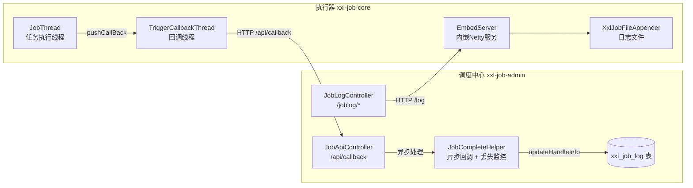
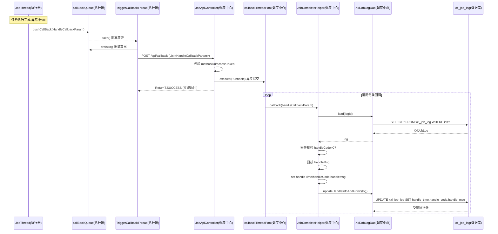
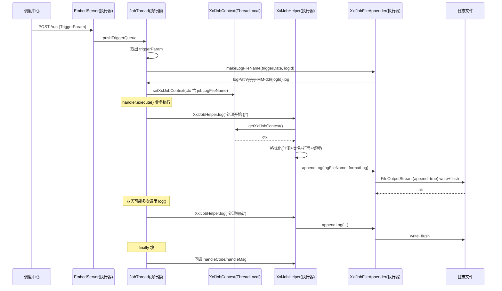
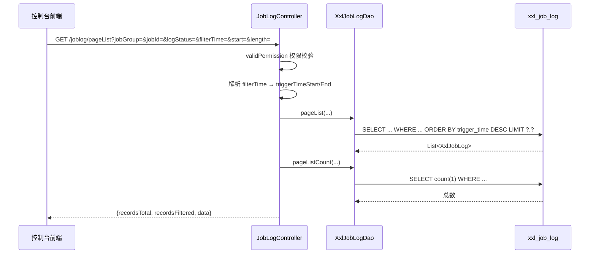
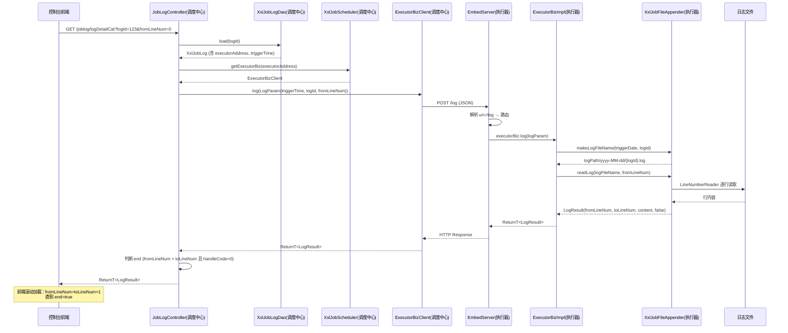
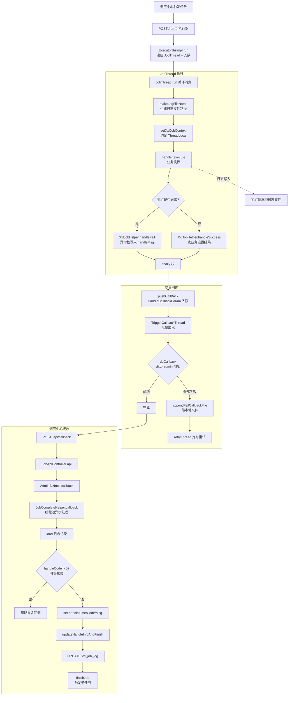

# XXL-Job 2.4.0 执行结果与日志机制源码分析

> 基于 xxl-job 2.4.0 源码深入分析任务执行结果的保存机制、执行日志的生成机制，以及控制台查询执行日志的接口调用链路。
> 所有代码片段均标注真实文件路径与行号，便于对照查阅。

---

## 目录

- [一、整体架构概览](#一整体架构概览)
- [二、任务执行结果保存机制](#二任务执行结果保存机制)
  - [2.1 执行器端：结果回传](#21-执行器端结果回传)
  - [2.2 调度中心端：接收与持久化](#22-调度中心端接收与持久化)
  - [2.3 结果保存时序图](#23-结果保存时序图)
  - [2.4 失败重试与丢失监控](#24-失败重试与丢失监控)
- [三、执行日志生成机制](#三执行日志生成机制)
  - [3.1 日志文件存储结构](#31-日志文件存储结构)
  - [3.2 日志上下文与写入链路](#32-日志上下文与写入链路)
  - [3.3 日志生成时序图](#33-日志生成时序图)
  - [3.4 日志读取接口](#34-日志读取接口)
- [四、控制台查询日志接口](#四控制台查询日志接口)
  - [4.1 接口总览](#41-接口总览)
  - [4.2 调度日志列表查询 `/joblog/pageList`](#42-调度日志列表查询-joblogpagelist)
  - [4.3 实时日志详情查询 `/joblog/logDetailCat`](#43-实时日志详情查询-jobloglogdetailcat)
  - [4.4 执行结果回调接口 `/api/callback`](#44-执行结果回调接口-apicallback)
  - [4.5 控制台查询日志时序图](#45-控制台查询日志时序图)
- [五、完整流程图](#五完整流程图)
- [六、核心数据结构](#六核心数据结构)
- [七、关键类与文件索引](#七关键类与文件索引)

---

## 一、整体架构概览

xxl-job 采用 **调度中心（admin） + 执行器（executor）** 的分布式架构，两者通过 HTTP（JSON）协议通信。



**两大核心机制：**

| 机制 | 数据流向 | 存储位置 |
|------|----------|----------|
| 执行结果保存 | 执行器 → 调度中心 → DB | `xxl_job_log` 表（handle_code/handle_msg/handle_time） |
| 执行日志生成 | 执行器业务代码 → 本地日志文件 | 执行器本地 `logPath/yyyy-MM-dd/{logId}.log` |

执行结果是结构化数据（成功/失败码 + 消息），落库于调度中心；执行日志是详细运行过程文本，存于执行器本地磁盘，调度中心按需实时拉取，**不落库**。

---

## 二、任务执行结果保存机制

执行结果保存分为「执行器端回传」和「调度中心端接收持久化」两个阶段。

### 2.1 执行器端：结果回传

#### 2.1.1 回调触发时机

任务执行线程 `JobThread` 在 `run()` 方法的 `finally` 块中，无论任务是正常完成、异常终止还是被杀掉，都会构造回调参数并入队。

> 文件：`xxl-job-core/src/main/java/com/xxl/job/core/thread/JobThread.java:205-225`

```java
} finally {
    if(triggerParam != null) {
        // callback handler info
        if (!toStop) {
            // common：正常执行完成
            TriggerCallbackThread.pushCallBack(new HandleCallbackParam(
                    triggerParam.getLogId(),
                    triggerParam.getLogDateTime(),
                    XxlJobContext.getXxlJobContext().getHandleCode(),   // 从上下文取出执行结果码
                    XxlJobContext.getXxlJobContext().getHandleMsg() )   // 从上下文取出执行消息
            );
        } else {
            // is killed：被强制终止
            TriggerCallbackThread.pushCallBack(new HandleCallbackParam(
                    triggerParam.getLogId(),
                    triggerParam.getLogDateTime(),
                    XxlJobContext.HANDLE_CODE_FAIL,
                    stopReason + " [job running, killed]" )
            );
        }
    }
}
```

关键点：`handleCode` 和 `handleMsg` 来自 `XxlJobContext`，由业务代码通过 `XxlJobHelper.handleSuccess()/handleFail()` 设置。

> 文件：`xxl-job-core/src/main/java/com/xxl/job/core/context/XxlJobContext.java:11-13`

```java
public static final int HANDLE_CODE_SUCCESS = 200;
public static final int HANDLE_CODE_FAIL = 500;
public static final int HANDLE_CODE_TIMEOUT = 502;
```

#### 2.1.2 回调队列（生产者-消费者解耦）

`TriggerCallbackThread` 维护一个线程安全的 `LinkedBlockingQueue`，将业务线程与回调发送线程解耦，避免阻塞任务执行。

> 文件：`xxl-job-core/src/main/java/com/xxl/job/core/thread/TriggerCallbackThread.java:37-41`

```java
private LinkedBlockingQueue<HandleCallbackParam> callBackQueue = new LinkedBlockingQueue<HandleCallbackParam>();
public static void pushCallBack(HandleCallbackParam callback){
    getInstance().callBackQueue.add(callback);
    logger.debug(">>>>>>>>>>> xxl-job, push callback request, logId:{}", callback.getLogId());
}
```

#### 2.1.3 批量回调发送

回调线程循环阻塞获取队列头部元素，再 `drainTo` 批量取出后续元素，一次性批量发送，提升吞吐量。

> 文件：`xxl-job-core/src/main/java/com/xxl/job/core/thread/TriggerCallbackThread.java:64-84`

```java
while(!toStop){
    try {
        HandleCallbackParam callback = getInstance().callBackQueue.take();   // 阻塞获取
        if (callback != null) {
            // 批量取出后续回调请求
            List<HandleCallbackParam> callbackParamList = new ArrayList<HandleCallbackParam>();
            int drainToNum = getInstance().callBackQueue.drainTo(callbackParamList);
            callbackParamList.add(callback);

            // 批量回调
            if (callbackParamList!=null && callbackParamList.size()>0) {
                doCallback(callbackParamList);
            }
        }
    } catch (Exception e) {
        if (!toStop) {
            logger.error(e.getMessage(), e);
        }
    }
}
```

#### 2.1.4 HTTP 调用调度中心

`doCallback` 遍历配置的所有调度中心地址（支持高可用多 admin），逐一尝试，任一成功即停止。

> 文件：`xxl-job-core/src/main/java/com/xxl/job/core/thread/TriggerCallbackThread.java:163-183`

```java
private void doCallback(List<HandleCallbackParam> callbackParamList){
    boolean callbackRet = false;
    // 遍历所有 admin 地址，任一成功即 break
    for (AdminBiz adminBiz: XxlJobExecutor.getAdminBizList()) {
        try {
            ReturnT<String> callbackResult = adminBiz.callback(callbackParamList);
            if (callbackResult!=null && ReturnT.SUCCESS_CODE == callbackResult.getCode()) {
                callbackLog(callbackParamList, "<br>----------- xxl-job job callback finish.");
                callbackRet = true;
                break;
            } else {
                callbackLog(callbackParamList, "<br>----------- xxl-job job callback fail, callbackResult:" + callbackResult);
            }
        } catch (Exception e) {
            callbackLog(callbackParamList, "<br>----------- xxl-job job callback error, errorMsg:" + e.getMessage());
        }
    }
    if (!callbackRet) {
        appendFailCallbackFile(callbackParamList);   // 全部失败则落本地文件，待重试
    }
}
```

底层 HTTP 客户端实现：

> 文件：`xxl-job-core/src/main/java/com/xxl/job/core/biz/client/AdminBizClient.java:36-38`

```java
@Override
public ReturnT<String> callback(List<HandleCallbackParam> callbackParamList) {
    return XxlJobRemotingUtil.postBody(addressUrl+"api/callback", accessToken, timeout, callbackParamList, String.class);
}
```

### 2.2 调度中心端：接收与持久化

#### 2.2.1 API 接口接收

调度中心通过统一 API 入口 `JobApiController` 接收执行器回调。

> 文件：`xxl-job-admin/src/main/java/com/xxl/job/admin/controller/JobApiController.java:38-69`

```java
@RequestMapping("/{uri}")
@ResponseBody
@PermissionLimit(limit=false)
public ReturnT<String> api(HttpServletRequest request, @PathVariable("uri") String uri, @RequestBody(required = false) String data) {

    // 校验请求方法、uri、accessToken
    if (!"POST".equalsIgnoreCase(request.getMethod())) { ... }
    if (XxlJobAdminConfig...getAccessToken()...equals(request.getHeader(XxlJobRemotingUtil.XXL_JOB_ACCESS_TOKEN))) { ... }

    // services mapping
    if ("callback".equals(uri)) {
        List<HandleCallbackParam> callbackParamList = GsonTool.fromJson(data, List.class, HandleCallbackParam.class);
        return adminBiz.callback(callbackParamList);
    } else if ("registry".equals(uri)) {
        ...
    } else if ("registryRemove".equals(uri)) {
        ...
    }
}
```

#### 2.2.2 异步线程池处理

`AdminBizImpl` 委托 `JobCompleteHelper` 处理，回调请求被提交到独立线程池异步执行，立即返回 `SUCCESS`，保证 HTTP 响应快速。

> 文件：`xxl-job-admin/src/main/java/com/xxl/job/admin/core/thread/JobCompleteHelper.java:32-56`

```java
// 回调处理线程池：核心2，最大20，队列3000
callbackThreadPool = new ThreadPoolExecutor(
        2, 20, 30L, TimeUnit.SECONDS,
        new LinkedBlockingQueue<Runnable>(3000),
        ...,
        new RejectedExecutionHandler() {
            @Override
            public void rejectedExecution(Runnable r, ThreadPoolExecutor executor) {
                r.run();   // 拒绝策略：调用者线程直接执行，避免丢失
                logger.warn(">>>>>>>>>>> xxl-job, callback too fast, match threadpool rejected handler(run now).");
            }
        });
```

> 文件：`xxl-job-admin/src/main/java/com/xxl/job/admin/core/thread/JobCompleteHelper.java:138-152`

```java
public ReturnT<String> callback(List<HandleCallbackParam> callbackParamList) {
    callbackThreadPool.execute(new Runnable() {
        @Override
        public void run() {
            for (HandleCallbackParam handleCallbackParam: callbackParamList) {
                ReturnT<String> callbackResult = callback(handleCallbackParam);
                logger.debug(">>>>>>>>> JobApiController.callback {}, handleCallbackParam={}, callbackResult={}",
                        (callbackResult.getCode()== ReturnT.SUCCESS_CODE?"success":"fail"), handleCallbackParam, callbackResult);
            }
        }
    });
    return ReturnT.SUCCESS;   // 立即返回，不等处理完成
}
```

#### 2.2.3 单条回调处理与持久化

核心逻辑：加载日志记录 → 幂等校验 → 拼接消息 → 更新数据库。

> 文件：`xxl-job-admin/src/main/java/com/xxl/job/admin/core/thread/JobCompleteHelper.java:154-180`

```java
private ReturnT<String> callback(HandleCallbackParam handleCallbackParam) {
    // 1. 校验日志记录存在
    XxlJobLog log = XxlJobAdminConfig.getAdminConfig().getXxlJobLogDao().load(handleCallbackParam.getLogId());
    if (log == null) {
        return new ReturnT<String>(ReturnT.FAIL_CODE, "log item not found.");
    }
    // 2. 幂等校验：避免重复回调（防止重复触发子任务等）
    if (log.getHandleCode() > 0) {
        return new ReturnT<String>(ReturnT.FAIL_CODE, "log repeate callback.");
    }

    // 3. 拼接处理消息
    StringBuffer handleMsg = new StringBuffer();
    if (log.getHandleMsg()!=null) {
        handleMsg.append(log.getHandleMsg()).append("<br>");
    }
    if (handleCallbackParam.getHandleMsg() != null) {
        handleMsg.append(handleCallbackParam.getHandleMsg());
    }

    // 4. 设置结果字段，保存
    log.setHandleTime(new Date());
    log.setHandleCode(handleCallbackParam.getHandleCode());
    log.setHandleMsg(handleMsg.toString());
    XxlJobCompleter.updateHandleInfoAndFinish(log);

    return ReturnT.SUCCESS;
}
```

最终落库 SQL：

> 文件：`xxl-job-admin/src/main/resources/mybatis-mapper/XxlJobLogMapper.xml:153-160`

```xml
<update id="updateHandleInfo">
    UPDATE xxl_job_log
    SET
        `handle_time`= #{handleTime},
        `handle_code`= #{handleCode},
        `handle_msg`= #{handleMsg}
    WHERE `id`= #{id}
</update>
```

`XxlJobCompleter.updateHandleInfoAndFinish()` 在更新结果后，还会调用 `finishJob()` 完成后续处理（如触发子任务）。

> 文件：`xxl-job-admin/src/main/java/com/xxl/job/admin/core/complete/XxlJobCompleter.java:38-39`

```java
return XxlJobAdminConfig.getAdminConfig().getXxlJobLogDao().updateHandleInfo(xxlJobLog);
```

### 2.3 结果保存时序图



### 2.4 失败重试与丢失监控

#### 2.4.1 执行器端失败重试

若所有调度中心地址回调均失败，回调参数序列化到本地文件，由独立的重试线程定期重发。

> 文件：`xxl-job-core/src/main/java/com/xxl/job/core/thread/TriggerCallbackThread.java:108-132`

```java
// retry
triggerRetryCallbackThread = new Thread(new Runnable() {
    @Override
    public void run() {
        while(!toStop){
            try {
                retryFailCallbackFile();   // 重试本地失败文件
            } catch (Exception e) { ... }
            try {
                TimeUnit.SECONDS.sleep(RegistryConfig.BEAT_TIMEOUT);   // 定时轮询
            } catch (InterruptedException e) { ... }
        }
    }
});
triggerRetryCallbackThread.setDaemon(true);
triggerRetryCallbackThread.setName("xxl-job, executor retry callback thread");
triggerRetryCallbackThread.start();
```

#### 2.4.2 调度中心丢失任务监控

`JobCompleteHelper` 内置监控线程，每 60 秒扫描一次：将「运行中（handle_code=0）超过 10 分钟」且「执行器心跳注册失败已离线」的调度记录主动标记为失败。

> 文件：`xxl-job-admin/src/main/java/com/xxl/job/admin/core/thread/JobCompleteHelper.java:74-108`

```java
// monitor
while (!toStop) {
    try {
        // 任务结果丢失处理：调度记录停留在 "运行中" 状态超过10min，且对应执行器心跳注册失败不在线，则将本地调度主动标记失败；
        Date losedTime = DateUtil.addMinutes(new Date(), -10);
        List<Long> losedJobIds  = XxlJobAdminConfig.getAdminConfig().getXxlJobLogDao().findLostJobIds(losedTime);

        if (losedJobIds!=null && losedJobIds.size()>0) {
            for (Long logId: losedJobIds) {
                XxlJobLog jobLog = new XxlJobLog();
                jobLog.setId(logId);
                jobLog.setHandleTime(new Date());
                jobLog.setHandleCode(ReturnT.FAIL_CODE);
                jobLog.setHandleMsg( I18nUtil.getString("joblog_lost_fail") );
                XxlJobCompleter.updateHandleInfoAndFinish(jobLog);
            }
        }
    } catch (Exception e) { ... }

    try {
        TimeUnit.SECONDS.sleep(60);   // 每 60s 扫描一次
    } catch (Exception e) { ... }
}
```

对应的丢失任务查询 SQL（通过 `LEFT JOIN xxl_job_registry` 判断执行器是否在线）：

> 文件：`xxl-job-admin/src/main/resources/mybatis-mapper/XxlJobLogMapper.xml:249-260`

```xml
<select id="findLostJobIds" resultType="long" >
    SELECT t.id
    FROM xxl_job_log t
        LEFT JOIN xxl_job_registry t2 ON t.executor_address = t2.registry_value
    WHERE
        t.trigger_code = 200
            AND t.handle_code = 0
            AND t.trigger_time <![CDATA[ <= ]]> #{losedTime}
            AND t2.id IS NULL;
</select>
```

---

## 三、执行日志生成机制

执行日志是业务代码运行过程中产生的详细文本，**存储于执行器本地磁盘**，调度中心查询时实时拉取，不落库。

### 3.1 日志文件存储结构

> 文件：`xxl-job-core/src/main/java/com/xxl/job/core/log/XxlJobFileAppender.java:18-51`

```java
/**
 * log base path
 * strut like:
 * 	---/
 * 	---/gluesource/
 * 	---/gluesource/10_1514171108000.js
 * 	---/2017-12-25/
 * 	---/2017-12-25/639.log
 * 	---/2017-12-25/821.log
 */
private static String logBasePath = "/data/applogs/xxl-job/jobhandler";
private static String glueSrcPath = logBasePath.concat("/gluesource");
```

| 要素 | 说明 |
|------|------|
| 默认根路径 | `/data/applogs/xxl-job/jobhandler`（可通过配置覆盖） |
| 日期目录 | `yyyy-MM-dd`（按触发日期分目录） |
| 文件名 | `{logId}.log`（logId 即 `xxl_job_log` 表主键） |
| 完整路径 | `logBasePath/yyyy-MM-dd/{logId}.log` |
| Glue 源码 | `logBasePath/gluesource/{jobId}_{updateTime}.js` |

日志文件名生成方法（注意 `SimpleDateFormat` 非静态，避免并发问题）：

> 文件：`xxl-job-core/src/main/java/com/xxl/job/core/log/XxlJobFileAppender.java:66-81`

```java
public static String makeLogFileName(Date triggerDate, long logId) {
    // filePath/yyyy-MM-dd
    SimpleDateFormat sdf = new SimpleDateFormat("yyyy-MM-dd");   // 避免并发问题，不可为 static
    File logFilePath = new File(getLogPath(), sdf.format(triggerDate));
    if (!logFilePath.exists()) {
        logFilePath.mkdir();
    }
    // filePath/yyyy-MM-dd/9999.log
    String logFileName = logFilePath.getPath()
            .concat(File.separator)
            .concat(String.valueOf(logId))
            .concat(".log");
    return logFileName;
}
```

### 3.2 日志上下文与写入链路

#### 3.2.1 任务执行前初始化上下文

`JobThread` 在执行任务前，根据 `triggerParam.getLogDateTime()`（触发时间戳）和 `logId` 生成日志文件名，并放入 `XxlJobContext`，再绑定到 `InheritableThreadLocal`（支持子线程继承）。

> 文件：`xxl-job-core/src/main/java/com/xxl/job/core/thread/JobThread.java:120-133`

```java
// log filename, like "logPath/yyyy-MM-dd/9999.log"
String logFileName = XxlJobFileAppender.makeLogFileName(new Date(triggerParam.getLogDateTime()), triggerParam.getLogId());
XxlJobContext xxlJobContext = new XxlJobContext(
        triggerParam.getJobId(),
        triggerParam.getExecutorParams(),
        logFileName,
        triggerParam.getBroadcastIndex(),
        triggerParam.getBroadcastTotal());

// init job context
XxlJobContext.setXxlJobContext(xxlJobContext);

// execute
XxlJobHelper.log("<br>----------- xxl-job job execute start -----------<br>----------- Param:" + xxlJobContext.getJobParam());
```

> 文件：`xxl-job-core/src/main/java/com/xxl/job/core/context/XxlJobContext.java:112-120`

```java
// InheritableThreadLocal：支持任务 handler 中产生的子线程也能写入同一日志
private static InheritableThreadLocal<XxlJobContext> contextHolder = new InheritableThreadLocal<XxlJobContext>();

public static void setXxlJobContext(XxlJobContext xxlJobContext){
    contextHolder.set(xxlJobContext);
}
public static XxlJobContext getXxlJobContext(){
    return contextHolder.get();
}
```

#### 3.2.2 业务代码写日志

业务代码通过 `XxlJobHelper.log()` 写日志，支持 `{}` 占位符。

> 文件：`xxl-job-core/src/main/java/com/xxl/job/core/context/XxlJobHelper.java:107-119`

```java
public static boolean log(String appendLogPattern, Object ... appendLogArguments) {
    FormattingTuple ft = MessageFormatter.arrayFormat(appendLogPattern, appendLogArguments);
    String appendLog = ft.getMessage();

    StackTraceElement callInfo = new Throwable().getStackTrace()[1];   // 获取调用方信息
    return logDetail(callInfo, appendLog);
}
```

#### 3.2.3 日志格式化与追加写入

`logDetail` 将调用方类名、方法名、行号、线程名拼入日志，再写入文件。

> 文件：`xxl-job-core/src/main/java/com/xxl/job/core/context/XxlJobHelper.java:142-170`

```java
private static boolean logDetail(StackTraceElement callInfo, String appendLog) {
    XxlJobContext xxlJobContext = XxlJobContext.getXxlJobContext();
    if (xxlJobContext == null) {
        return false;
    }

    StringBuffer stringBuffer = new StringBuffer();
    stringBuffer.append(DateUtil.formatDateTime(new Date())).append(" ")
            .append("["+ callInfo.getClassName() + "#" + callInfo.getMethodName() +"]").append("-")
            .append("["+ callInfo.getLineNumber() +"]").append("-")
            .append("["+ Thread.currentThread().getName() +"]").append(" ")
            .append(appendLog!=null?appendLog:"");
    String formatAppendLog = stringBuffer.toString();

    // appendlog
    String logFileName = xxlJobContext.getJobLogFileName();
    if (logFileName!=null && logFileName.trim().length()>0) {
        XxlJobFileAppender.appendLog(logFileName, formatAppendLog);
        return true;
    } else {
        logger.info(">>>>>>>>>>> {}", formatAppendLog);
        return false;
    }
}
```

**日志行格式：**
```
yyyy-MM-dd HH:mm:ss [ClassName#MethodName]-[LineNumber]-[ThreadName] 日志内容
```

#### 3.2.4 文件追加写入（同步）

> 文件：`xxl-job-core/src/main/java/com/xxl/job/core/log/XxlJobFileAppender.java:89-130`

```java
public static void appendLog(String logFileName, String appendLog) {
    if (logFileName==null || logFileName.trim().length()==0) {
        return;
    }
    File logFile = new File(logFileName);
    if (!logFile.exists()) {
        try {
            logFile.createNewFile();
        } catch (IOException e) {
            logger.error(e.getMessage(), e);
            return;
        }
    }

    if (appendLog == null) {
        appendLog = "";
    }
    appendLog += "\r\n";

    // 同步追加写入
    FileOutputStream fos = null;
    try {
        fos = new FileOutputStream(logFile, true);   // append=true
        fos.write(appendLog.getBytes("utf-8"));
        fos.flush();   // 每次写入后立即刷新，保证日志实时落地
    } catch (Exception e) {
        logger.error(e.getMessage(), e);
    } finally {
        if (fos != null) {
            try { fos.close(); } catch (IOException e) { logger.error(e.getMessage(), e); }
        }
    }
}
```

> 写入方式：**同步追加写入**，每次 `flush()`。无独立异步队列，但任务本身在独立 `JobThread` 中执行，不会阻塞调度。

### 3.3 日志生成时序图



### 3.4 日志读取接口

执行器端提供日志读取能力，按行号读取，返回 `[fromLineNum, toLineNum]` 区间内容。

> 文件：`xxl-job-core/src/main/java/com/xxl/job/core/biz/impl/ExecutorBizImpl.java:163-170`

```java
@Override
public ReturnT<LogResult> log(LogParam logParam) {
    // log filename: logPath/yyyy-MM-dd/9999.log
    String logFileName = XxlJobFileAppender.makeLogFileName(new Date(logParam.getLogDateTim()), logParam.getLogId());
    LogResult logResult = XxlJobFileAppender.readLog(logFileName, logParam.getFromLineNum());
    return new ReturnT<LogResult>(logResult);
}
```

> 文件：`xxl-job-core/src/main/java/com/xxl/job/core/log/XxlJobFileAppender.java:138-187`

```java
public static LogResult readLog(String logFileName, int fromLineNum){
    if (logFileName==null || logFileName.trim().length()==0) {
        return new LogResult(fromLineNum, 0, "readLog fail, logFile not found", true);
    }
    File logFile = new File(logFileName);
    if (!logFile.exists()) {
        return new LogResult(fromLineNum, 0, "readLog fail, logFile not exists", true);
    }

    StringBuffer logContentBuffer = new StringBuffer();
    int toLineNum = 0;
    LineNumberReader reader = null;
    try {
        reader = new LineNumberReader(new InputStreamReader(new FileInputStream(logFile), "utf-8"));
        String line = null;
        while ((line = reader.readLine())!=null) {
            toLineNum = reader.getLineNumber();        // [from, to], start as 1
            if (toLineNum >= fromLineNum) {
                logContentBuffer.append(line).append("\n");
            }
        }
    } catch (IOException e) { ... } finally { ... }

    LogResult logResult = new LogResult(fromLineNum, toLineNum, logContentBuffer.toString(), false);
    return logResult;
}
```

执行器内嵌 Netty 服务器将 `/log` 请求路由到 `ExecutorBizImpl.log()`：

> 文件：`xxl-job-core/src/main/java/com/xxl/job/core/server/EmbedServer.java:185-202`

```java
switch (uri) {
    case "/beat": return executorBiz.beat();
    case "/idleBeat": ... return executorBiz.idleBeat(idleBeatParam);
    case "/run": ... return executorBiz.run(triggerParam);
    case "/kill": ... return executorBiz.kill(killParam);
    case "/log":
        LogParam logParam = GsonTool.fromJson(requestData, LogParam.class);
        return executorBiz.log(logParam);
    default: ...
}
```

---

## 四、控制台查询日志接口

控制台查询日志分两类：
- **调度日志列表**（分页）：从 `xxl_job_log` 表查询，返回结构化调度记录
- **执行日志详情**（实时滚动）：通过调度中心转发，HTTP 调用执行器 `/log` 接口拉取文本日志

### 4.1 接口总览

> 文件：`xxl-job-admin/src/main/java/com/xxl/job/admin/controller/JobLogController.java`

| 接口路径 | HTTP方法 | 功能 | 数据来源 |
|----------|----------|------|----------|
| `/joblog` | GET | 日志列表页面入口 | 加载执行器列表 |
| `/joblog/pageList` | GET | 分页查询调度日志列表 | `xxl_job_log` 表 |
| `/joblog/logDetailPage` | GET | 日志详情页面入口 | `xxl_job_log` 表 |
| `/joblog/logDetailCat` | GET | 实时查询日志内容 | 执行器本地文件 |
| `/joblog/logKill` | POST | 终止运行中任务 | 调用执行器 `/kill` |
| `/joblog/clearLog` | POST | 清理过期日志 | 删除 `xxl_job_log` 表 |
| `/joblog/getJobsByGroup` | GET | 按执行器查询任务列表 | `xxl_job_info` 表 |

### 4.2 调度日志列表查询 `/joblog/pageList`

支持按执行器、任务、时间范围、状态筛选，返回 DataTables 格式。

> 文件：`xxl-job-admin/src/main/java/com/xxl/job/admin/controller/JobLogController.java:87-118`

```java
@RequestMapping("/pageList")
@ResponseBody
public Map<String, Object> pageList(HttpServletRequest request,
                                    @RequestParam(required = false, defaultValue = "0") int start,
                                    @RequestParam(required = false, defaultValue = "10") int length,
                                    int jobGroup, int jobId, int logStatus, String filterTime) {

    // 权限校验：普通用户仅能查询有权限的 jobGroup
    JobInfoController.validPermission(request, jobGroup);

    // 解析时间范围 "yyyy-MM-dd HH:mm:ss - yyyy-MM-dd HH:mm:ss"
    Date triggerTimeStart = null;
    Date triggerTimeEnd = null;
    if (filterTime!=null && filterTime.trim().length()>0) {
        String[] temp = filterTime.split(" - ");
        if (temp.length == 2) {
            triggerTimeStart = DateUtil.parseDateTime(temp[0]);
            triggerTimeEnd = DateUtil.parseDateTime(temp[1]);
        }
    }

    // 分页查询 + 计数
    List<XxlJobLog> list = xxlJobLogDao.pageList(start, length, jobGroup, jobId, triggerTimeStart, triggerTimeEnd, logStatus);
    int list_count = xxlJobLogDao.pageListCount(start, length, jobGroup, jobId, triggerTimeStart, triggerTimeEnd, logStatus);

    // 封装结果（DataTables 格式）
    Map<String, Object> maps = new HashMap<String, Object>();
    maps.put("recordsTotal", list_count);
    maps.put("recordsFiltered", list_count);
    maps.put("data", list);
    return maps;
}
```

**入参说明：**

| 参数 | 类型 | 说明 |
|------|------|------|
| start | int | 分页起始位置，默认 0 |
| length | int | 每页条数，默认 10 |
| jobGroup | int | 执行器分组 ID |
| jobId | int | 任务 ID |
| logStatus | int | 状态：1=成功, 2=失败, 3=运行中 |
| filterTime | String | 时间范围字符串 |

**对应 SQL（状态过滤逻辑）：**

> 文件：`xxl-job-admin/src/main/resources/mybatis-mapper/XxlJobLogMapper.xml:47-79`

```xml
<select id="pageList" resultMap="XxlJobLog">
    SELECT <include refid="Base_Column_List" />
    FROM xxl_job_log AS t
    <trim prefix="WHERE" prefixOverrides="AND | OR" >
        <if test="jobId==0 and jobGroup gt 0">
            AND t.job_group = #{jobGroup}
        </if>
        <if test="jobId gt 0">
            AND t.job_id = #{jobId}
        </if>
        <if test="triggerTimeStart != null">
            AND t.trigger_time <![CDATA[ >= ]]> #{triggerTimeStart}
        </if>
        <if test="triggerTimeEnd != null">
            AND t.trigger_time <![CDATA[ <= ]]> #{triggerTimeEnd}
        </if>
        <if test="logStatus == 1" >
            AND t.handle_code = 200                              <!-- 成功 -->
        </if>
        <if test="logStatus == 2" >
            AND (t.trigger_code NOT IN (0, 200) OR               <!-- 触发失败 或 -->
                 t.handle_code NOT IN (0, 200))                   <!-- 处理失败 -->
        </if>
        <if test="logStatus == 3" >
            AND t.trigger_code = 200 AND t.handle_code = 0        <!-- 触发成功但未处理完 -->
        </if>
    </trim>
    ORDER BY t.trigger_time DESC
    LIMIT #{offset}, #{pagesize}
</select>
```

### 4.3 实时日志详情查询 `/joblog/logDetailCat`

这是**控制台查询执行日志的核心接口**，实时从执行器拉取日志文件内容。

> 文件：`xxl-job-admin/src/main/java/com/xxl/job/admin/controller/JobLogController.java:136-162`

```java
@RequestMapping("/logDetailCat")
@ResponseBody
public ReturnT<LogResult> logDetailCat(long logId, int fromLineNum){
    try {
        // 1. 从 DB 加载日志基本信息，获取执行器地址和触发时间
        XxlJobLog jobLog = xxlJobLogDao.load(logId);
        if (jobLog == null) {
            return new ReturnT<LogResult>(ReturnT.FAIL_CODE, I18nUtil.getString("joblog_logid_unvalid"));
        }

        // 2. 获取执行器客户端
        ExecutorBiz executorBiz = XxlJobScheduler.getExecutorBiz(jobLog.getExecutorAddress());
        // 3. 远程调用执行器 /log 接口拉取日志
        ReturnT<LogResult> logResult = executorBiz.log(new LogParam(jobLog.getTriggerTime().getTime(), logId, fromLineNum));

        // 4. 判断是否已到日志末尾
        if (logResult.getContent()!=null && logResult.getContent().getFromLineNum() > logResult.getContent().getToLineNum()) {
            if (jobLog.getHandleCode() > 0) {     // 任务已结束 + 无新日志 => 已到末尾
                logResult.getContent().setEnd(true);
            }
        }
        return logResult;
    } catch (Exception e) {
        logger.error(e.getMessage(), e);
        return new ReturnT<LogResult>(ReturnT.FAIL_CODE, e.getMessage());
    }
}
```

**入参：**

| 参数 | 类型 | 说明 |
|------|------|------|
| logId | long | 调度日志 ID（`xxl_job_log` 主键） |
| fromLineNum | int | 起始行号（从该行开始读取） |

**返回值 `ReturnT<LogResult>` 结构：**

```java
ReturnT<LogResult> {
    code: 200,                  // 返回码
    msg: null,                  // 消息
    content: LogResult {
        fromLineNum: int,       // 本次起始行号
        toLineNum: int,         // 本次结束行号
        logContent: String,     // 日志文本内容
        end: boolean            // 是否已到日志文件末尾
    }
}
```

调度中心调用执行器使用的客户端：

> 文件：`xxl-job-core/src/main/java/com/xxl/job/core/biz/client/ExecutorBizClient.java:51-54`

```java
@Override
public ReturnT<LogResult> log(LogParam logParam) {
    return XxlJobRemotingUtil.postBody(addressUrl + "log", accessToken, timeout, logParam, LogResult.class);
}
```

执行器端 `EmbedServer` 收到 `/log` 请求后路由到 `ExecutorBizImpl.log()`（见 [3.4 日志读取接口](#34-日志读取接口)）。

**注意：** 日志**不落库**，每次前端查询都实时从执行器拉取最新内容。前端通过滚动增加 `fromLineNum` 实现日志滚动加载，直到 `end=true`。

### 4.4 执行结果回调接口 `/api/callback`

执行器主动上报执行结果的接口（区别于控制台查询接口，这是执行器→调度中心方向的调用）。

> 文件：`xxl-job-admin/src/main/java/com/xxl/job/admin/controller/JobApiController.java:57-59`

```java
if ("callback".equals(uri)) {
    List<HandleCallbackParam> callbackParamList = GsonTool.fromJson(data, List.class, HandleCallbackParam.class);
    return adminBiz.callback(callbackParamList);
}
```

**入参（JSON 数组）：**

```json
[
  {
    "logId": 123,
    "logDateTim": 1688688000000,
    "handleCode": 200,
    "handleMsg": "执行成功"
  }
]
```

处理流程见 [2.2 调度中心端：接收与持久化](#22-调度中心端接收与持久化)。

### 4.5 控制台查询日志时序图

#### 4.5.1 调度日志列表查询



#### 4.5.2 实时执行日志查询



---

## 五、完整流程图

### 5.1 任务执行与结果保存整体流程



### 5.2 执行日志生成与查询流程


---

## 六、核心数据结构

### 6.1 `xxl_job_log` 表字段

| 字段 | 类型 | 说明 |
|------|------|------|
| `id` | bigint(20) | 主键，即 logId |
| `job_group` | int(11) | 执行器分组 ID |
| `job_id` | int(11) | 任务 ID |
| `executor_address` | varchar(255) | 执行器地址 |
| `executor_handler` | varchar(255) | 执行器处理器名 |
| `executor_param` | text | 执行参数 |
| `executor_sharding_param` | varchar(20) | 分片参数 |
| `executor_fail_retry_count` | int(11) | 失败重试次数 |
| `trigger_time` | datetime | **触发时间**（用于生成日志文件路径） |
| `trigger_code` | int(11) | 触发结果码：200=成功 |
| `trigger_msg` | text | 触发信息 |
| `handle_time` | datetime | **处理完成时间**（回调时设置） |
| `handle_code` | int(11) | **处理结果码**：0=运行中, 200=成功, 500=失败, 502=超时 |
| `handle_msg` | text | **处理结果消息** |
| `alarm_status` | int(11) | 告警状态：0=未告警, 1=已告警 |

**关键字段生命周期：**
1. 任务触发时：`INSERT`，仅写入 `job_group/job_id/trigger_time/trigger_code/handle_code(=0)`
2. 触发成功更新执行器信息：`updateTriggerInfo` 写入 executor_address 等
3. 回调时：`updateHandleInfo` 写入 `handle_time/handle_code/handle_msg`

> 文件：`xxl-job-admin/src/main/resources/mybatis-mapper/XxlJobLogMapper.xml:120-160`

### 6.2 `HandleCallbackParam` 回调参数

> 文件：`xxl-job-core/src/main/java/com/xxl/job/core/biz/model/HandleCallbackParam.java:8-23`

```java
public class HandleCallbackParam implements Serializable {
    private long logId;          // 调度日志 ID（xxl_job_log 主键）
    private long logDateTim;     // 日志时间戳（用于生成日志文件路径）
    private int handleCode;      // 处理结果码：200/500/502
    private String handleMsg;    // 处理结果消息
}
```

### 6.3 `LogResult` / `LogParam` 日志查询参数与结果

```java
LogParam {
    long logDateTim;    // 触发时间戳（定位日志文件目录）
    long logId;         // 日志 ID（定位日志文件名）
    int fromLineNum;    // 起始行号
}

LogResult {
    int fromLineNum;    // 本次起始行
    int toLineNum;      // 本次结束行
    String logContent;  // 日志文本
    boolean end;        // 是否到末尾
}
```

---

## 七、关键类与文件索引

### 7.1 执行器端（xxl-job-core）

| 文件 | 职责 |
|------|------|
| `core/thread/JobThread.java` | 任务执行线程，初始化上下文、执行 handler、finally 回调 |
| `core/thread/TriggerCallbackThread.java` | 回调队列、批量回调、失败重试 |
| `core/biz/client/AdminBizClient.java` | 调度中心 HTTP 客户端（callback 等） |
| `core/biz/impl/ExecutorBizImpl.java` | 执行器服务实现（run/kill/log） |
| `core/biz/model/HandleCallbackParam.java` | 回调参数模型 |
| `core/biz/model/LogParam.java` | 日志查询入参 |
| `core/biz/model/LogResult.java` | 日志查询结果 |
| `core/context/XxlJobContext.java` | 任务上下文（ThreadLocal，含 jobLogFileName、handleCode） |
| `core/context/XxlJobHelper.java` | 日志写入与结果设置工具 |
| `core/log/XxlJobFileAppender.java` | 日志文件路径生成、追加写入、按行读取 |
| `core/server/EmbedServer.java` | 内嵌 Netty HTTP 服务器，路由 /run /kill /log 等请求 |

### 7.2 调度中心端（xxl-job-admin）

| 文件 | 职责 |
|------|------|
| `controller/JobLogController.java` | 控制台日志查询控制器（/joblog/*） |
| `controller/JobApiController.java` | 执行器 API 入口（/api/callback、/api/registry） |
| `service/impl/AdminBizImpl.java` | 业务接口实现，委托 JobCompleteHelper |
| `core/thread/JobCompleteHelper.java` | 异步回调处理 + 丢失任务监控 |
| `core/complete/XxlJobCompleter.java` | 任务完成处理（更新结果 + 触发子任务） |
| `dao/XxlJobLogDao.java` | 日志 DAO 接口 |
| `resources/mybatis-mapper/XxlJobLogMapper.xml` | MyBatis SQL 映射 |
| `core/model/XxlJobLog.java` | 调度日志实体类 |
| `core/scheduler/XxlJobScheduler.java` | 调度器，管理 ExecutorBiz 客户端 |

---

## 总结

1. **执行结果保存**：执行器 `JobThread` finally 块 → `TriggerCallbackThread` 队列 → 批量 HTTP POST `/api/callback` → 调度中心 `JobCompleteHelper` 异步线程池 → 幂等校验 → `UPDATE xxl_job_log` 写入 `handle_time/handle_code/handle_msg`。
2. **执行日志生成**：`JobThread` 执行前 `makeLogFileName` 生成路径 → 存入 `XxlJobContext`（InheritableThreadLocal） → 业务代码 `XxlJobHelper.log()` → `XxlJobFileAppender.appendLog()` 同步追加写入本地文件 `logPath/yyyy-MM-dd/{logId}.log`。
3. **控制台查询执行日志**：核心接口 `/joblog/logDetailCat`（`JobLogController.java:136`），前端传入 `logId + fromLineNum`，调度中心从 DB 取出 `executorAddress + triggerTime`，通过 `ExecutorBizClient` HTTP 调用执行器 `/log`，执行器 `ExecutorBizImpl.log()` 读取本地日志文件按行返回，**日志不落库，实时拉取**。

| 维度 | 执行结果 | 执行日志 |
|------|----------|----------|
| 生成方 | 业务代码设置 handleCode | 业务代码调用 `XxlJobHelper.log()` |
| 传输方 | 执行器主动回调 admin | admin 按需拉取 executor |
| 存储方 | 调度中心数据库 `xxl_job_log` | 执行器本地磁盘文件 |
| 查询接口 | `/joblog/pageList`（列表） | `/joblog/logDetailCat`（实时详情） |
| 接收接口 | `/api/callback`（执行器→admin） | `/log`（admin→执行器） |
