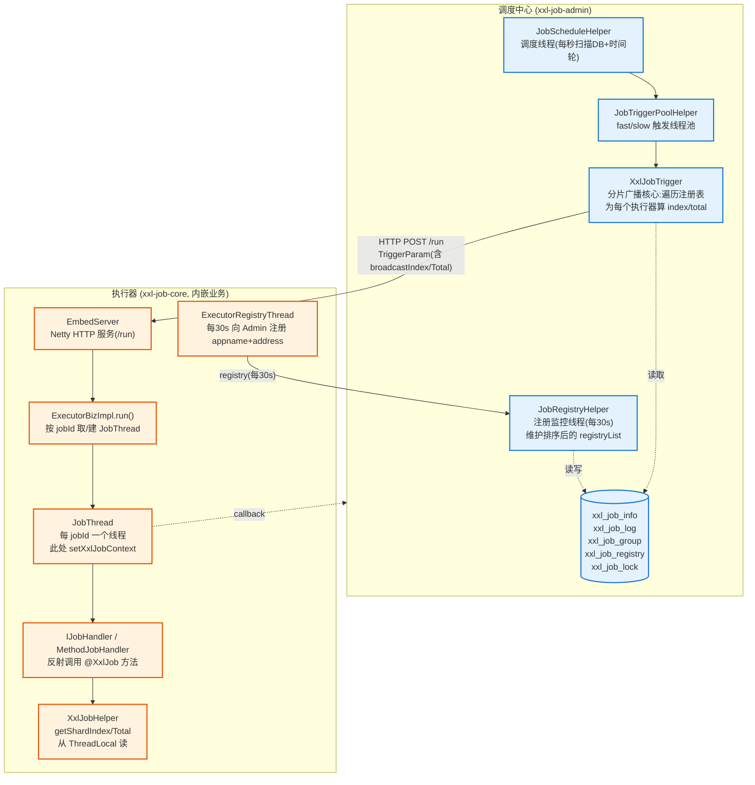
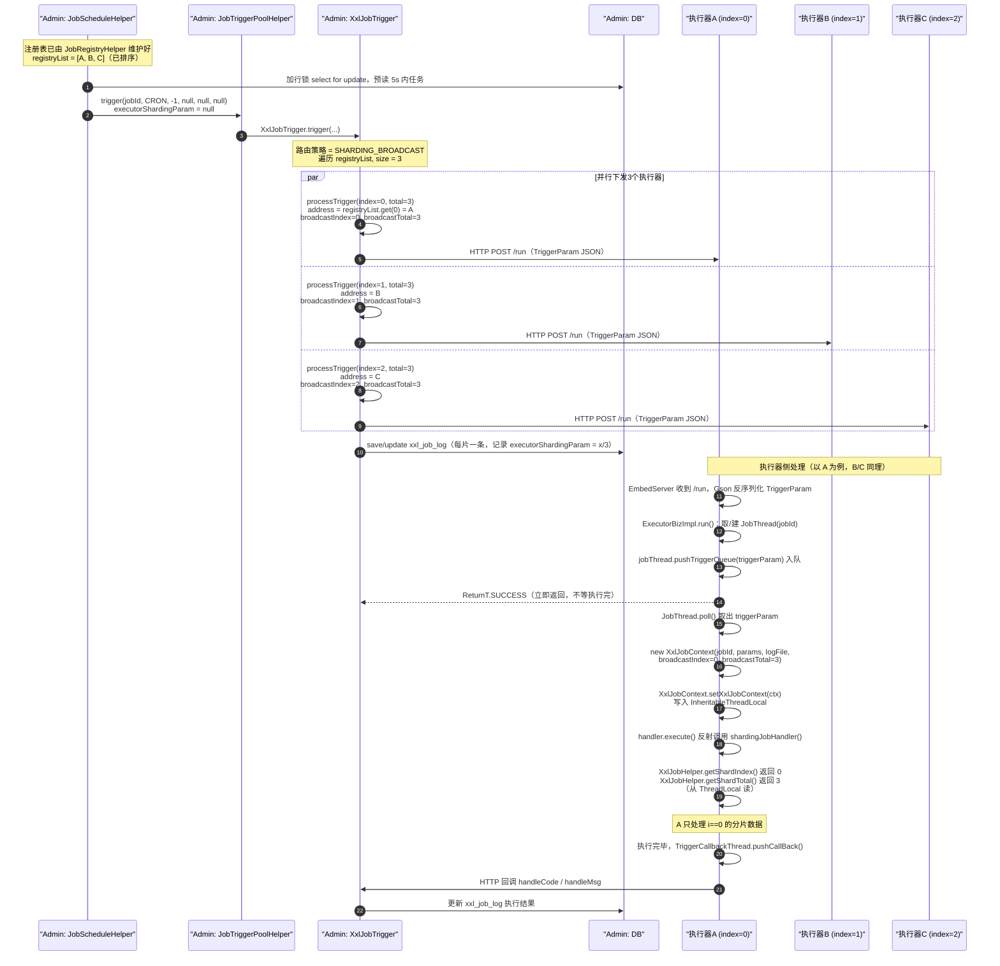
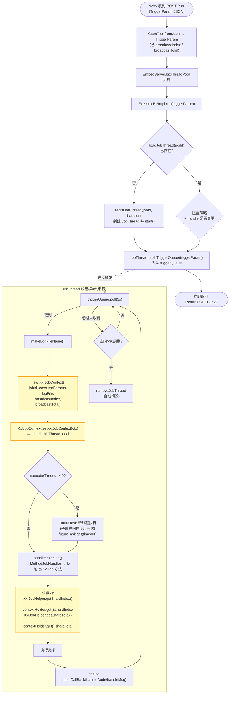
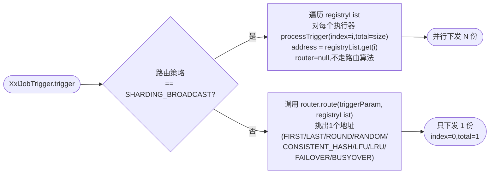

# XXL-JOB 2.4.0 分片广播任务实现原理深度源码分析

> 分析对象：xxl-job 2.4.0 源码
> 核心问题：**为什么在执行器（Executor）的业务代码里，只需调用 `XxlJobHelper.getShardIndex()` / `getShardTotal()`，就能拿到"当前执行器是第几片、一共几片"？**

---

## 一、一句话结论

分片序号 `shardIndex` 和总分片数 `shardTotal` **并不是执行器自己算出来的**，而是由 **调度中心（Admin）在触发"分片广播（SHARDING_BROADCAST）"任务时计算好**，随调度参数 `TriggerParam`（字段 `broadcastIndex` / `broadcastTotal`）通过 HTTP 下发给执行器；执行器收到后在真正执行 `JobHandler` 之前，把它们写进 `XxlJobContext` 的 `InheritableThreadLocal` 里。业务方法里调用的 `XxlJobHelper.getShardIndex()`，本质就是从这个 ThreadLocal 中把值读出来。

所以分片信息的完整生命周期是：

```
Admin 计算分片 → 随 TriggerParam 下发 → 执行器解析 → 写入 ThreadLocal(XxlJobContext) → 业务代码经 XxlJobHelper 读取
```

---

## 二、整体架构总览



---

## 三、核心数据结构与"上下文"机制

要理解整条链路，先看三个最关键的类：`XxlJobHelper`、`XxlJobContext`、`TriggerParam`。

### 3.1 `XxlJobContext` —— 分片信息的"容器" + ThreadLocal

文件：`xxl-job-core/src/main/java/com/xxl/job/core/context/XxlJobContext.java`

```java
public class XxlJobContext {
    public static final int HANDLE_CODE_SUCCESS = 200;
    public static final int HANDLE_CODE_FAIL = 500;
    public static final int HANDLE_CODE_TIMEOUT = 502;

    private final long jobId;            // 任务ID
    private final String jobParam;       // 任务参数
    private final String jobLogFileName;  // 日志文件名

    // ---------------------- for shard ----------------------
    private final int shardIndex;        // 当前分片序号(0-based)
    private final int shardTotal;        // 总分片数

    private int handleCode;              // 执行结果码
    private String handleMsg;            // 执行结果信息

    public XxlJobContext(long jobId, String jobParam, String jobLogFileName,
                         int shardIndex, int shardTotal) { ... }

    // ---------------------- tool ----------------------
    // 关键:InheritableThreadLocal,支持业务里起子线程时子线程也能读到同一份上下文
    private static InheritableThreadLocal<XxlJobContext> contextHolder =
            new InheritableThreadLocal<XxlJobContext>();

    public static void setXxlJobContext(XxlJobContext xxlJobContext){
        contextHolder.set(xxlJobContext);
    }
    public static XxlJobContext getXxlJobContext(){
        return contextHolder.get();
    }
}
```

**关键点：**

1. `shardIndex` / `shardTotal` 是 `final` 字段，构造时写入，之后不可变——值是从外部（调度参数）传进来的。
2. 容器本身存在 `InheritableThreadLocal` 里。这意味着：业务 `JobHandler` 里如果自己 `new Thread(...)` 或用线程池提交子任务，**子线程也能继承到这份 context**（注意：线程池场景下复用线程会继承"创建线程那一刻"的值，存在坑，见第十一节）。
3. 这是一个**进程内、按线程**的上下文，不是全局静态变量——所以同一台执行器上不同 `jobId` 的并发执行互不干扰。

### 3.2 `XxlJobHelper` —— 业务侧的"读取门面"

文件：`xxl-job-core/src/main/java/com/xxl/job/core/context/XxlJobHelper.java`

业务代码里能调用的 `getShardIndex()` / `getShardTotal()`，实现极其简单——就是从 ThreadLocal 里取 context 再读字段：

```java
public static int getShardIndex() {
    XxlJobContext xxlJobContext = XxlJobContext.getXxlJobContext();  // 从 ThreadLocal 取
    if (xxlJobContext == null) {
        return -1;    // 没有上下文时返回 -1(说明当前线程不是 JobThread 调度进来的)
    }
    return xxlJobContext.getShardIndex();
}

public static int getShardTotal() {
    XxlJobContext xxlJobContext = XxlJobContext.getXxlJobContext();
    if (xxlJobContext == null) {
        return -1;
    }
    return xxlJobContext.getShardTotal();
}
```

`XxlJobHelper` 还提供了 `getJobId()` / `getJobParam()` / `log()` / `handleSuccess()` / `handleFail()` 等，全部都是从同一个 `XxlJobContext` 里读或写。**它本身不存任何分片数据**，纯粹是 `XxlJobContext` 的静态门面。

所以问题的另一半变成：**`XxlJobContext` 是谁、在什么时机、用什么值构造并 `set` 进 ThreadLocal 的？** —— 答案在执行器的 `JobThread` 里（见第七节）。

### 3.3 `TriggerParam` —— 调度中心下发给执行器的"调度参数"

文件：`xxl-job-core/src/main/java/com/xxl/job/core/biz/model/TriggerParam.java`

```java
public class TriggerParam implements Serializable {
    private int jobId;
    private String executorHandler;     // JobHandler 名称(如 "shardingJobHandler")
    private String executorParams;      // 任务参数
    private String executorBlockStrategy;
    private int executorTimeout;
    private long logId;                 // 本次调度的日志ID
    private long logDateTime;
    private String glueType;
    private String glueSource;
    private long glueUpdatetime;

    // ===== 分片广播专属字段 =====
    private int broadcastIndex;         // 当前分片序号
    private int broadcastTotal;         // 总分片数
    ...
}
```

`broadcastIndex` / `broadcastTotal` 就是分片信息在网络传输时的载体。它们由调度中心写入（见第六节 `XxlJobTrigger.processTrigger`），执行器读出后塞进 `XxlJobContext`（见第七节 `JobThread`）。**这两个 int 就是"分片"在分布式节点间流动的全部信息量**。

---

## 四、前置：执行器如何把自己注册到调度中心

分片广播依赖"调度中心知道当前有哪些执行器实例在线"。这部分由注册机制完成。

### 4.1 执行器侧：定时上报

执行器启动入口（Spring Boot 场景）：`XxlJobSpringExecutor.afterSingletonsInstantiated()`
→ `super.start()`（`XxlJobExecutor.start()`）
→ `initEmbedServer(...)` → `EmbedServer.start(...)` → `startRegistry(appname, address)`
→ `ExecutorRegistryThread.start(appname, address)`

文件：`xxl-job-core/src/main/java/com/xxl/job/core/thread/ExecutorRegistryThread.java`

```java
// 守护线程,循环上报
while (!toStop) {
    RegistryParam registryParam = new RegistryParam(
        RegistryConfig.RegistType.EXECUTOR.name(), appname, address);  // appname + "http://ip:port/"
    for (AdminBiz adminBiz: XxlJobExecutor.getAdminBizList()) {
        ReturnT<String> registryResult = adminBiz.registry(registryParam);
        if (registryResult!=null && ReturnT.SUCCESS_CODE == registryResult.getCode()) {
            break;   // 任一 admin 注册成功即停止向其他 admin 重试
        }
    }
    TimeUnit.SECONDS.sleep(RegistryConfig.BEAT_TIMEOUT);   // 30s 上报一次
}
```

- 上报间隔 `BEAT_TIMEOUT = 30s`（`RegistryConfig`）。
- 注册内容 = `appname`（执行器分组标识） + `address`（形如 `http://192.168.x.x:9999/`）。

### 4.2 调度中心侧：维护"排序后"的注册表

文件：`xxl-job-admin/src/main/java/com/xxl/job/admin/core/thread/JobRegistryHelper.java`

收到注册时异步写表 `xxl_job_registry`；同时有一个 `registryMonitorThread` 每 30s 做一次"刷新在线地址列表"：

```java
// 1. 清理超过 DEAD_TIMEOUT(90s) 未续约的死地址
List<Integer> ids = xxlJobRegistryDao.findDead(DEAD_TIMEOUT, new Date());
xxlJobRegistryDao.removeDead(ids);

// 2. 查出所有存活注册,按 appname 分组,构建 appAddressMap
HashMap<String, List<String>> appAddressMap = new HashMap<>();
List<XxlJobRegistry> list = xxlJobRegistryDao.findAll(DEAD_TIMEOUT, new Date());
for (XxlJobRegistry item: list) {
    if (EXECUTOR.equals(item.getRegistryGroup())) {
        String appname = item.getRegistryKey();
        List<String> registryList = appAddressMap.computeIfAbsent(appname, k -> new ArrayList<>());
        if (!registryList.contains(item.getRegistryValue())) {
            registryList.add(item.getRegistryValue());
        }
        appAddressMap.put(appname, registryList);
    }
}

// 3. 刷新每个分组的地址列表,并【排序】后写回 xxl_job_group.addressList
for (XxlJobGroup group: groupList) {
    List<String> registryList = appAddressMap.get(group.getAppname());
    if (registryList!=null && !registryList.isEmpty()) {
        Collections.sort(registryList);          // ★ 关键:排序保证 index↔执行器映射稳定
        // 拼成逗号分隔字符串 addressListStr
    }
    group.setAddressList(addressListStr);
    xxlJobGroupDao.update(group);
}
```

**为什么必须排序？** 分片广播时 `index = 在列表中的下标`。如果不排序，`xxl_job_registry` 查询顺序可能不稳定，导致同一个执行器在不同调度周期拿到不同的 `index`，分片就会错乱。`Collections.sort(registryList)` 按 address 字符串排序，保证**只要在线集合不变，每个执行器拿到的 index 就稳定不变**。

`XxlJobGroup` 取注册表的方法（按逗号切分 `addressList`）：

文件：`xxl-job-admin/src/main/java/com/xxl/job/admin/core/model/XxlJobGroup.java`

```java
public List<String> getRegistryList() {
    if (addressList!=null && addressList.trim().length()>0) {
        registryList = new ArrayList<>(Arrays.asList(addressList.split(",")));
    }
    return registryList;
}
```

---

## 五、调度中心：什么时候触发分片广播任务

文件：`xxl-job-admin/src/main/java/com/xxl/job/admin/core/thread/JobScheduleHelper.java`

调度中心启动时 `XxlJobScheduler.init()` 会拉起 `JobScheduleHelper`，它有两个线程：

1. **`scheduleThread`**：每秒扫描 DB（带 `select * from xxl_job_lock where lock_name='schedule_lock' for update` 行锁，保证多 admin 集群只有一个在调度），预读未来 5s 内要触发的任务，把"到点"的任务推给触发线程池、把"5s 内要到点"的放进时间轮。

```java
// 到点(<5s过期)直接触发
JobTriggerPoolHelper.trigger(jobInfo.getId(), TriggerTypeEnum.CRON, -1, null, null, null);
```

2. **`ringThread`**：每秒拨动时间轮，到刻度的 jobId 调 `JobTriggerPoolHelper.trigger(...)`。

注意这里 `executorShardingParam` 传的是 `null`——**分片参数由谁出，交给 `XxlJobTrigger` 根据任务的路由策略自行决定**。

### 触发线程池

文件：`xxl-job-admin/src/main/java/com/xxl/job/admin/core/thread/JobTriggerPoolHelper.java`

```java
// 根据"近1分钟该 job 触发是否频繁超时"选择 fast / slow 线程池
ThreadPoolExecutor triggerPool_ = fastTriggerPool;
if (jobTimeoutCount!=null && jobTimeoutCount.get() > 10) {
    triggerPool_ = slowTriggerPool;   // 慢任务隔离,避免拖垮快任务
}
triggerPool_.execute(() -> {
    XxlJobTrigger.trigger(jobId, triggerType, failRetryCount, executorShardingParam, executorParam, addressList);
});
```

---

## 六、★ 分片广播的核心：`XxlJobTrigger.trigger`（调度中心侧）

文件：`xxl-job-admin/src/main/java/com/xxl/job/admin/core/trigger/XxlJobTrigger.java`

这是回答"分片 index/total 怎么算出来的"的**最关键代码**。

### 6.1 入口：判断是否分片广播并遍历执行器

```java
public static void trigger(int jobId, TriggerTypeEnum triggerType, int failRetryCount,
                           String executorShardingParam, String executorParam, String addressList) {
    // 1. 加载任务信息、执行器分组
    XxlJobInfo jobInfo = ...loadById(jobId);
    XxlJobGroup group  = ...load(jobInfo.getJobGroup());
    if (addressList!=null && addressList.trim().length()>0) {   // 手动指定地址时覆盖
        group.setAddressType(1);
        group.setAddressList(addressList.trim());
    }

    // 2. 解析外部传入的分片参数(格式 "index/total"),通常为 null
    int[] shardingParam = null;
    if (executorShardingParam!=null){
        String[] shardingArr = executorShardingParam.split("/");   // 如 "0/3"
        if (shardingArr.length==2 && isNumeric(shardingArr[0]) && isNumeric(shardingArr[1])) {
            shardingParam = new int[]{ Integer.valueOf(shardingArr[0]), Integer.valueOf(shardingArr[1]) };
        }
    }

    // 3. ★ 分片广播分支
    if (ExecutorRouteStrategyEnum.SHARDING_BROADCAST == routeStrategy
            && group.getRegistryList()!=null && !group.getRegistryList().isEmpty()
            && shardingParam==null) {
        // 遍历注册表中的每个执行器,index=下标,total=总数
        for (int i = 0; i < group.getRegistryList().size(); i++) {
            processTrigger(group, jobInfo, finalFailRetryCount, triggerType,
                           i, group.getRegistryList().size());   // index=i, total=size
        }
    } else {
        // 非分片广播,或指定了具体分片(如失败重试指定 "0/3")
        if (shardingParam == null) {
            shardingParam = new int[]{0, 1};   // 默认 index=0,total=1
        }
        processTrigger(group, jobInfo, finalFailRetryCount, triggerType,
                       shardingParam[0], shardingParam[1]);
    }
}
```

**核心逻辑解读：**

- 当路由策略 = `SHARDING_BROADCAST`（分片广播）时，遍历注册表 `registryList`，**对每一个执行器调用一次 `processTrigger`，把它的下标 `i` 作为 `index`，把列表长度 `size` 作为 `total`**。
- 因此：`index ∈ [0, total)`，且每个执行器收到一个唯一的 `index`；`total` 对所有执行器一致（= 在线执行器实例数）。
- 比如 3 个执行器在线，注册表为 `[http://a, http://b, http://c]`：
  - 给 `a` 发：`index=0, total=3`
  - 给 `b` 发：`index=1, total=3`
  - 给 `c` 发：`index=2, total=3`
- `executorShardingParam` 不为 `null` 的场景：失败重试。`JobCompleteHelper` 重试某次失败调度时，会把 `log` 里记录的 `executorShardingParam`（如 `"1/3"`）传回来，只重试那一个分片，而不是再广播一次。

### 6.2 `processTrigger`：构造 TriggerParam 并选址下发

```java
private static void processTrigger(XxlJobGroup group, XxlJobInfo jobInfo, int finalFailRetryCount,
                                   TriggerTypeEnum triggerType, int index, int total) {
    ExecutorRouteStrategyEnum routeEnum = ...match(jobInfo.getExecutorRouteStrategy(), null);
    // 分片参数字符串(用于日志展示),如 "0/3"
    String shardingParam = (SHARDING_BROADCAST==routeEnum)
            ? String.valueOf(index).concat("/").concat(String.valueOf(total)) : null;

    // 1. 生成调度日志 logId
    XxlJobLog jobLog = new XxlJobLog();
    ...save(jobLog);

    // 2. 构造 TriggerParam
    TriggerParam triggerParam = new TriggerParam();
    triggerParam.setJobId(jobInfo.getId());
    triggerParam.setExecutorHandler(jobInfo.getExecutorHandler());
    triggerParam.setExecutorParams(jobInfo.getExecutorParam());
    triggerParam.setExecutorBlockStrategy(jobInfo.getExecutorBlockStrategy());
    triggerParam.setExecutorTimeout(jobInfo.getExecutorTimeout());
    triggerParam.setLogId(jobLog.getId());
    triggerParam.setLogDateTime(jobLog.getTriggerTime().getTime());
    triggerParam.setGlueType(...);
    triggerParam.setGlueSource(...);
    triggerParam.setGlueUpdatetime(...);
    // ★ 把分片信息塞进调度参数
    triggerParam.setBroadcastIndex(index);    // 传给执行器
    triggerParam.setBroadcastTotal(total);    // 传给执行器

    // 3. 选址:分片广播直接按下标取地址(不走 router,因为 SHARDING_BROADCAST 的 router 是 null)
    String address = null;
    if (group.getRegistryList()!=null && !group.getRegistryList().isEmpty()) {
        if (SHARDING_BROADCAST == routeEnum) {
            if (index < group.getRegistryList().size()) {
                address = group.getRegistryList().get(index);   // ★ 第 index 个执行器
            } else {
                address = group.getRegistryList().get(0);       // 边界兜底
            }
        } else {
            // 其他路由策略走 router.route(...)
            address = routeEnum.getRouter().route(triggerParam, group.getRegistryList()).getContent();
        }
    }

    // 4. 远程触发执行器
    ReturnT<String> triggerResult = (address != null)
            ? runExecutor(triggerParam, address)
            : new ReturnT<>(FAIL_CODE, null);

    // 5. 记录调度日志
    jobLog.setExecutorAddress(address);
    jobLog.setExecutorShardingParam(shardingParam);
    jobLog.setTriggerCode(triggerResult.getCode());
    ...updateTriggerInfo(jobLog);
}
```

**关键点：**

- 分片广播时 `address = registryList.get(index)`——**直接按下标取地址，不走路由策略 `router`**。这也解释了为什么 `ExecutorRouteStrategyEnum.SHARDING_BROADCAST` 的 `router` 字段是 `null`：

文件：`xxl-job-admin/src/main/java/com/xxl/job/admin/core/route/ExecutorRouteStrategyEnum.java`

```java
SHARDING_BROADCAST(I18nUtil.getString("jobconf_route_shard"), null);  // router = null
```

分片广播不需要"挑一个执行器"，它要"每个执行器都发一次"，选址逻辑直接内联在 `processTrigger` 里了。

- `broadcastIndex` / `broadcastTotal` 通过 `TriggerParam` 序列化后随 HTTP body 下发。

### 6.3 远程触发：HTTP 调用执行器

```java
public static ReturnT<String> runExecutor(TriggerParam triggerParam, String address){
    ExecutorBiz executorBiz = XxlJobScheduler.getExecutorBiz(address);  // 缓存 ExecutorBizClient
    return executorBiz.run(triggerParam);
}
```

`XxlJobScheduler.getExecutorBiz(address)` 用 `ConcurrentMap` 缓存了每个 address 对应的 `ExecutorBizClient`。

文件：`xxl-job-core/src/main/java/com/xxl/job/core/biz/client/ExecutorBizClient.java`

```java
public ReturnT<String> run(TriggerParam triggerParam) {
    return XxlJobRemotingUtil.postBody(addressUrl + "run", accessToken, timeout, triggerParam, String.class);
}
```

即向 `http://ip:port/run` 发 HTTP POST，body 是 `TriggerParam` 的 JSON（含 `broadcastIndex` / `broadcastTotal`），由 `XxlJobRemotingUtil` 走标准的 HTTP + Gson 序列化。

---

## 七、★ 执行器侧：接收调度并写入上下文（回答核心问题的关键代码）

### 7.1 Netty 接收并分发到 `/run`

文件：`xxl-job-core/src/main/java/com/xxl/job/core/server/EmbedServer.java`

```java
protected void channelRead0(final ChannelHandlerContext ctx, FullHttpRequest msg) {
    String requestData = msg.content().toString(CharsetUtil.UTF_8);
    String uri = msg.uri();
    ...
    bizThreadPool.execute(() -> {
        Object responseObj = process(httpMethod, uri, requestData, accessTokenReq);  // 丢业务线程池
        writeResponse(ctx, keepAlive, GsonTool.toJson(responseObj));
    });
}

private Object process(HttpMethod httpMethod, String uri, String requestData, String accessTokenReq) {
    ...
    switch (uri) {
        case "/run":
            TriggerParam triggerParam = GsonTool.fromJson(requestData, TriggerParam.class);  // 反序列化
            return executorBiz.run(triggerParam);                                           // ← 含 broadcastIndex/Total
        ...
    }
}
```

> 注意：`/run` 是把请求交给 `bizThreadPool`（一个最大 200 的线程池）异步执行的，**真正执行 `JobHandler` 的不是这个 biz 线程**，而是下面的 `JobThread`。`EmbedServer` 的 biz 线程只负责"把 TriggerParam 入队后立即返回"。

### 7.2 `ExecutorBizImpl.run()`：按 jobId 取/建 JobThread 并入队

文件：`xxl-job-core/src/main/java/com/xxl/job/core/biz/impl/ExecutorBizImpl.java`

```java
public ReturnT<String> run(TriggerParam triggerParam) {
    // load old：jobHandler + jobThread(每个 jobId 一个 JobThread)
    JobThread jobThread = XxlJobExecutor.loadJobThread(triggerParam.getJobId());
    IJobHandler jobHandler = jobThread!=null ? jobThread.getHandler() : null;

    // 根据 glueType 校验/重建 handler(BEAN/GLUE_GROOVY/SCRIPT...)
    // 处理阻塞策略(DISCARD_LATER / COVER_EARLY / SERIAL_EXECUTION)
    ...

    // 替换线程(新建或失效重建)
    if (jobThread == null) {
        jobThread = XxlJobExecutor.registJobThread(triggerParam.getJobId(), jobHandler, removeOldReason);
    }
    // ★ 入队:TriggerParam(含分片信息)进入 triggerQueue,JobThread 会取出执行
    return jobThread.pushTriggerQueue(triggerParam);
}
```

`registJobThread` 会为该 `jobId` 创建一个 `JobThread` 并 `start()`，存入 `jobThreadRepository`（`ConcurrentMap<Integer, JobThread>`）。**同一 jobId 的多次触发由同一个 JobThread 串行执行**（配合阻塞策略）。

### 7.3 `JobThread.run()`：构造并 `setXxlJobContext`（最关键）

文件：`xxl-job-core/src/main/java/com/xxl/job/core/thread/JobThread.java`

```java
public void run() {
    handler.init();   // 生命周期:初始化
    while(!toStop) {
        running = false;
        idleTimes++;
        TriggerParam triggerParam = null;
        try {
            triggerParam = triggerQueue.poll(3L, TimeUnit.SECONDS);   // 从队列取调度
            if (triggerParam != null) {
                running = true;
                idleTimes = 0;
                triggerLogIdSet.remove(triggerParam.getLogId());

                // 日志文件名:logPath/yyyy-MM-dd/{logId}.log
                String logFileName = XxlJobFileAppender.makeLogFileName(
                        new Date(triggerParam.getLogDateTime()), triggerParam.getLogId());

                // ★★★ 关键:用 TriggerParam 里的分片信息构造 XxlJobContext ★★★
                XxlJobContext xxlJobContext = new XxlJobContext(
                        triggerParam.getJobId(),
                        triggerParam.getExecutorParams(),      // 任务参数 → getJobParam()
                        logFileName,
                        triggerParam.getBroadcastIndex(),      // ★ 分片序号
                        triggerParam.getBroadcastTotal());      // ★ 总分片数

                // ★★★ 写入当前 JobThread 线程的 InheritableThreadLocal ★★★
                XxlJobContext.setXxlJobContext(xxlJobContext);

                XxlJobHelper.log("----------- xxl-job job execute start ----------- Param:" + xxlJobContext.getJobParam());

                if (triggerParam.getExecutorTimeout() > 0) {
                    // 有超时限制:丢到 FutureTask 子线程执行,主线程 get(timeout)
                    FutureTask<Boolean> futureTask = new FutureTask<>(() -> {
                        XxlJobContext.setXxlJobContext(xxlJobContext);  // ★ 子线程里再 set 一次
                        handler.execute();                              // 真正执行业务
                        return true;
                    });
                    futureThread = new Thread(futureTask);
                    futureThread.start();
                    Boolean tempResult = futureTask.get(timeout, TimeUnit.SECONDS);  // 超时则 handleTimeout
                } else {
                    handler.execute();   // 无超时:当前 JobThread 直接执行业务
                }

                // 校验执行结果(默认成功,业务可调 handleSuccess/handleFail 改写)
                ...
                XxlJobHelper.log("----------- xxl-job job execute end(finish) Result: handleCode=" + ...);
            } else {
                if (idleTimes > 30) {   // 空闲超过 30 个周期(约90s)自动销毁 JobThread
                    XxlJobExecutor.removeJobThread(jobId, "excutor idel times over limit.");
                }
            }
        } catch (Throwable e) {
            XxlJobHelper.handleFail(...);   // 异常 → 失败
        } finally {
            if (triggerParam != null) {
                // ★ 把执行结果(handleCode/handleMsg)回调给调度中心
                TriggerCallbackThread.pushCallBack(new HandleCallbackParam(
                        triggerParam.getLogId(),
                        triggerParam.getLogDateTime(),
                        XxlJobContext.getXxlJobContext().getHandleCode(),
                        XxlJobContext.getXxlJobContext().getHandleMsg()));
            }
        }
    }
    ...
    handler.destroy();   // 生命周期:销毁
}
```

**这一段就是回答核心问题的关键。** 要点：

1. **`new XxlJobContext(..., triggerParam.getBroadcastIndex(), triggerParam.getBroadcastTotal())`** —— 把调度中心下发的 `broadcastIndex` / `broadcastTotal` 作为构造参数，写入 context 的 `shardIndex` / `shardTotal` 字段。
2. **`XxlJobContext.setXxlJobContext(xxlJobContext)`** —— 把 context 放进 `InheritableThreadLocal`，对当前 `JobThread` 线程（及其继承的子线程）可见。
3. **`handler.execute()`** —— 真正调用业务 `@XxlJob` 方法。此时 ThreadLocal 里已经有分片信息了，所以业务里 `XxlJobHelper.getShardIndex()` 能取到值。
4. **超时场景**：业务丢到 `FutureTask` + 新线程执行。因为是 `InheritableThreadLocal`，且这里又显式 `set` 了一次，所以业务子线程也能读到正确的 context。
5. **执行完回调**：`finally` 里把 `handleCode/handleMsg` 通过 `TriggerCallbackThread` 异步回调给调度中心。

### 7.4 业务方法反射调用

文件：`xxl-job-core/src/main/java/com/xxl/job/core/handler/impl/MethodJobHandler.java`

```java
public class MethodJobHandler extends IJobHandler {
    private final Object target;            // Spring Bean 实例(SampleXxlJob)
    private final Method method;           // shardingJobHandler()
    private Method initMethod;
    private Method destroyMethod;

    @Override
    public void execute() throws Exception {
        Class<?>[] paramTypes = method.getParameterTypes();
        if (paramTypes.length > 0) {
            method.invoke(target, new Object[paramTypes.length]);  // 反射调用
        } else {
            method.invoke(target);   // 无参方法直接 invoke
        }
    }
    ...
}
```

业务侧 `@XxlJob("shardingJobHandler")` 标注的方法正是通过这里反射调用的。`MethodJobHandler` 在执行器启动时由 `XxlJobSpringExecutor.initJobHandlerMethodRepository()` 扫描所有 `@XxlJob` 注解方法构建（见第八节）。

### 7.5 业务代码读分片

文件：`xxl-job-executor-samples/xxl-job-executor-sample-springboot/src/main/java/com/xxl/job/executor/service/jobhandler/SampleXxlJob.java`

```java
@XxlJob("shardingJobHandler")
public void shardingJobHandler() throws Exception {
    // 分片参数
    int shardIndex = XxlJobHelper.getShardIndex();   // ← 从 ThreadLocal 读
    int shardTotal = XxlJobHelper.getShardTotal();   // ← 从 ThreadLocal 读
    XxlJobHelper.log("分片参数：当前分片序号 = {}, 总分片数 = {}", shardIndex, shardTotal);

    // 业务逻辑:每个执行器只处理自己命中的分片
    for (int i = 0; i < shardTotal; i++) {
        if (i == shardIndex) {
            XxlJobHelper.log("第 {} 片, 命中分片开始处理", i);
        } else {
            XxlJobHelper.log("第 {} 片, 忽略", i);
        }
    }
}
```

到这里，**`getShardIndex()` 的值，源头一路追溯回 `XxlJobTrigger.processTrigger` 里的 `index = registryList 中的下标`**，闭环完成。

---

## 八、`@XxlJob` 方法是如何被发现并注册的（执行器启动扫描）

文件：`xxl-job-core/src/main/java/com/xxl/job/core/executor/impl/XxlJobSpringExecutor.java`

```java
@Override
public void afterSingletonsInstantiated() {
    initJobHandlerMethodRepository(applicationContext);  // 扫描 @XxlJob
    GlueFactory.refreshInstance(1);
    super.start();   // 启动 EmbedServer + 注册线程 + 回调线程
}

private void initJobHandlerMethodRepository(ApplicationContext applicationContext) {
    String[] beanNames = applicationContext.getBeanNamesForType(Object.class, false, true);
    for (String name : beanNames) {
        Object bean = applicationContext.getBean(name);
        // 用 Spring 的 MethodIntrospector 找出所有标注 @XxlJob 的方法
        Map<Method, XxlJob> annotatedMethods = MethodIntrospector.selectMethods(bean.getClass(),
            method -> AnnotatedElementUtils.findMergedAnnotation(method, XxlJob.class));
        for (Map.Entry<Method, XxlJob> e : annotatedMethods.entrySet()) {
            registJobHandler(e.getValue(), bean, e.getKey());   // 注册到 jobHandlerRepository
        }
    }
}
```

`registJobHandler(name, new MethodJobHandler(bean, executeMethod, initMethod, destroyMethod))` 把 `shardingJobHandler` 这个名字映射到一个 `MethodJobHandler`，存入 `jobHandlerRepository`（`ConcurrentMap<String, IJobHandler>`）。

这样当调度参数 `executorHandler="shardingJobHandler"` 到达时，`ExecutorBizImpl.run()` 里 `XxlJobExecutor.loadJobHandler("shardingJobHandler")` 就能取到对应的 handler。

---

## 九、完整时序图：一次分片广播任务的端到端流转

> 场景：分组 `appname=xxl-job-executor-sample` 下有 3 个执行器在线（A/B/C），任务 `shardingJobHandler` 路由策略为分片广播，Cron 到点触发。



---

## 十、执行器内部流程图（从 `/run` 到 `getShardIndex()`）



---

## 十一、关键设计点与延伸说明

### 11.1 为什么用 `InheritableThreadLocal` 而不是普通 `ThreadLocal`？

业务 `JobHandler` 里常会自己起子线程（`new Thread` / `CompletableFuture` 等）并行处理。普通 `ThreadLocal` 子线程读不到父线程 set 的值；`InheritableThreadLocal` 让子线程在创建时继承父线程的值，从而子线程里 `XxlJobHelper.getShardIndex()` 也能拿到正确分片。

**超时分支特别处理**：`JobThread.run()` 在 `executorTimeout > 0` 时把业务丢进新建的 `FutureTask` 子线程，并在子线程内**再次显式 `setXxlJobContext`**（见 `JobThread.java:140`），双保险。

> ⚠️ 线程池坑：`InheritableThreadLocal` 只在**线程创建时**继承一次。若业务用线程池，线程会被复用，复用线程拿到的是"它当初被创建那一刻"父线程的值，可能与当前任务不符。需自行用 `TransmittableThreadLocal`（阿里 TTL）或在提交任务前手动 set 解决。

### 11.2 分片信息"由中心计算 + 下发"而非"执行器自算"

这是 xxl-job 分片广播最关键的设计决策。如果让执行器自己算 index/total：

- 需要每个执行器都知道全局执行器列表（又要拉一份注册表，引入一致性难题）；
- 各执行器看到的列表顺序若不一致，index 会冲突或遗漏。

xxl-job 把这件事**集中在调度中心做**：admin 是唯一真相源，算好 `index/total` 随 `TriggerParam` 下发，执行器只管"按收到的 index 处理自己那一份"。简洁、无锁、无脑分布式。

### 11.3 注册表排序保证 `index ↔ 执行器` 映射稳定

`JobRegistryHelper` 在写回 `xxl_job_group.addressList` 前 `Collections.sort(registryList)`。只要在线集合不变，每个执行器在每轮调度拿到的 `index` 都一样——业务才能据此稳定路由数据（如 `userId % shardTotal == shardIndex` 才处理）。

### 11.4 分片广播 vs 普通路由策略



`SHARDING_BROADCAST` 是唯一一个"一对多"的策略，其余都是"多选一"。注意非分片广播任务里 `XxlJobHelper.getShardIndex()` 也能用，返回的是 `0`、`getShardTotal()` 返回 `1`（见 `XxlJobTrigger.java:80` 的 `shardingParam = new int[]{0, 1}`）——所以分片代码可以无差别地用在所有任务上，非分片任务相当于"只有一片"。

### 11.5 失败重试如何只重试"那一片"

调度日志 `xxl_job_log.executor_sharding_param` 记录了形如 `"1/3"` 的分片参数。失败重试时 `JobCompleteHelper` 把它作为 `executorShardingParam` 传回 `XxlJobTrigger.trigger`，于是走 `else` 分支 `shardingParam = [1, 3]`，只对 `index=1` 那个执行器重试，而不是再广播一遍。

### 11.6 每 `jobId` 一个 `JobThread` 的并发模型

- `jobThreadRepository`：`ConcurrentMap<jobId, JobThread>`，每个任务独占一个工作线程。
- `triggerQueue`：`LinkedBlockingQueue<TriggerParam>`，同一任务的多次触发在该线程内**串行**执行。
- `triggerLogIdSet`：去重，避免同一 `logId` 重复执行。
- 阻塞策略（`ExecutorBlockStrategyEnum`）：`SERIAL_EXECUTION`（排队）、`DISCARD_LATER`（丢弃本次）、`COVER_EARLY`（杀掉在跑的、插队）。
- 空闲回收：`poll(3s)` 连续 30 次取不到任务（约 90s 无触发）则 `removeJobThread` 自动销毁线程，避免线程泄漏。

### 11.7 `index` 与 `executorParams` 是两个独立维度

`TriggerParam.executorParams`（即 `jobInfo.executorParam`）是任务的业务参数，对应 `XxlJobHelper.getJobParam()`；而 `broadcastIndex/broadcastTotal` 是分片参数，对应 `getShardIndex()/getShardTotal()`。两者都放进同一个 `XxlJobContext`，互不干扰。分片广播任务通常用 `getShardIndex()` 而非 `getJobParam()` 来路由数据。

---

## 十二、涉及的核心源码文件索引

| 模块 | 文件 | 作用 |
| --- | --- | --- |
| 执行器/上下文 | `xxl-job-core/.../context/XxlJobContext.java` | 分片信息容器 + `InheritableThreadLocal` |
| 执行器/门面 | `xxl-job-core/.../context/XxlJobHelper.java` | 业务读取门面 `getShardIndex/Total` |
| 调度参数 | `xxl-job-core/.../biz/model/TriggerParam.java` | 分片信息传输载体 `broadcastIndex/Total` |
| 调度中心/触发 | `xxl-job-admin/.../trigger/XxlJobTrigger.java` | **分片广播核心：遍历注册表算 index/total** |
| 调度中心/触发池 | `xxl-job-admin/.../thread/JobTriggerPoolHelper.java` | fast/slow 触发线程池 |
| 调度中心/调度 | `xxl-job-admin/.../thread/JobScheduleHelper.java` | 时间轮调度，Cron 到点触发 |
| 调度中心/注册 | `xxl-job-admin/.../thread/JobRegistryHelper.java` | **维护排序后的 registryList** |
| 调度中心/路由枚举 | `xxl-job-admin/.../route/ExecutorRouteStrategyEnum.java` | `SHARDING_BROADCAST`(router=null) |
| 调度中心/分组 | `xxl-job-admin/.../model/XxlJobGroup.java` | `getRegistryList()` |
| 调度中心/客户端缓存 | `xxl-job-admin/.../scheduler/XxlJobScheduler.java` | `getExecutorBiz(address)` |
| 执行器/Netty | `xxl-job-core/.../server/EmbedServer.java` | 接收 `/run`，反序列化 TriggerParam |
| 执行器/Biz | `xxl-job-core/.../biz/impl/ExecutorBizImpl.java` | `run()`：取/建 JobThread + 入队 |
| 执行器/工作线程 | `xxl-job-core/.../thread/JobThread.java` | **构造并 setXxlJobContext（最关键）** |
| 执行器/Handler | `xxl-job-core/.../handler/impl/MethodJobHandler.java` | 反射调用 `@XxlJob` 方法 |
| 执行器/启动 | `xxl-job-core/.../executor/XxlJobExecutor.java` | `jobHandlerRepository`/`jobThreadRepository` |
| 执行器/Spring | `xxl-job-core/.../executor/impl/XxlJobSpringExecutor.java` | 扫描 `@XxlJob` + `super.start()` |
| 执行器/注册 | `xxl-job-core/.../thread/ExecutorRegistryThread.java` | 每 30s 上报 appname+address |
| 执行器/回调 | `xxl-job-core/.../thread/TriggerCallbackThread.java` | 异步回调执行结果 |
| 执行器/远程客户端 | `xxl-job-core/.../biz/client/ExecutorBizClient.java` | admin 端调执行器 `run()` |
| 示例 | `xxl-job-executor-sample-springboot/.../SampleXxlJob.java` | `shardingJobHandler()` 用法示例 |
| 常量 | `xxl-job-core/.../enums/RegistryConfig.java` | `BEAT_TIMEOUT=30`, `DEAD_TIMEOUT=90` |

---

## 十三、总结

回到最初的问题——**"为什么在执行器中调用 `XxlJobHelper` 的方法就能获取到执行器的总数据和 index？"**

1. **总数据 `shardTotal` 和 `index` 是调度中心算出来的**：`XxlJobTrigger.trigger` 在路由策略为 `SHARDING_BROADCAST` 时，遍历该执行器分组下排序后的在线执行器列表 `registryList`，用 `index = 列表下标`、`total = 列表长度`，对每个执行器各下发一次调度。
2. **通过 `TriggerParam` 的 `broadcastIndex/broadcastTotal` 字段随 HTTP 下发**到对应执行器（`address = registryList.get(index)`）。
3. **执行器 `JobThread` 收到后**，在执行 `JobHandler` 之前，用这两个字段构造 `XxlJobContext`，并 `setXxlJobContext()` 写入 `InheritableThreadLocal`。
4. **业务方法里 `XxlJobHelper.getShardIndex()/getShardTotal()`** 只是从这个 ThreadLocal 里把值读出来——它自己不计算、不存储任何分片数据。

一句话：**分片是"调度中心分配、网络下发、线程上下文暂存、Helper 门面读取"四段式协作的结果**，业务一行 `getShardIndex()` 的背后，是 admin 端 `XxlJobTrigger` 的遍历下发 + executor 端 `JobThread` 的上下文注入。

```
XxlJobTrigger.processTrigger(index, total)
        │  setBroadcastIndex / setBroadcastTotal
        ▼
   TriggerParam ──HTTP /run──▶ EmbedServer ──▶ ExecutorBizImpl.run()
        │                                              │ pushTriggerQueue
        ▼                                              ▼
                                              JobThread.run()
                                                      │ new XxlJobContext(broadcastIndex, broadcastTotal)
                                                      ▼
                                            XxlJobContext.setXxlJobContext()  [InheritableThreadLocal]
                                                      │
                                                      ▼
                                            handler.execute() → @XxlJob 方法
                                                      │
                                                      ▼
                                  XxlJobHelper.getShardIndex() ──读取──▶ contextHolder.get().shardIndex
```