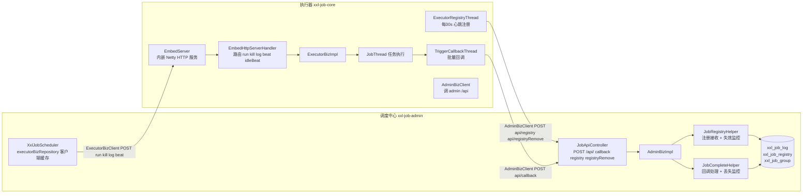
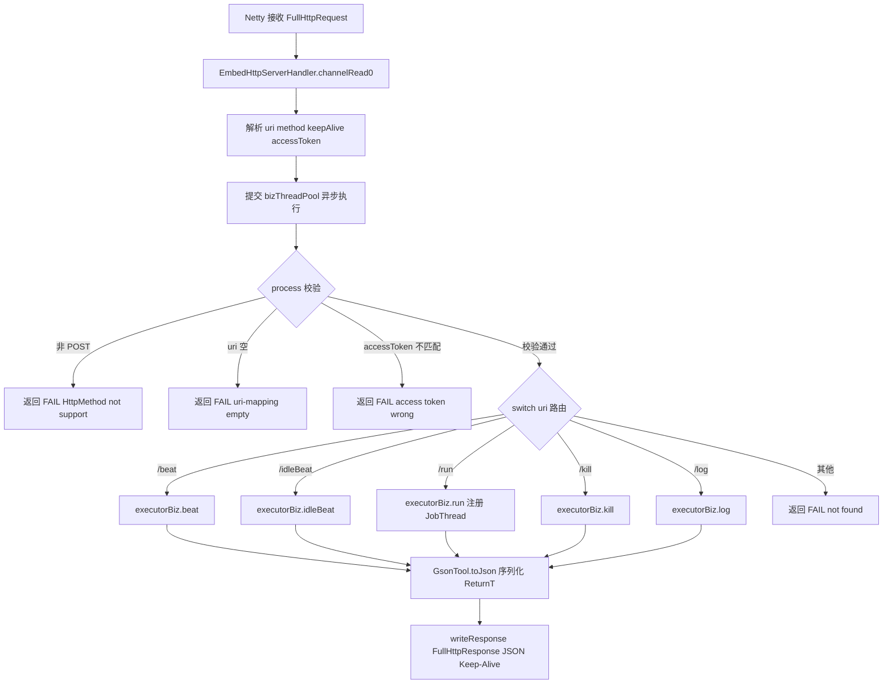
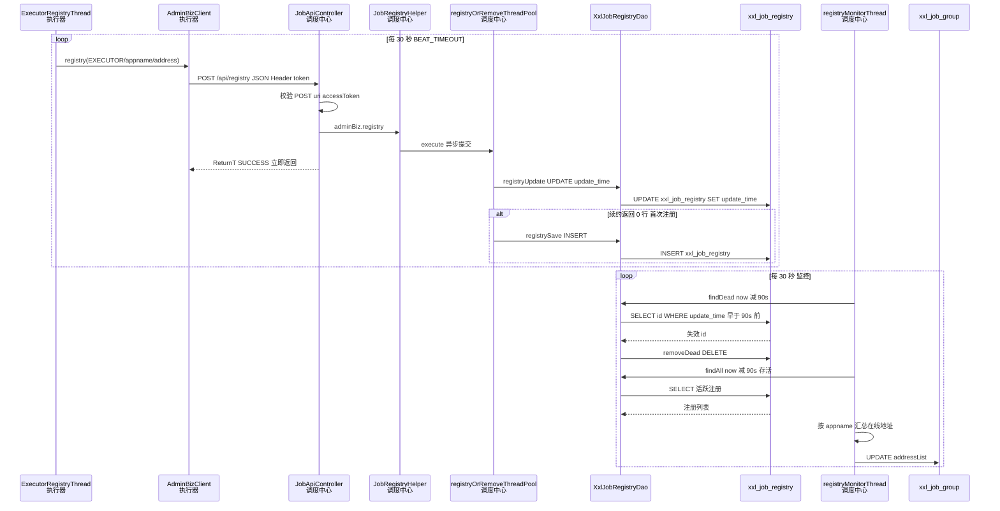
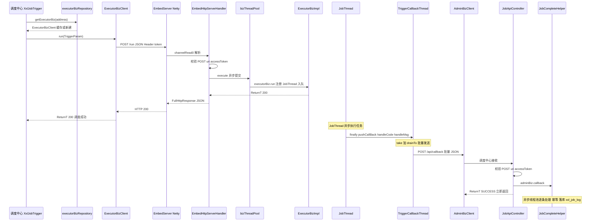
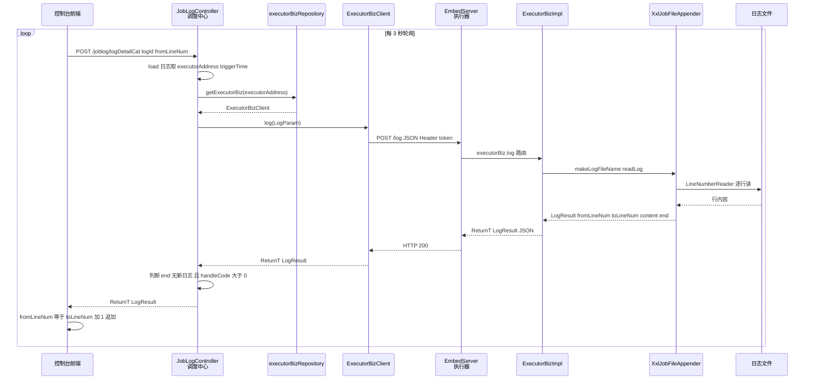

# XXL-Job 通信机制源码分析

> 基于 xxl-job 2.4.0，系统分析调度中心（admin）与执行器（executor）之间的双向通信机制：通信协议、接口矩阵、客户端/服务端实现、注册与心跳、鉴权、异步处理设计。
> 所有代码片段均标注真实文件路径与行号，便于对照查阅。

---

## 目录

- [一、概述](#一概述)
- [二、整体架构图](#二整体架构图)
- [三、通信协议](#三通信协议)
- [四、接口矩阵](#四接口矩阵)
- [五、客户端机制](#五客户端机制)
- [六、执行器服务端 EmbedServer（Netty）](#六执行器服务端-embedservernetty)
- [七、调度中心服务端 JobApiController（Spring MVC）](#七调度中心服务端-jobapicontrollerspring-mvc)
- [八、注册与心跳机制](#八注册与心跳机制)
- [九、鉴权机制 accessToken](#九鉴权机制-accesstoken)
- [十、异步处理设计](#十异步处理设计)
- [十一、关键时序图](#十一关键时序图)
- [十二、关键文件索引](#十二关键文件索引)

---

## 一、概述

xxl-job 采用 **调度中心（admin） + 执行器（executor）** 分布式架构，两者之间是**双向 HTTP（JSON）通信**，不依赖长连接或消息中间件：

| 通信方向 | 发起方 | 接收方 | 用途 | 接口 |
|----------|--------|--------|------|------|
| admin -> executor | 调度中心 | 执行器 | 触发任务、终止任务、查日志、探活 | `ExecutorBiz`（/run /kill /log /beat /idleBeat） |
| executor -> admin | 执行器 | 调度中心 | 回调执行结果、注册/注销自身 | `AdminBiz`（/api/callback /api/registry /api/registryRemove） |

**两端服务端实现异构**：
- 执行器端用**内嵌 Netty HTTP 服务**（`EmbedServer`），不依赖 Servlet 容器，轻量独立。
- 调度中心端复用 **Spring MVC**（`JobApiController`），跑在内嵌 Web 容器里。

**两端客户端统一**：都基于 JDK `HttpURLConnection` 封装的 `XxlJobRemotingUtil.postBody()`，序列化用 Gson，返回值统一包装为 `ReturnT<T>`。

---

## 二、整体架构图



**两条通信链路**：
- 蓝色（admin -> executor）：调度中心通过 `ExecutorBizClient` 调执行器 Netty 服务，触发任务/查日志/kill。
- 绿色（executor -> admin）：执行器通过 `AdminBizClient` 调调度中心 `/api/*`，回传结果与注册心跳。

---

## 三、通信协议

### 3.1 协议特征

| 特征 | 说明 |
|------|------|
| 传输协议 | HTTP（短连接请求-响应，`Keep-Alive` 复用连接） |
| 请求方法 | **仅 POST**（两端都校验，非 POST 直接拒绝） |
| 数据格式 | `application/json;charset=UTF-8`，Gson 序列化 |
| 鉴权 | Header `XXL-JOB-ACCESS-TOKEN`（两端配置需一致） |
| 连接超时 | 3 秒（`setConnectTimeout`） |
| 读超时 | 参数化（客户端默认 3 秒） |
| HTTPS | 支持，`trustAllHosts` 信任所有证书（测试友好，生产应配正规证书） |

### 3.2 统一返回结构 ReturnT

所有接口返回统一包装 `ReturnT<T>`，code/msg/content 三段式：

```java
public class ReturnT<T> implements Serializable {
    public static final int SUCCESS_CODE = 200;
    public static final int FAIL_CODE = 500;

    private int code;        // 200 成功 / 500 失败
    private String msg;      // 消息
    private T content;       // 业务内容（泛型）
}
```

> 文件：`xxl-job-core/src/main/java/com/xxl/job/core/biz/model/ReturnT.java:10-57`

### 3.3 请求报文封装

请求体即业务参数对象的 JSON（如 `TriggerParam`、`HandleCallbackParam`、`RegistryParam`）；响应体是 `ReturnT<T>` 的 JSON。Gson 通过自定义 `ParameterizedType4ReturnT` 处理 `ReturnT<T>` 的泛型反序列化。

---

## 四、接口矩阵

### 4.1 admin -> executor：ExecutorBiz 接口

> 接口定义：`xxl-job-core/src/main/java/com/xxl/job/core/biz/ExecutorBiz.java`
> 客户端：`ExecutorBizClient`，服务端路由：`EmbedServer.EmbedHttpServerHandler.process()`

| 方法 | URL | 入参 | 用途 |
|------|-----|------|------|
| `beat()` | `/beat` | 无 | 探活（执行器是否在线） |
| `idleBeat(param)` | `/idleBeat` | `IdleBeatParam(jobId)` | 探测某任务是否空闲（路由策略用） |
| `run(param)` | `/run` | `TriggerParam` | **触发任务执行** |
| `kill(param)` | `/kill` | `KillParam(jobId,logId)` | 终止运行中的任务 |
| `log(param)` | `/log` | `LogParam(logDateTim,logId,fromLineNum)` | 拉取执行日志（实时滚动） |

### 4.2 executor -> admin：AdminBiz 接口

> 接口定义：`xxl-job-core/src/main/java/com/xxl/job/core/biz/AdminBiz.java`
> 客户端：`AdminBizClient`，服务端路由：`JobApiController.api()`

| 方法 | URL | 入参 | 用途 |
|------|-----|------|------|
| `callback(list)` | `/api/callback` | `List<HandleCallbackParam>` | **回传任务执行结果**（批量） |
| `registry(param)` | `/api/registry` | `RegistryParam(group,key,value)` | 执行器注册/心跳续约 |
| `registryRemove(param)` | `/api/registryRemove` | `RegistryParam` | 执行器下线注销 |

> 注意：admin -> executor 的 URL 是 `/run`（无前缀）；executor -> admin 的 URL 是 `/api/callback`（带 `/api` 前缀，由 `JobApiController` 的 `@RequestMapping("/api")` 类注解决定）。

---

## 五、客户端机制

### 5.1 统一 HTTP 工具 XxlJobRemotingUtil

所有客户端调用最终都走 `XxlJobRemotingUtil.postBody()`，基于 JDK `HttpURLConnection`：

> 文件：`xxl-job-core/src/main/java/com/xxl/job/core/util/XxlJobRemotingUtil.java:68-157`

```java
public static ReturnT postBody(String url, String accessToken, int timeout, Object requestObj, Class returnTargClassOfT) {
    HttpURLConnection connection = null;
    try {
        URL realUrl = new URL(url);
        connection = (HttpURLConnection) realUrl.openConnection();

        // HTTPS 信任所有证书
        if (url.startsWith("https")) { trustAllHosts((HttpsURLConnection) connection); }

        // 连接设置
        connection.setRequestMethod("POST");                    // 仅 POST
        connection.setDoOutput(true);
        connection.setReadTimeout(timeout * 1000);
        connection.setConnectTimeout(3 * 1000);                 // 连接超时 3s
        connection.setRequestProperty("Content-Type", "application/json;charset=UTF-8");
        connection.setRequestProperty("connection", "Keep-Alive");

        // accessToken 鉴权 Header
        if (accessToken!=null && accessToken.trim().length()>0){
            connection.setRequestProperty(XXL_JOB_ACCESS_TOKEN, accessToken);
        }
        connection.connect();

        // 写请求体（Gson 序列化）
        if (requestObj != null) {
            String requestBody = GsonTool.toJson(requestObj);
            DataOutputStream out = new DataOutputStream(connection.getOutputStream());
            out.write(requestBody.getBytes("UTF-8"));
            out.flush(); out.close();
        }

        // 校验状态码
        int statusCode = connection.getResponseCode();
        if (statusCode != 200) {
            return new ReturnT<String>(ReturnT.FAIL_CODE, "xxl-job remoting fail, StatusCode("+ statusCode +")");
        }

        // 读取响应并反序列化为 ReturnT<T>
        ... // BufferedReader 读 body
        ReturnT returnT = GsonTool.fromJson(resultJson, ReturnT.class, returnTargClassOfT);
        return returnT;
    } catch (Exception e) {
        return new ReturnT<String>(ReturnT.FAIL_CODE, "xxl-job remoting error("+ e.getMessage() +")");
    } finally { connection.disconnect(); }
}
```

### 5.2 两个客户端

**ExecutorBizClient**（admin 用，调执行器）：

> 文件：`xxl-job-core/src/main/java/com/xxl/job/core/biz/client/ExecutorBizClient.java:31-54`

```java
public ReturnT<String> beat()                       { return postBody(addressUrl+"beat", accessToken, timeout, "", String.class); }
public ReturnT<String> idleBeat(IdleBeatParam p)    { return postBody(addressUrl+"idleBeat", accessToken, timeout, p, String.class); }
public ReturnT<String> run(TriggerParam p)           { return postBody(addressUrl+"run", accessToken, timeout, p, String.class); }
public ReturnT<String> kill(KillParam p)             { return postBody(addressUrl+"kill", accessToken, timeout, p, String.class); }
public ReturnT<LogResult> log(LogParam p)            { return postBody(addressUrl+"log", accessToken, timeout, p, LogResult.class); }
```

**AdminBizClient**（executor 用，调调度中心）：

> 文件：`xxl-job-core/src/main/java/com/xxl/job/core/biz/client/AdminBizClient.java:36-48`

```java
public ReturnT<String> callback(List<HandleCallbackParam> list) { return postBody(addressUrl+"api/callback", accessToken, timeout, list, String.class); }
public ReturnT<String> registry(RegistryParam p)                { return postBody(addressUrl+"api/registry", accessToken, timeout, p, String.class); }
public ReturnT<String> registryRemove(RegistryParam p)         { return postBody(addressUrl+"api/registryRemove", accessToken, timeout, p, String.class); }
```

### 5.3 admin 端 ExecutorBiz 客户端按需缓存

调度中心要调执行器时，按 `address` 从 `ConcurrentHashMap` 缓存中取/建 `ExecutorBizClient`，避免重复创建：

> 文件：`xxl-job-admin/src/main/java/com/xxl/job/admin/core/scheduler/XxlJobScheduler.java:78-97`

```java
private static ConcurrentMap<String, ExecutorBiz> executorBizRepository = new ConcurrentHashMap<String, ExecutorBiz>();
public static ExecutorBiz getExecutorBiz(String address) throws Exception {
    if (address==null || address.trim().length()==0) return null;
    address = address.trim();
    ExecutorBiz executorBiz = executorBizRepository.get(address);   // load-cache
    if (executorBiz != null) return executorBiz;
    executorBiz = new ExecutorBizClient(address, ...getAccessToken());  // set-cache
    executorBizRepository.put(address, executorBiz);
    return executorBiz;
}
```

执行器端则相反：启动时一次性为每个 admin 地址建好 `AdminBizClient` 列表（`XxlJobExecutor.initAdminBizList`，`:120-125`），供注册与回调复用。

---

## 六、执行器服务端 EmbedServer（Netty）

执行器启动时 `XxlJobExecutor.initEmbedServer()` 创建 `EmbedServer`，启动内嵌 Netty HTTP 服务并开始注册。

### 6.1 Netty 服务初始化

> 文件：`xxl-job-core/src/main/java/com/xxl/job/core/server/EmbedServer.java:36-103`

```java
public void start(final String address, final int port, final String appname, final String accessToken) {
    executorBiz = new ExecutorBizImpl();
    // 业务线程池：核心0 最大200 队列2000 拒绝抛异常
    ThreadPoolExecutor bizThreadPool = new ThreadPoolExecutor(0, 200, 60L, TimeUnit.SECONDS,
            new LinkedBlockingQueue<Runnable>(2000), ...,
            (r, exec) -> { throw new RuntimeException("EmbedServer bizThreadPool is EXHAUSTED!"); });

    ServerBootstrap bootstrap = new ServerBootstrap();
    bootstrap.group(new NioEventLoopGroup(), new NioEventLoopGroup())       // boss + worker
            .channel(NioServerSocketChannel.class)
            .childHandler(new ChannelInitializer<SocketChannel>() {
                public void initChannel(SocketChannel channel) {
                    channel.pipeline()
                            .addLast(new IdleStateHandler(0, 0, 30*3, TimeUnit.SECONDS))  // 90s 全空闲关闭
                            .addLast(new HttpServerCodec())                              // HTTP 编解码
                            .addLast(new HttpObjectAggregator(5*1024*1024))              // 聚合为 FullHttp（5MB）
                            .addLast(new EmbedHttpServerHandler(executorBiz, accessToken, bizThreadPool)); // 业务处理
                }
            })
            .childOption(ChannelOption.SO_KEEPALIVE, true);
    bootstrap.bind(port).sync();
    startRegistry(appname, address);   // 启动注册线程
}
```

**Pipeline 设计要点**：
- `IdleStateHandler(90s)`：连接 90 秒无读写则触发 `IdleStateEvent`，关闭空闲连接，防止连接泄漏。
- `HttpObjectAggregator(5MB)`：把分片的 HTTP 消息聚合为完整的 `FullHttpRequest`，方便一次性处理。
- `SO_KEEPALIVE`：TCP 层保活。

### 6.2 请求处理与路由

`EmbedHttpServerHandler` 收到请求后**提交业务线程池异步处理**（不阻塞 Netty IO 线程），按 URI 路由到 `ExecutorBizImpl`：

> 文件：`xxl-job-core/src/main/java/com/xxl/job/core/server/EmbedServer.java:133-202`

```java
protected void channelRead0(final ChannelHandlerContext ctx, FullHttpRequest msg) {
    String requestData = msg.content().toString(CharsetUtil.UTF_8);
    String uri = msg.uri();
    HttpMethod httpMethod = msg.method();
    boolean keepAlive = HttpUtil.isKeepAlive(msg);
    String accessTokenReq = msg.headers().get(XxlJobRemotingUtil.XXL_JOB_ACCESS_TOKEN);

    // 提交业务线程池异步执行
    bizThreadPool.execute(() -> {
        Object responseObj = process(httpMethod, uri, requestData, accessTokenReq);   // 路由处理
        String responseJson = GsonTool.toJson(responseObj);                            // 序列化
        writeResponse(ctx, keepAlive, responseJson);                                   // 写回
    });
}

private Object process(HttpMethod httpMethod, String uri, String requestData, String accessTokenReq) {
    // 校验：仅 POST / uri 非空 / accessToken 匹配
    if (HttpMethod.POST != httpMethod) return new ReturnT<>(FAIL_CODE, "HttpMethod not support.");
    if (accessToken!=null && !accessToken.equals(accessTokenReq)) return new ReturnT<>(FAIL_CODE, "access token is wrong.");

    // services mapping
    switch (uri) {
        case "/beat":      return executorBiz.beat();
        case "/idleBeat":  return executorBiz.idleBeat(GsonTool.fromJson(requestData, IdleBeatParam.class));
        case "/run":       return executorBiz.run(GsonTool.fromJson(requestData, TriggerParam.class));
        case "/kill":      return executorBiz.kill(GsonTool.fromJson(requestData, KillParam.class));
        case "/log":       return executorBiz.log(GsonTool.fromJson(requestData, LogParam.class));
        default:           return new ReturnT<>(FAIL_CODE, "uri-mapping not found.");
    }
}
```

### 6.3 响应写出

> 文件：`xxl-job-core/src/main/java/com/xxl/job/core/server/EmbedServer.java:207-216`

```java
private void writeResponse(ChannelHandlerContext ctx, boolean keepAlive, String responseJson) {
    FullHttpResponse response = new DefaultFullHttpResponse(HTTP_1_1, OK,
            Unpooled.copiedBuffer(responseJson, CharsetUtil.UTF_8));
    response.headers().set(CONTENT_TYPE, "text/html;charset=UTF-8");
    response.headers().set(CONTENT_LENGTH, response.content().readableBytes());
    if (keepAlive) response.headers().set(CONNECTION, KEEP_ALIVE);   // 复用连接
    ctx.writeAndFlush(response);
}
```

### 6.4 请求处理流程图



---

## 七、调度中心服务端 JobApiController（Spring MVC）

调度中心用 Spring MVC `JobApiController` 作为执行器请求的统一入口，路径 `/api/{uri}`，通过 URI 分发：

> 文件：`xxl-job-admin/src/main/java/com/xxl/job/admin/controller/JobApiController.java:24-62`

```java
@Controller
@RequestMapping("/api")
public class JobApiController {

    @Resource
    private AdminBiz adminBiz;   // 实际为 AdminBizImpl

    @RequestMapping("/{uri}")
    @ResponseBody
    @PermissionLimit(limit=false)   // 跳过登录鉴权，但保留 accessToken
    public ReturnT<String> api(HttpServletRequest request, @PathVariable("uri") String uri,
                               @RequestBody(required = false) String data) {
        // 校验：仅 POST / uri 非空 / accessToken 匹配
        if (!"POST".equalsIgnoreCase(request.getMethod())) {
            return new ReturnT<>(ReturnT.FAIL_CODE, "HttpMethod not support.");
        }
        if (...getAccessToken()!=null && !...getAccessToken().equals(
                request.getHeader(XxlJobRemotingUtil.XXL_JOB_ACCESS_TOKEN))) {
            return new ReturnT<>(ReturnT.FAIL_CODE, "The access token is wrong.");
        }

        // services mapping
        if ("callback".equals(uri)) {
            List<HandleCallbackParam> list = GsonTool.fromJson(data, List.class, HandleCallbackParam.class);
            return adminBiz.callback(list);                      // -> AdminBizImpl -> JobCompleteHelper
        } else if ("registry".equals(uri)) {
            return adminBiz.registry(GsonTool.fromJson(data, RegistryParam.class));      // -> JobRegistryHelper
        } else if ("registryRemove".equals(uri)) {
            return adminBiz.registryRemove(GsonTool.fromJson(data, RegistryParam.class));
        } else {
            return new ReturnT<>(ReturnT.FAIL_CODE, "uri-mapping not found.");
        }
    }
}
```

**关键点**：
- `@PermissionLimit(limit=false)`：跳过 admin Web 控制台的登录鉴权（执行器没有用户态），但仍校验 `accessToken`。
- `@RequestBody String data`：原始 JSON 字符串，再由 `GsonTool.fromJson` 按具体类型反序列化。
- `AdminBizImpl` 委托给具体 Helper：

> 文件：`xxl-job-admin/src/main/java/com/xxl/job/admin/service/impl/AdminBizImpl.java:20-33`

```java
public ReturnT<String> callback(List<HandleCallbackParam> list)      { return JobCompleteHelper.getInstance().callback(list); }
public ReturnT<String> registry(RegistryParam p)                     { return JobRegistryHelper.getInstance().registry(p); }
public ReturnT<String> registryRemove(RegistryParam p)               { return JobRegistryHelper.getInstance().registryRemove(p); }
```

---

## 八、注册与心跳机制

执行器通过**定时心跳注册**把自己的地址上报给调度中心，调度中心维护注册表并定期摘除失效节点。

### 8.1 执行器侧：ExecutorRegistryThread

守护线程，每 30 秒向所有 admin 发 `/api/registry`，任一成功即停止；退出时发 `/api/registryRemove` 注销。

> 文件：`xxl-job-core/src/main/java/com/xxl/job/core/thread/ExecutorRegistryThread.java:36-108`

```java
registryThread = new Thread(() -> {
    while (!toStop) {
        try {
            RegistryParam registryParam = new RegistryParam(RegistType.EXECUTOR.name(), appname, address);
            for (AdminBiz adminBiz: XxlJobExecutor.getAdminBizList()) {     // 遍历所有 admin，高可用
                try {
                    ReturnT<String> result = adminBiz.registry(registryParam);
                    if (result!=null && ReturnT.SUCCESS_CODE == result.getCode()) {
                        break;   // 任一成功即 break
                    }
                } catch (Exception e) { ... }
            }
        } catch (Exception e) { ... }
        TimeUnit.SECONDS.sleep(RegistryConfig.BEAT_TIMEOUT);   // 30s
    }
    // 退出时注销
    for (AdminBiz adminBiz: XxlJobExecutor.getAdminBizList()) {
        adminBiz.registryRemove(new RegistryParam(RegistType.EXECUTOR.name(), appname, address));
    }
});
registryThread.setDaemon(true);
registryThread.start();
```

**注册参数 RegistryParam**（`RegistryParam.java`）：

| 字段 | 含义 | 取值 |
|------|------|------|
| `registryGroup` | 注册组 | `EXECUTOR`（或 `ADMIN`） |
| `registryKey` | 注册键 | 执行器 `appname` |
| `registryValue` | 注册值 | 执行器地址（`ip:port`） |

### 8.2 调度中心侧：JobRegistryHelper

收到注册请求后，**异步线程池**写 `xxl_job_registry` 表（update 不存在则 insert）；同时有独立监控线程定期摘除失效节点、刷新执行器分组的在线地址。

> 文件：`xxl-job-admin/src/main/java/com/xxl/job/admin/core/thread/JobRegistryHelper.java:149-173`

```java
public ReturnT<String> registry(RegistryParam registryParam) {
    // valid ...
    registryOrRemoveThreadPool.execute(() -> {           // 异步执行，立即返回 SUCCESS
        int ret = ...getXxlJobRegistryDao().registryUpdate(group, key, value, new Date());  // UPDATE update_time
        if (ret < 1) {
            ...getXxlJobRegistryDao().registrySave(group, key, value, new Date());           // 不存在则 INSERT
        }
    });
    return ReturnT.SUCCESS;
}
```

**注册表 SQL**（`XxlJobRegistryMapper.xml`）：

```xml
<!-- 续约：更新 update_time，返回受影响行数 -->
<update id="registryUpdate">
    UPDATE xxl_job_registry SET `update_time` = #{updateTime}
    WHERE `registry_group` = #{registryGroup} AND `registry_key` = #{registryKey} AND `registry_value` = #{registryValue}
</update>
<!-- 首次注册：续约返回 0 行时插入 -->
<insert id="registrySave">
    INSERT INTO xxl_job_registry(registry_group, registry_key, registry_value, update_time)
    VALUES(#{registryGroup}, #{registryKey}, #{registryValue}, #{updateTime})
</insert>
<!-- 注销 -->
<delete id="registryDelete">
    DELETE FROM xxl_job_registry WHERE registry_group=#{registryGroup} AND registry_key=#{registryKey} AND registry_value=#{registryValue}
</delete>
```

### 8.3 失效摘除与地址刷新

`JobRegistryHelper` 监控线程每 30 秒执行一次：删除 90 秒未续约的「死」节点，把存活节点汇总刷新到 `xxl_job_group.addressList`。

> 文件：`xxl-job-admin/src/main/java/com/xxl/job/admin/core/thread/JobRegistryHelper.java:56-128`

```java
registryMonitorThread = new Thread(() -> {
    while (!toStop) {
        List<XxlJobGroup> groupList = ...getXxlJobGroupDao().findByAddressType(0);  // 自动注册型分组
        if (groupList!=null && !groupList.isEmpty()) {
            // 1. 删除死节点：update_time 早于 now-90s
            List<Integer> ids = ...getXxlJobRegistryDao().findDead(DEAD_TIMEOUT, new Date());
            if (ids!=null && ids.size()>0) {
                ...getXxlJobRegistryDao().removeDead(ids);
            }
            // 2. 查存活节点：update_time 晚于 now-90s
            List<XxlJobRegistry> list = ...getXxlJobRegistryDao().findAll(DEAD_TIMEOUT, new Date());
            // 按 appname 汇总地址列表
            HashMap<String, List<String>> appAddressMap = new HashMap<>();
            for (XxlJobRegistry item: list) { ... appAddressMap.put(appname, registryList); }
            // 3. 刷新分组地址
            for (XxlJobGroup group: groupList) {
                List<String> registryList = appAddressMap.get(group.getAppname());
                group.setAddressList(拼接);   // 排序后逗号拼接
                ...getXxlJobGroupDao().update(group);
            }
        }
        TimeUnit.SECONDS.sleep(RegistryConfig.BEAT_TIMEOUT);   // 30s
    }
});
```

**失效判定 SQL**（`DEAD_TIMEOUT = BEAT_TIMEOUT * 3 = 90s`）：

```xml
<!-- 死节点：update_time < now-90s -->
<select id="findDead">
    SELECT t.id FROM xxl_job_registry AS t
    WHERE t.update_time <![CDATA[ < ]]> DATE_ADD(#{nowTime}, INTERVAL -#{timeout} SECOND)
</select>
<!-- 存活节点：update_time > now-90s -->
<select id="findAll">
    SELECT ... FROM xxl_job_registry AS t
    WHERE t.update_time <![CDATA[ > ]]> DATE_ADD(#{nowTime}, INTERVAL -#{timeout} SECOND)
</select>
```

> 配置：`xxl-job-core/src/main/java/com/xxl/job/core/enums/RegistryConfig.java`
> `BEAT_TIMEOUT = 30`（心跳间隔），`DEAD_TIMEOUT = BEAT_TIMEOUT * 3 = 90`（失效阈值）。

**容错窗口**：执行器每 30s 续约一次，调度中心容忍 3 次未续约（90s）才判定失效摘除，避免单次网络抖动误摘。

### 8.4 注册机制时序图



---

## 九、鉴权机制 accessToken

两端通过共享密钥 `accessToken` 双向鉴权，配置在请求 Header `XXL-JOB-ACCESS-TOKEN`：

| 端 | 配置来源 | 校验位置 |
|----|----------|----------|
| 执行器 | `XxlJobExecutor.accessToken`（`XxlJobExecutor.java:33,44`） | `EmbedServer.process()`（`:175-177`） |
| 调度中心 | `XxlJobAdminConfig.accessToken` | `JobApiController.api()`（`:42-46`） |

**校验规则**（两端一致）：
- 若本地 `accessToken` 为空，**跳过校验**（仅 warn 提示不安全）。
- 若非空，则请求 Header 必须与之相等，否则返回 `FAIL_CODE("The access token is wrong.")`。

> 文件：`xxl-job-core/src/main/java/com/xxl/job/core/executor/XxlJobExecutor.java:155-157`

```java
// accessToken
if (accessToken==null || accessToken.trim().length()==0) {
    logger.warn(">>>>>>>>>>> xxl-job accessToken is empty. To ensure system security, please set the accessToken.");
}
```

> 安全建议：生产环境务必两端配置相同的非空 `accessToken`，防止未授权调用执行器或伪造回调。

---

## 十、异步处理设计

两端服务端都采用「**接收即返回 + 线程池异步处理**」模式，避免阻塞通信线程：

| 端 | 通信线程 | 业务处理 | 立即返回 |
|----|----------|----------|----------|
| 执行器 | Netty worker（IO 线程） | `bizThreadPool`（0-200，队列 2000） | 提交后 Netty 写回响应（处理完才回） |
| 调度中心 | Spring MVC 容器线程 | `callbackThreadPool`（2-20，队列 3000）/ `registryOrRemoveThreadPool`（2-10，队列 2000） | `ReturnT.SUCCESS` 立即返回 |

**调度中心侧关键**：`callback` 与 `registry` 都是「**提交线程池后立即返回 SUCCESS**」，HTTP 响应不等待业务处理完成，保证执行器快速拿到确认：

> 文件：`xxl-job-admin/src/main/java/com/xxl/job/admin/core/thread/JobCompleteHelper.java:138-152`

```java
public ReturnT<String> callback(List<HandleCallbackParam> callbackParamList) {
    callbackThreadPool.execute(() -> {
        for (HandleCallbackParam p: callbackParamList) {
            callback(p);   // 逐条处理：load 幂等校验 拼接 落库
        }
    });
    return ReturnT.SUCCESS;   // 立即返回，不等处理完成
}
```

**拒绝策略差异**：
- 执行器 `bizThreadPool`：拒绝时**抛异常**（`EXHAUSTED`），让调用方感知压力。
- 调度中心 `callbackThreadPool`：拒绝时**调用者线程直接执行**（`r.run()`），不丢任务。
- 调度中心 `registryOrRemoveThreadPool`：同样调用者执行。

---

## 十一、关键时序图

### 11.1 任务触发与结果回调通信



**两段通信**：
1. **触发**（admin -> executor）：`ExecutorBizClient.run` -> `/run` -> `EmbedServer` 路由到 `ExecutorBizImpl.run`，注册 `JobThread` 后立即返回，任务异步执行。
2. **回调**（executor -> admin）：任务执行完，`TriggerCallbackThread` 批量调 `/api/callback`，admin 校验后**立即返回 SUCCESS**，异步落库 `xxl_job_log.handle_code`。

### 11.2 执行日志实时拉取通信



日志查询是 admin -> executor 方向的典型调用：admin 通过 `ExecutorBizClient.log` 调执行器 `/log`，执行器读本地日志文件按行返回。**日志不落 admin 库，实时拉取**。

---

## 十二、关键文件索引

### 12.1 通信协议与工具（xxl-job-core）

| 文件 | 职责 |
|------|------|
| `core/util/XxlJobRemotingUtil.java` | HTTP POST 通用工具（HttpURLConnection + Gson + accessToken + HTTPS） |
| `core/util/GsonTool.java` | JSON 序列化/反序列化（含 ReturnT 泛型处理） |
| `core/biz/model/ReturnT.java` | 统一返回结构 code/msg/content |
| `core/biz/model/RegistryParam.java` | 注册参数 group/key/value |

### 12.2 接口与客户端（xxl-job-core）

| 文件 | 职责 |
|------|------|
| `core/biz/ExecutorBiz.java` | admin->executor 接口（beat/idleBeat/run/kill/log） |
| `core/biz/AdminBiz.java` | executor->admin 接口（callback/registry/registryRemove） |
| `core/biz/client/ExecutorBizClient.java` | admin 端客户端，调执行器 |
| `core/biz/client/AdminBizClient.java` | executor 端客户端，调调度中心 |
| `core/biz/impl/ExecutorBizImpl.java` | 执行器 biz 实现 |

### 12.3 服务端（xxl-job-core 执行器 + xxl-job-admin 调度中心）

| 文件 | 职责 |
|------|------|
| `core/server/EmbedServer.java` | 执行器内嵌 Netty HTTP 服务 + 请求路由 + 响应写出 |
| `core/executor/XxlJobExecutor.java` | 执行器启动：initAdminBizList + initEmbedServer + accessToken |
| `admin/controller/JobApiController.java` | 调度中心 /api/* 统一入口（Spring MVC） |
| `admin/service/impl/AdminBizImpl.java` | AdminBiz 实现，委托 JobCompleteHelper/JobRegistryHelper |

### 12.4 注册与心跳

| 文件 | 职责 |
|------|------|
| `core/thread/ExecutorRegistryThread.java` | 执行器注册线程（30s 心跳 + 退出注销） |
| `core/enums/RegistryConfig.java` | BEAT_TIMEOUT=30s / DEAD_TIMEOUT=90s |
| `admin/core/thread/JobRegistryHelper.java` | 注册接收（异步落库）+ 失效摘除 + 分组地址刷新 |
| `admin/core/scheduler/XxlJobScheduler.java` | ExecutorBiz 客户端缓存 executorBizRepository |
| `admin/resources/mybatis-mapper/XxlJobRegistryMapper.xml` | 注册表 SQL（registryUpdate/Save/Delete/findDead/findAll） |

---

## 总结

xxl-job 的通信机制可以概括为 **「双向 HTTP + JSON + accessToken + 注册表寻址」**：

| 维度 | 设计 |
|------|------|
| **协议** | HTTP POST + JSON（Gson），统一 `ReturnT<T>` 返回，`Keep-Alive` 复用连接，支持 HTTPS |
| **双向通信** | admin -> executor（`ExecutorBiz`：触发/查日志/kill/探活）+ executor -> admin（`AdminBiz`：回调/注册/注销），不依赖长连接 |
| **服务端异构** | 执行器 Netty（`EmbedServer`，无 Servlet 依赖）；调度中心 Spring MVC（`JobApiController`，复用 Web 容器） |
| **客户端统一** | 都基于 `XxlJobRemotingUtil.postBody`（JDK HttpURLConnection）；admin 端按 address 缓存 `ExecutorBizClient`，executor 端启动时建好 `AdminBizClient` 列表 |
| **寻址** | 执行器启动时把自己的 `appname:address` 注册到 admin 的 `xxl_job_registry` 表，admin 监控线程汇总刷新到 `xxl_job_group.addressList`，调度时按地址路由 |
| **心跳与容错** | 执行器 30s 续约，admin 容忍 90s（3 次）未续约才摘除，避免抖动误摘；退出时主动注销 |
| **鉴权** | 双向 `accessToken`（Header `XXL-JOB-ACCESS-TOKEN`），两端配置一致，为空则跳过（warn） |
| **异步处理** | 两端服务端都「接收即提交线程池 + 快速响应」，不阻塞通信线程；调度中心 callback/registry 立即返回 SUCCESS 异步落库 |

**核心设计哲学**：用最朴素的 HTTP 短连接 + JSON 实现双向 RPC，避免引入长连接/注册中心/消息中间件等复杂依赖；通过「执行器自注册 + 心跳续约 + 失效摘除」的注册表模型实现动态寻址；通过统一 `ReturnT` 与 `XxlJobRemotingUtil` 让两端客户端/服务端高度对称、易于维护。
